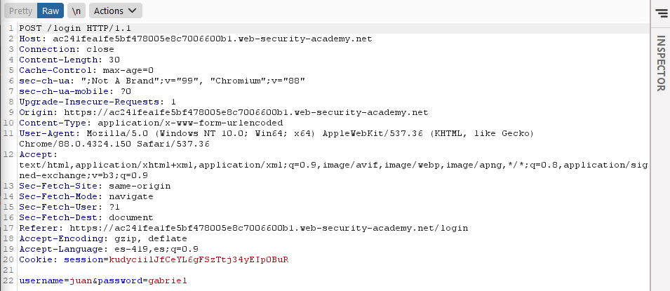

# Authentication

## Lab 1: User name enumeration via different responses

Para estos laboratorios se estará utilizando burp suite. El ataque se efectuara en la pagina de logeo del laboratorio.

Primero en el burp suite debemos interceptar los paquetes en la pestaña de proxy, luego debemos ingresar algun dato para interceptar la consulta. Entonces tendremos algo como esto:

