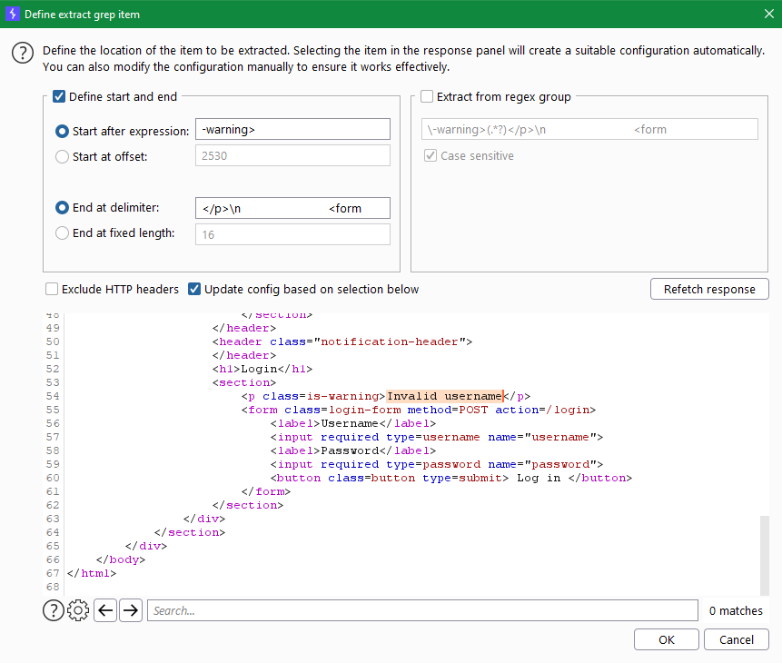
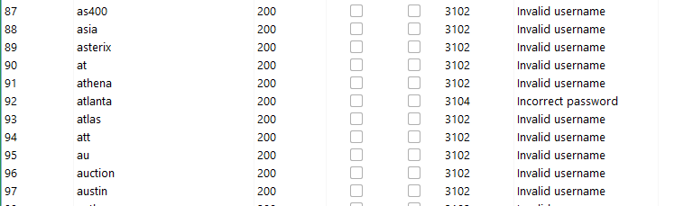

# Authentication

## Lab 1: User name enumeration via different responses

Para estos laboratorios se estará utilizando burp suite. El ataque se efectuara en la pagina de logeo del laboratorio.

Primero en el burp suite debemos interceptar los paquetes en la pestaña de proxy, luego debemos ingresar algun dato para interceptar la consulta. Entonces tendremos algo como esto:

En este caso coloque de usuario `juan` y contraseña `gabriel`.

Click derecho en la consulta y le ponemos `send to intruder, de ahí nos movemos a la pestaña de intruder.

En positions le damos a clear y seleccionamos solo el usuario

type attack: sniper

Nos vamos a payloads y agregamos en payload options en load para cargar la lista de usuarios que nos da la pagina de port swigger.

Luego en options nos vamos a `Grep - Extract` y agregamos con Add, nos da una ventanita en donde le damos a `Fetch response`  y buscamos `Invalid username`

le damos ok y luego en start attack

con eso veremos que los resultados positivos son los que no tengan Invalid username, sino diran Invalid password.

Con eso ya encontramos un usuario, ahora hacemos lo mismo pero cambiando la contraseña con el diccionario que te dan port swigger.

La respuesta que no tiene ningun mensaje de error sería la contraseña correcta.

## Lab 2: 

Para este laboratorio tenemos que realizar el mismo proceso que el anteriro laboratorio pero las respuestas son el mismo en ambos casos aparentemente, en este caso te dan `Invalid username or password.` pero cuando la respuesta es correcta no tiene el punto final

Para la contraseña de la misma manera realizamos un ataque de fuerza bruta y buscamos el que nos de una redireccion o que no nos bote algun mensaje de error.

