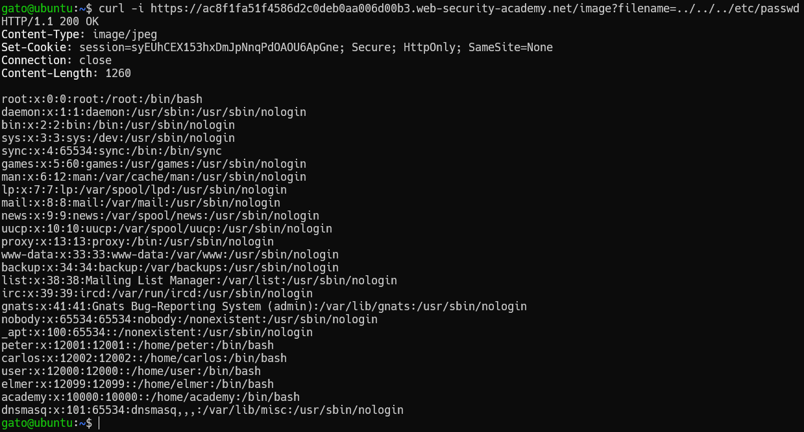

# Path Traversal

## Reading arbitrary files via directory traversal

### Lab 1: File path traversal, simple case

En este laboratorio nos indican que la página tiene una vulnerabilidad de path traversal en la visualización de imagenes de los productos. Sacamos el link de alguna de las imágenes para realizar las pruebas.

`https://acec1fab1f1086c6c0ecada300b800d0.web-security-academy.net/image?filename=37.jpg`

Para estos laboratorios variaremos el valor de filename para conseguir leer algún archivo que no deberíamos poder leer(/etc/passwd). Para ello usaremos **curl** o también podemos usar **burp suite**, pero necesitamos ver la respuesta del servidor en un formato crudo.


```bash
curl -i "https://acec1fab1f1086c6c0ecada300b800d0.web-security-academy.net/image?filename=../../../etc/passwd"
```



Si lo probamos en el navegador el mismo enlace nos mostrará que intenta intrepretar la imagen con el resultado, debido a que la respuesta indica que el tipo de archivo que ha enviado en una imágen. Esta "imágen" no tiene el formato de imágen por eso no sabe como leerlo.