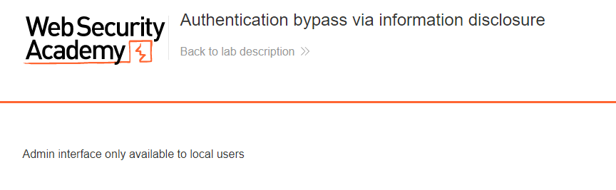
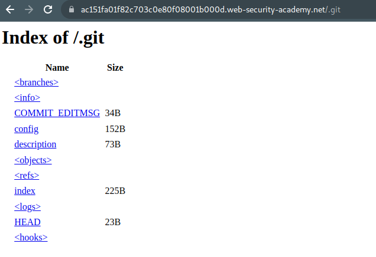
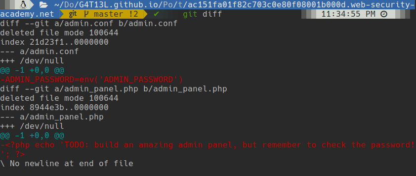
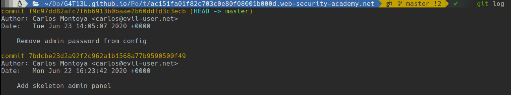
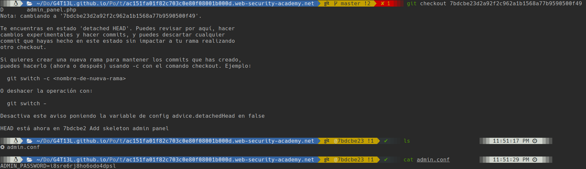

# Information Disclosure

## How to find and exploit information disclosure vulnerabilities

### Common sources of information disclosure

#### Error messages

##### Lab 1: Information disclosure in error messages

Le agregamos cualquier texto al parametro **productid** y nos arrojara el error con la version del framework que esta usando.


#### Debugging data

##### Lab 2: Information disclosure on debug page

En el código fuente encontramos un comentario de un enlace `/cgi-bin/phpinfo.php`, otra manera de encontrar esta ruta es realizando fuzzing a los directorios con wfuzz o otra herrramienta que busque directorios por diccionario.


Aqui si buscamos las variables de entorno encontraremos la variable **SECRET_KEY**.


### Source code disclosure via backup files

#### Lab 3: Source code disclosure via backup files

El laboratorio nos indica que hay archivos ocultos así que buscamos en `robots.txt`.


Encontramos que existe la carpeta `/backup` donde nos indica el enlace a un código fuente en java con extension `.java.bak`.


Aca encontraremos la contraseña de la base de datos, dentro de una función para realizar conexión a la base de datos.

### Information disclosure due to insecure configuration

#### Lab 4: Authentication bypass via information disclosure

Si intentamos entra al panel de administración, nos da un mensaje de que solo esta disponible la administración para usarios locales.



Interceptamos la consulta al actualizar la página usando **Burp Suite** y cambiamos la cabecera **GET** por un **TRACE**.


Esto nos hará descargar un archivo de nombre `admin` que nos mostrará la consulta que acabamos de realizar pero además de ello nos muestra una cabecera que no veíamos en una consulta normal.


Esta cabecera indica nuestra IP publica y la utiliza para saber si es que se esta realizando las consultas de forma local o externa.

Ahora vamos a actualizar la página, pero esta vez vamos a agregar la cabecera `X-Custom-IP-Authorization: 127.0.0.1`.


### Version control history

#### Lab 5: Information disclosure in version control history

Buscamos los archivos de `.git` entrando a la ruta /.git dentro de la página.



Para sacar toda la carpeta vamos a usar wget con la flag "**-r**" esto descargará recursivamente la carpeta completa.

```bash
wget -r https://ac151fa01f82c703c0e80f08001b000d.web-security-academy.net/.git
```

Ahora que tenemos la carpeta .git usaremos el mismo git para buscar algún cambio que se haya hecho que nos pueda ser útil.

```bash
git diff
```



Ahora sabemos que existe un archivo admin.conf en el cual se encontraba la contraseña del administrador. Vamos a regresar a ese commit donde estaba escrita la contraseña.

```bash
git log
```



```bash
git checkout 7bdcbe23d2a92f2c962a1b1568a77b9590500f49
```



Con esta contraseña lograremos entrar como `administrator` y podremos borrar el usuario **carlos**.