# Business Logic Vulnerabilities

## Excessive trust in client-side controls

### Lab 1: Excessive trust in client-side controls

Interceptamos la consulta al dar click en el boton `add to chart`.


El paquete que se envía lo modificamos para que el precio tenga un valor mas bajo, puede ser 1 o 100 pq los 2 últimos digitos los pone como centavos.


```
...
productId=1&redir=PRODUCT&quantity=1&price=100
```

Luego entramos al carrito para ver que el precio que tiene la chaqueta es 1$.


### Lab: 2FA broken logic

[2FA broken logic](https://g4t13l.github.io/PortSwigger/Authentication.html#lab-8-2fa-broken-logic)

## Failing to handle unconventional input
### Lab 2: High-level logic vulnerability

Ingresamos las credenciales que nos dieron. Lo que nos piden comprar es la chaqueta de cuero, así lo añadimos al carrito y otro producto cualquiera. Entonces al entrar al carrito, deberiamos ver algo así:


Interceptamos los paquetes y le damos en aumentar el producto 2, luego le cambiamos la cantidad con -10 para disminuir el precio.


Vamos probando valores hasta que salga un precio menor a 100$ que es lo que tenemos en la cuenta.

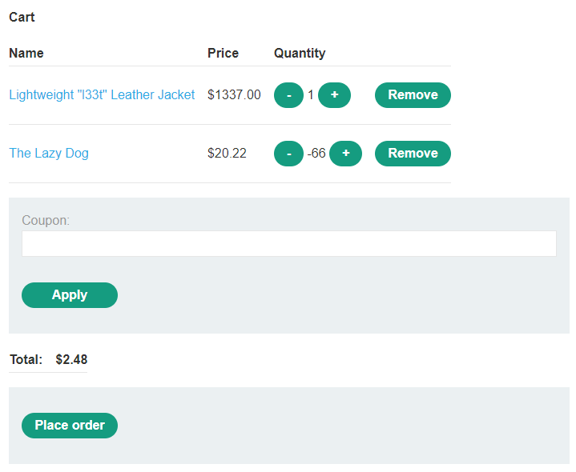

En este caso llego a costar todo $2.48

### Lab 3: Low-level logic flaw

Interceptamos la consulta para aumentar la cantidad, nos damos cuenta de que no podemos aumentar la cantidad en un número de 3 cifras. Mandamos esa consulta al intruder subiendo el valor a 99.

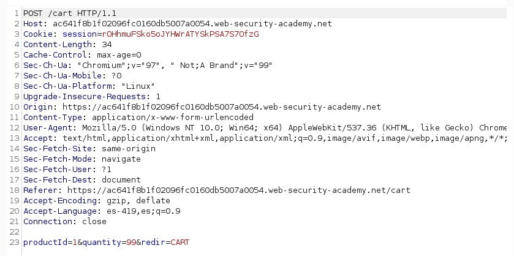

En la pestaña de payloads colocamos **Null payloads** y que se generen infinitamente. En la pestaña de **Resource pool** configuramos para que se manden consultas a lo mas 1 a la vez. Empezamos el ataque y mientras en otro navegador estaremos actualizando constantemente el carrito para ver la cantidad de elementos que se van generando. Buscamos que la cantidad aumente tanto que sobrepase el valor entero posible y comience a tomar valores negativos, que así es como esta definido el formato de los números enteros.

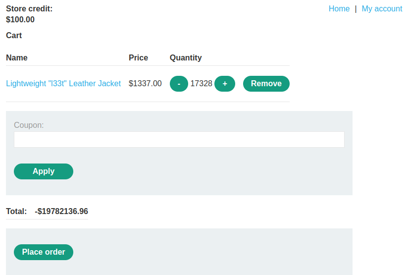

Dejamos que siga corriendo hasta que este cerca a 0, es cuestión de tantear valores cercanos a 0 pero menor a 0. Lo demás lo completamos con otro producto subiendo la cantidad hasta que sea el precio menor a 100$ y mayor a 0$.

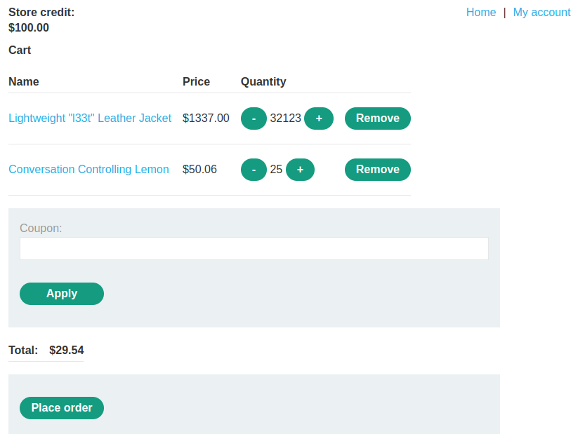

### Lab 4: Inconsistent handling of exceptional input

Este laboratorio se explota en el registro de usuarios. Agregaremos 300 'a' antes del `@exploit-ac871f231ed60f3ac0543fc801e90073.web-security-academy.net`, pues veremos que al registrarnos trunca el correo. 


Además hay que saber que el correo que acepta para los administradores tienen la terminación `@dontwannacry.com`

Hay que aceptar la verificación en el servidor de correo que nos proporciona el laboratorio y nos logeamos.


El máximo de caracteres permitido es 250. Entonces creamos un script en python.

```python
#!/bin/python3

email=".exploit-ac871f231ed60f3ac0543fc801e90073.web-security-academy.net"
admin="@dontwannacry.com"

payload='a'*(255-len(admin))+admin
print (payload)
print (len(payload))

print (payload+email)
print (len(payload+email))

```


La última cadena es la que utilizaremos como payload para el email, este será truncado y solo tomará en cuenta con la terminación `@dontwannacry.com`.

Entonces intentamos registrarnos con `aaaaaaaaaaaaaaaaaaaaaaaaaaaaaaaaaaaaaaaaaaaaaaaaaaaaaaaaaaaaaaaaaaaaaaaaaaaaaaaaaaaaaaaaaaaaaaaaaaaaaaaaaaaaaaaaaaaaaaaaaaaaaaaaaaaaaaaaaaaaaaaaaaaaaaaaaaaaaaaaaaaaaaaaaaaaaaaaaaaaaaaaaaaaaaaaaaaaaaaaaaaaaaaaaaaaaaaaaaaaaaaaaaaaaaaaaaaaaa@dontwannacry.com.exploit-ac871f231ed60f3ac0543fc801e90073.web-security-academy.net`, verificamos el correo y nos logeamos con el usuario que creamos.

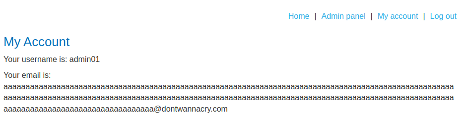

Ahora nos permite entrar a la opcion `Admin panel` donde podremos eliminar el usuario carlos.

## Making flawed assumptions about user behavior

### Trusted users won't always remain trustworthy

#### Lab 5: Inconsistent security controls

Nos registramos y nos logeamos con alguna cuenta creada.
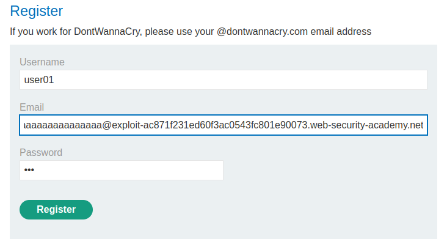

En la seccion **My Account** cambiamos el correo a alguno que tenga la terminación `@dontwannacry.com`. Con eso ya podremos tener acceso a las opciones del panel de administrador y elminar a *carlos*.

### Users won't always supply mandatory input

#### Lab 6: Weak isolation on dual-use endpoint

Nos logeamos con la cuenta que nos dieron **wiener:peter**. En el apartado de **My account** le llenamos cualquier dato para cambiar la contraseña e interceptamos la consulta con burp suite.

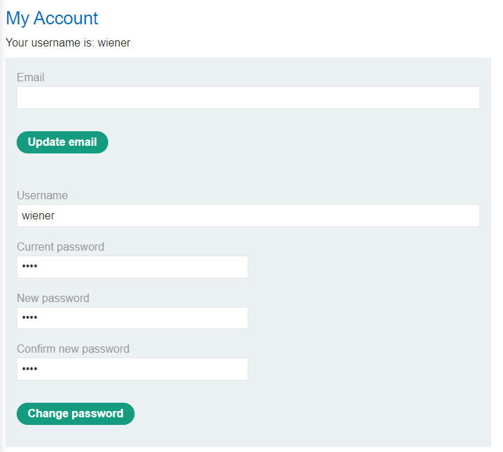

Le cambiamos el usuario a `administrator` y  quitamos `current-password=asdf` para que no verifique la contraseña actual con el usuario.

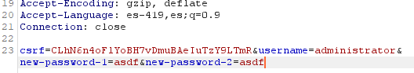

Cerramos sesión e ingresamos como administator usando la nueva contraseña.

#### Lab: Password reset broken logic

[Password reset broken logic](https://g4t13l.github.io/PortSwigger/Authentication.html#lab12-password-reset-broken-logic)

### Users won't always follow the intended sequence

#### Lab: 2FA simple bypass

[2FA simple bypass](https://g4t13l.github.io/PortSwigger/Authentication.html#lab-7-2fa-simple-bypass)

#### Lab 7: Insufficient workflow validation

Ingresamos con las credenciales que nos dan usando burp suite. No interceptamos los paquetes pero si lo hacemos con la configuración del proxy. Seleccionamos un producto barato y menos de 100$ que es la cantidad que disponemos con nuestra cuenta. Realizamos la compra.

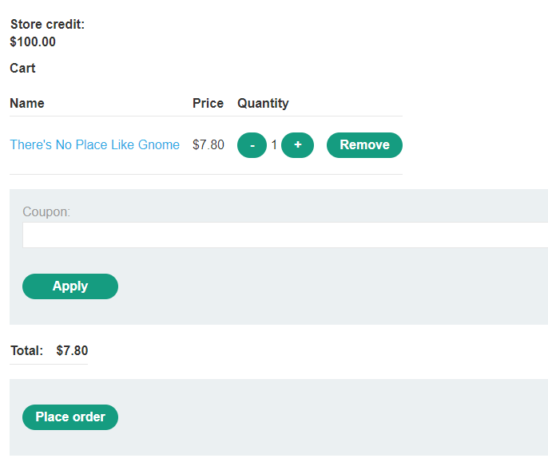

En la sección de **http history** del proxy de BurpSuite nos damos cuenta que despues de estar en el carrito de compras (/cart) realiza un checkout(/cart/checkout) para hacer la verificación del producto y confirmar que tenemos saldo disponible para realizar la compra. Además luego de pedir el checkout envia un **order-confirmation**(/cart/order-confirmation) para indicar que esta todo ok y realiza la compra. Esta última consulta vamos a mandarla al repeater y mantenerla ahí por ahora.

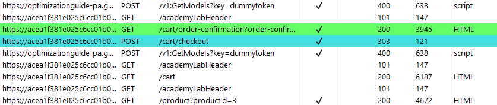

Luego hacemos el pedido de la chaqueta y nos movemos al carrito. Ahora si mandamos la consulta del repeater para confirmar la orden

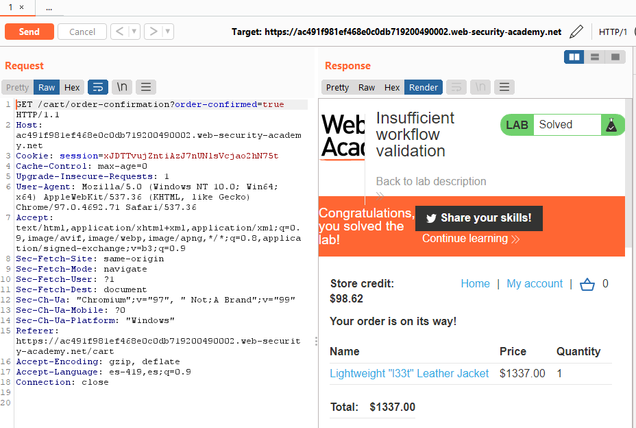

