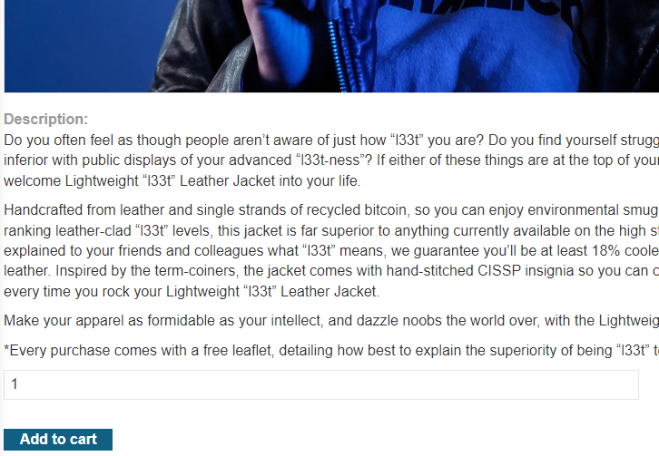
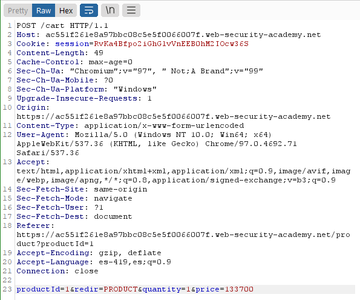
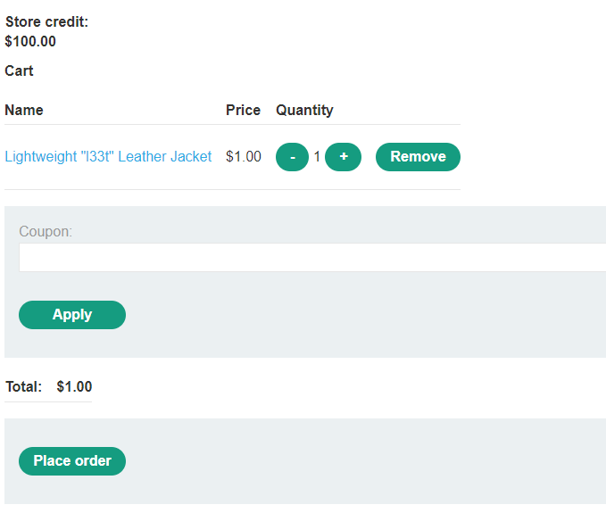

# Business Logic Vulnerabilities

## Excessive trust in client-side controls

### Lab 1: Excessive trust in client-side controls

Interceptamos la consulta al dar click en el boton `add to chart`.



El paquete que se envía lo modificamos para que el precio tenga un valor mas bajo, puede ser 1 o 100 pq los 2 últimos digitos los pone como centavos.



```
...
productId=1&redir=PRODUCT&quantity=1&price=100
```

Luego entramos al carrito para ver que el precio que tiene la chaqueta es 1$.



### Lab 2: 2FA broken logic

[business logic 2FA](https://g4t13l.github.io/PortSwigger/Authentication.html#lab-8-2fa-broken-logic)

