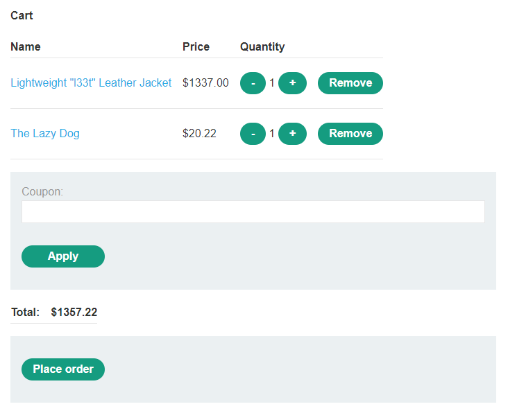
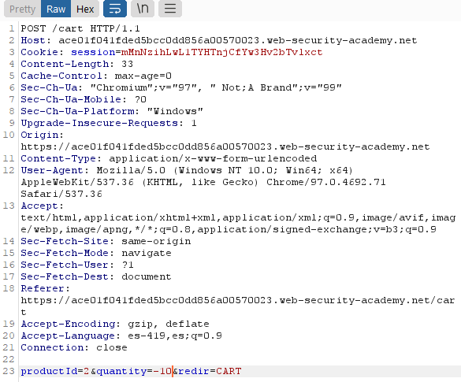
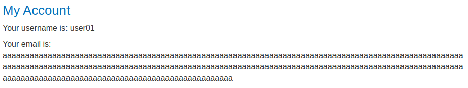
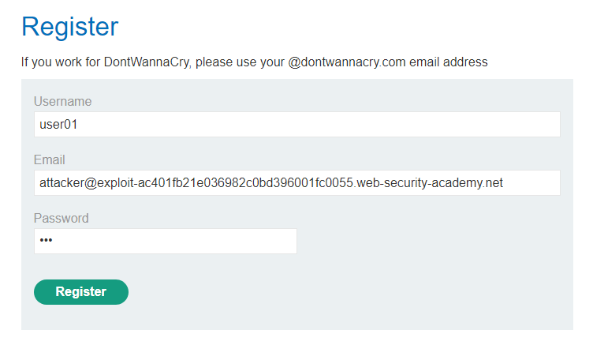

# Business Logic Vulnerabilities

- [Business Logic Vulnerabilities](#business-logic-vulnerabilities)
  - [Excessive trust in client-side controls](#excessive-trust-in-client-side-controls)
    - [Lab 1: Excessive trust in client-side controls](#lab-1-excessive-trust-in-client-side-controls)
    - [Lab: 2FA broken logic](#lab-2fa-broken-logic)
  - [Failing to handle unconventional input](#failing-to-handle-unconventional-input)
    - [Lab 2: High-level logic vulnerability](#lab-2-high-level-logic-vulnerability)
    - [Lab 3: Low-level logic flaw](#lab-3-low-level-logic-flaw)
    - [Lab 4: Inconsistent handling of exceptional input](#lab-4-inconsistent-handling-of-exceptional-input)
  - [Making flawed assumptions about user behavior](#making-flawed-assumptions-about-user-behavior)
    - [Trusted users won't always remain trustworthy](#trusted-users-wont-always-remain-trustworthy)
      - [Lab 5: Inconsistent security controls](#lab-5-inconsistent-security-controls)
    - [Users won't always supply mandatory input](#users-wont-always-supply-mandatory-input)
      - [Lab 6: Weak isolation on dual-use endpoint](#lab-6-weak-isolation-on-dual-use-endpoint)
      - [Lab: Password reset broken logic](#lab-password-reset-broken-logic)
    - [Users won't always follow the intended sequence](#users-wont-always-follow-the-intended-sequence)
      - [Lab: 2FA simple bypass](#lab-2fa-simple-bypass)
      - [Lab 7: Insufficient workflow validation](#lab-7-insufficient-workflow-validation)
      - [Lab 8: Authentication bypass via flawed state machine](#lab-8-authentication-bypass-via-flawed-state-machine)
  - [Domain-specific flaws](#domain-specific-flaws)
    - [Lab 9: Flawed enforcement of business rules](#lab-9-flawed-enforcement-of-business-rules)
    - [Lab 10: Infinite money logic flaw](#lab-10-infinite-money-logic-flaw)
    - [Lab 11: Authentication bypass via encryption oracle](#lab-11-authentication-bypass-via-encryption-oracle)

## Excessive trust in client-side controls

### Lab 1: Excessive trust in client-side controls

Interceptamos la consulta al dar click en el boton `add to chart`.


El paquete que se envía lo modificamos para que el precio tenga un valor mas bajo, puede ser 1 o 100 pq los 2 últimos digitos los pone como centavos.


```
...
productId=1&redir=PRODUCT&quantity=1&price=100
```

Luego entramos al carrito para ver que el precio que tiene la chaqueta es 1$.


### Lab: 2FA broken logic

[2FA broken logic](https://g4t13l.github.io/PortSwigger/Authentication.html#lab-8-2fa-broken-logic)

## Failing to handle unconventional input
### Lab 2: High-level logic vulnerability

Ingresamos las credenciales que nos dieron. Lo que nos piden comprar es la chaqueta de cuero, así lo añadimos al carrito y otro producto cualquiera. Entonces al entrar al carrito, deberiamos ver algo así:



Interceptamos los paquetes y le damos en aumentar el producto 2, luego le cambiamos la cantidad con -10 para disminuir el precio.



Vamos probando valores hasta que salga un precio menor a 100$ que es lo que tenemos en la cuenta.


En este caso llego a costar todo $2.48

### Lab 3: Low-level logic flaw

Interceptamos la consulta para aumentar la cantidad, nos damos cuenta de que no podemos aumentar la cantidad en un número de 3 cifras. Mandamos esa consulta al intruder subiendo el valor a 99.


En la pestaña de payloads colocamos **Null payloads** y que se generen infinitamente. En la pestaña de **Resource pool** configuramos para que se manden consultas a lo mas 1 a la vez. Empezamos el ataque y mientras en otro navegador estaremos actualizando constantemente el carrito para ver la cantidad de elementos que se van generando. Buscamos que la cantidad aumente tanto que sobrepase el valor entero posible y comience a tomar valores negativos, que así es como esta definido el formato de los números enteros.


Dejamos que siga corriendo hasta que este cerca a 0, es cuestión de tantear valores cercanos a 0 pero menor a 0. Lo demás lo completamos con otro producto subiendo la cantidad hasta que sea el precio menor a 100$ y mayor a 0$.


### Lab 4: Inconsistent handling of exceptional input

Este laboratorio se explota en el registro de usuarios. Agregaremos 300 'a' antes del `@exploit-ac871f231ed60f3ac0543fc801e90073.web-security-academy.net`, pues veremos que al registrarnos trunca el correo. 


Además hay que saber que el correo que acepta para los administradores tienen la terminación `@dontwannacry.com`

Hay que aceptar la verificación en el servidor de correo que nos proporciona el laboratorio y nos logeamos.



El máximo de caracteres permitido es 250. Entonces creamos un script en python.

```python
#!/bin/python3

email=".exploit-ac871f231ed60f3ac0543fc801e90073.web-security-academy.net"
admin="@dontwannacry.com"

payload='a'*(255-len(admin))+admin
print (payload)
print (len(payload))

print (payload+email)
print (len(payload+email))

```


La última cadena es la que utilizaremos como payload para el email, este será truncado y solo tomará en cuenta con la terminación `@dontwannacry.com`.

Entonces intentamos registrarnos con `aaaaaaaaaaaaaaaaaaaaaaaaaaaaaaaaaaaaaaaaaaaaaaaaaaaaaaaaaaaaaaaaaaaaaaaaaaaaaaaaaaaaaaaaaaaaaaaaaaaaaaaaaaaaaaaaaaaaaaaaaaaaaaaaaaaaaaaaaaaaaaaaaaaaaaaaaaaaaaaaaaaaaaaaaaaaaaaaaaaaaaaaaaaaaaaaaaaaaaaaaaaaaaaaaaaaaaaaaaaaaaaaaaaaaaaaaaaaaa@dontwannacry.com.exploit-ac871f231ed60f3ac0543fc801e90073.web-security-academy.net`, verificamos el correo y nos logeamos con el usuario que creamos.


Ahora nos permite entrar a la opcion `Admin panel` donde podremos eliminar el usuario carlos.

## Making flawed assumptions about user behavior

### Trusted users won't always remain trustworthy

#### Lab 5: Inconsistent security controls

Nos registramos y nos logeamos con alguna cuenta creada.


En la seccion **My Account** cambiamos el correo a alguno que tenga la terminación `@dontwannacry.com`. Con eso ya podremos tener acceso a las opciones del panel de administrador y elminar a *carlos*.

### Users won't always supply mandatory input

#### Lab 6: Weak isolation on dual-use endpoint

Nos logeamos con la cuenta que nos dieron **wiener:peter**. En el apartado de **My account** le llenamos cualquier dato para cambiar la contraseña e interceptamos la consulta con burp suite.


Le cambiamos el usuario a `administrator` y  quitamos `current-password=asdf` para que no verifique la contraseña actual con el usuario.


Cerramos sesión e ingresamos como administator usando la nueva contraseña.

#### Lab: Password reset broken logic

[Password reset broken logic](https://g4t13l.github.io/PortSwigger/Authentication.html#lab12-password-reset-broken-logic)

### Users won't always follow the intended sequence

#### Lab: 2FA simple bypass

[2FA simple bypass](https://g4t13l.github.io/PortSwigger/Authentication.html#lab-7-2fa-simple-bypass)

#### Lab 7: Insufficient workflow validation

Ingresamos con las credenciales que nos dan usando burp suite. No interceptamos los paquetes pero si lo hacemos con la configuración del proxy. Seleccionamos un producto barato y menos de 100$ que es la cantidad que disponemos con nuestra cuenta. Realizamos la compra.


En la sección de **http history** del proxy de BurpSuite nos damos cuenta que despues de estar en el carrito de compras (/cart) realiza un checkout(/cart/checkout) para hacer la verificación del producto y confirmar que tenemos saldo disponible para realizar la compra. Además luego de pedir el checkout envia un **order-confirmation**(/cart/order-confirmation) para indicar que esta todo ok y realiza la compra. Esta última consulta vamos a mandarla al repeater y mantenerla ahí por ahora.


Luego hacemos el pedido de la chaqueta y nos movemos al carrito. Ahora si mandamos la consulta del repeater para confirmar la orden


#### Lab 8: Authentication bypass via flawed state machine

Entramos a la pagina de logeo e interceptamos los paquetes con burp suite al iniciar sesión con las credenciales que nos dieron. Pasamos la consulta del inicio de sesión pero la consulta de role-selector la dropeamos. Ahora cuando entremos a la página de inicio tendremos el role de administrador.


Como administrador entramos a su panel y eliminamos a carlos.

## Domain-specific flaws

### Lab 9: Flawed enforcement of business rules

Iniciamos sesión con las credenciales que nos dieron. Agregamos la chaqueta al carrito. En la parte de arriba nos muestra un código de cupon que podemos usar para la compra de los productos.


Si intentamos usar el mismo cupon dos veces nos botara un error.


En la parte de abajo de la página de inicio si le agregamos un correo, nos reenviara a un pop up donde nos dan otro cupon. 


Ahora tenemos dos cupones:
* NEWCUST5
* SIGNUP30

Nos bota error si es que mandamos el mismo cupon dos veces pero no si es que lo mandamos de forma intercalada.


Con esto reducimos el precio a 0 y podremos comprar la chaqueta.

### Lab 10: Infinite money logic flaw

Iniciamos sesión con el proxy de **BurpSuite** encendido y como el anterior laboratorio vamos a sacar el cupon de la parte de abajo de la pagina principal.


Ahora vamos a seleccionar el producto **gift card**.


Lo agregamos al carrito y colocamos el cupon que obtuvimos antes. Aplicamos el cupon y emitimos el pedido.


Nos darán un descuento de 3 dolares y nos darán un código para usar la *gift card*. Usaremos la gift card en la sección de *My profile*. Así recuperaremos los 7 dolares que gastamos y obtendremos 3 dolares extra.

Ahora usaremos el BurpSuite, nos vamos a la sección de *project options*->*sessions* agregamos un elemento en *Session Handling Rules*.


Ahora en la zona de *scope* incluiremos todas las URLs.


Volvemos a *details* y agregamos una elemento en *Rule Actions* y seleccionamos *run a macro*.


Luego le damos al *Add* y seleccionamos. Las consultas que acabmos de hacer para:
* Seleccionar el producto *gift card*
* Usar el cupon de descuento
* Verificar la compra
* Confirmar la compra
* Utilizar la *gift card* en nuestra cuenta
```
POST /cart
POST /cart/coupon
POST /cart/checkout
GET /cart/order-confirmation?order-confirmed=true
POST /gift-card
```

Hay que verificar que la primera consulta con la ruta /cart realice la petición del producto 2 como muestra en la pantalla.


Se debería ver de esta manera.


Seleccionamos la 4 petición y le damos a *configure item*.


Agregamos un elemento a *Custom parameter locations in response*. En el cuadro que nos sale seleccionamos el código de la gift card y le damos, le ponemos de nombre al parametro "*gift-card*". Luego le damos a ok >> ok.


Regresando a *Macro Editor* configuramos la última consulta. Al parametro *gift-card* seleccionamos *Deribe from prior response* y seleccionamos al otro lado response 4.


Le damos al *Ok* y a Test Macro.

Mandamos al intruder la consulta en *My profile* donde haremos un sniper attack sin especificar los payloads. En *payloads sets* configuramos con *Null payloads* y que generé 412(como minimo para comprar la chaqueta) payloads. En *Resource Pool* configuramos para que se haga como maximo una conexión a la vez.


Ahora solo queda comprar la chaqueta.


### Lab 11: Authentication bypass via encryption oracle

Iniciamos sesión agregando la casilla *stayed log in*. Ahora entramos a un post y tratamos de comentar con un correo erroneo.


Notamos que el mensaje de error se envía por una cookie encryptada, que luego se muestra en la respuesta de la página.


Mandamos al repeater las consultas del comentario que podemos usarlo para encriptar desde el parametro email y la consulta de `/post?postId=8` nos servira para desencriptar.


En la consulta de decifrado mandamos con la cookie `stay-logged-in` y lo colocamos en la cookie *notification*.


Vemos que el formato de la cookie *stayed-log-in* es `usuario:timestamp`. Ahora mandaremos la consulta que encripta y en el correo colocaremos `administrator:timestamp` el valor de timestamp será el mismo que teniamos con el usuario wiener.


si mandamos lo mismo con la consulta que desencripta nos damos cuenta que el resultado es: `Invalid email address: administrator:1644012633191`. Esto quiere decir que en todos los casos esta que le agrega la cadena `"Invalid email address: "` de 23 caracteres de longitud.

Lo que haremos será mandar la cadena encriptada completa al decoder de BurpSuite. Ahí le aplicamos decodificación url y base64. Seleccionamos los 23 primeros caracteres y los eliminamos.


Al resto le hacemos una encodificación de base64 y url.


Cuando probamos la consulta que desencripta obtenemos el siguiente mensaje.


Entonces tenemmos que agregar una cantidad de caracteres al prefijo *"Invalid email address"* para que el número de caracteres que elimine sea múltiplo de 16. Así de esta manera el resto podrá ser intepretado correctamente.

Tenemos la cadena inicial de *"Invalid email address* de 23 caracteres, nos faltaría 9 para un bloque múltiplo de 16. Enviamos a encriptar a `XXXXXXXXXadministrator:1644012633191`. Luego lo enviamos al encoder con el mismo proceso que hicimos anteriormente, pero esta vez eliminaremos los 36 primeros bytes.

Ahora usamos esta cadena y la colocamos en la cookie *stay-logged-in*, para eso debemos borrar la cookie de session y podremos acceder como administrador para borrar la cuenta de carlos.